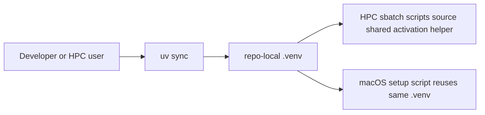

Title: Standardize repo-local uv/.venv workflow across macOS and HPC
Status: Done
Owner: agent-llm
Reviewers: n/a
Issues: n/a
Scope: repo-wide
Risk: medium

# Context & Problem

The repository uses a mixed environment story: macOS setup already uses `uv` and `.venv`, while
HPC setup and multiple sbatch entrypoints still assume conda. That split makes onboarding, local
validation, and cluster execution inconsistent.

# Goals / Non-goals

Goals:
- Make repo-local `.venv` the primary environment on both macOS and HPC.
- Make `uv` the primary install/sync command.
- Update HPC entrypoints to activate `.venv` instead of conda.

Non-goals:
- Remove every conda mention from imported data corpora under `docs/`.
- Rebuild the full dependency layout beyond what is needed for `uv`/`.venv` first-run workflows.

# Design Overview

# Alternatives Considered

- Keep conda on HPC and `.venv` on macOS only.
  - Rejected because it preserves duplicate setup logic and environment drift.
- Use separate activation logic in every sbatch script.
  - Rejected because it is repetitive and easy to regress.

# Implementation Plan

- [x] Add `.python-version` and shared activation helper.
- [x] Switch primary setup scripts to `uv` + `.venv`.
- [x] Update HPC sbatch entrypoints to source the shared helper.
- [x] Update README and docs to make `.venv` the primary workflow.
- [x] Generate and commit `uv.lock`.
- [x] Run targeted validation.

# Data Model & Migrations

No application data model changes. Environment bootstrap changes only.

# Testing Strategy

- Static tests for HPC scripts referencing the shared `.venv` activation path.
- `ruff check` on touched Python files.
- `uv lock` validation and selected pytest coverage in the repo-local `.venv`.

# Rollout & Telemetry

- Roll out as documentation + script migration.
- Existing users can keep conda temporarily, but repo defaults move to `uv` and `.venv`.

# Risks & Mitigations

- Risk: HPC cluster packages may still need module-provided CUDA/compiler state.
  - Mitigation: keep module loading in sbatch/setup scripts; only replace Python env management.
- Risk: old docs or muscle memory still use conda.
  - Mitigation: make README and setup scripts explicit, and fail fast when `.venv` is missing.

# Security & Privacy

- No application secrets or runtime credentials move into the repository as part of this change.
- Environment setup remains local to each machine or HPC checkout, which avoids reusing binary
  artifacts across incompatible platforms.
- Cluster-specific modules remain in launcher scripts rather than reusable Python modules.

# Docs to Update

- `README.md`
- `docs/README.md`
- `docs/hpc-vllm-runbook.md`

# Rollback Plan

- Restore the prior conda-based `setup_hpc.sh` and sbatch activation commands.
- Remove the shared activation helper and `uv`-first instructions.
- Keep the hosted vLLM operational scripts, since they are independent of the environment manager.

# Decision Log

- 2026-04-14: Standardize on repo-local `.venv` plus `uv` for both macOS and HPC workflows.
- 2026-04-14: Keep pip-compatible requirement files as fallback installs instead of removing them.
- 2026-04-14: Retain cluster module loading in setup and sbatch wrappers while removing conda
  activation from active launch paths.
