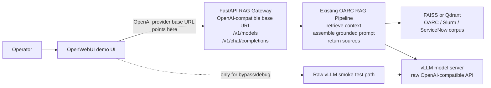

Title: OpenWebUI RAG Gateway Integration
Status: Draft
Owner: agent-llm
Reviewers: n/a
Issues: n/a
Scope: repo-wide
Risk: low

# Context & Problem

Phase 3 of `project_docs/DESIGN.md` validates OpenWebUI as an optional demo UI for the
OpenAI-compatible FastAPI RAG gateway. OpenWebUI must point at the RAG gateway, not directly at
vLLM, so user questions continue to pass through retrieval, prompt assembly, source metadata, and
the existing RAG telemetry path.

# Goals / Non-goals

Goals:
- Document how to configure OpenWebUI with the RAG gateway OpenAI-compatible base URL.
- Verify OpenWebUI can list and call the `oarc-rag-v1` gateway model.
- Preserve a separate raw-vLLM path for smoke testing and debugging only.
- Give operators a checklist for distinguishing RAG-backed answers from raw model answers.

Non-goals:
- Do not add auth, SSO, production deployment scripts, or service hardening.
- Do not replace vLLM, the RAG gateway, or the custom RAG pipeline.
- Do not build the final React/Next.js UI.
- Do not put planning docs under `docs/`.

# Architecture Notes

OpenWebUI should be configured as an OpenAI-compatible client whose base URL points to the FastAPI
RAG gateway, for example `http://<gateway-host>:<gateway-port>/v1`. The gateway then owns
`/v1/models` and `/v1/chat/completions`, while vLLM remains the private backing model server used by
the RAG pipeline.

# Implementation Plan

- [ ] Document the expected gateway base URL as `http://<gateway-host>:<gateway-port>/v1`.
- [ ] Document the raw vLLM URL as bypass-only and label it clearly as non-RAG.
- [ ] Add an OpenWebUI setup checklist: configure OpenAI-compatible provider, set API base URL to
  the RAG gateway, use the gateway API key field only if an operator has added one externally, and
  select `oarc-rag-v1`.
- [ ] Add gateway smoke checks before OpenWebUI setup: `GET /health`, `GET /v1/models`, and a direct
  `POST /v1/chat/completions` request.
- [ ] Add OpenWebUI verification steps using one known corpus-backed question.
- [ ] Add operator checks for RAG-backed behavior: model alias is `oarc-rag-v1`, answers are grounded
  in the corpus, gateway logs show the request, and source metadata is present in API responses even
  if OpenWebUI does not render it.
- [ ] Keep raw-vLLM smoke testing as a separate debug workflow with an explicit warning that it
  bypasses retrieval and sources.

# Verification Strategy

Manual verification:
- Start vLLM and confirm its raw OpenAI-compatible endpoint is healthy.
- Start the RAG gateway with `uvicorn src.rag.api:app --host 0.0.0.0 --port <port>`.
- Confirm `GET /health` returns `status: ok`.
- Confirm `GET /v1/models` returns `oarc-rag-v1`.
- Configure OpenWebUI's OpenAI-compatible provider base URL to the gateway `/v1` URL.
- Ask a known OARC or Slurm corpus-backed question.
- Confirm the request is handled by the gateway and not by direct vLLM.
- Confirm the raw-vLLM path remains available only for bypass/debug comparison.

Static validation:
- Add tests that assert `project_docs/DESIGN.md` links this plan and includes the OpenWebUI diagram.
- Add tests that assert this plan file is unignored by `.gitignore`.

# Risks & Mitigations

- Risk: OpenWebUI is accidentally pointed at raw vLLM.
  - Mitigation: document gateway URL and raw-vLLM bypass URL separately, with explicit operator
    checks.
- Risk: OpenWebUI may not display custom `rag_sources` fields.
  - Mitigation: verify source metadata through direct API calls and treat OpenWebUI as demo UI only.
- Risk: network forwarding differs between macOS and HPC.
  - Mitigation: keep Phase 3 documentation URL-based and leave deployment scripts to Phase 4.

# Rollout & Telemetry

Roll out as documentation and verification. Existing FastAPI gateway and vLLM behavior remains
unchanged. Runtime telemetry continues through the current RAG pipeline; this phase adds no new
telemetry fields.

# Rollback Plan

Revert the Phase 3 documentation and plan file. OpenWebUI can be disconnected without affecting the
RAG gateway, vector stores, or vLLM server.

# Decision Log

- 2026-04-27: Use OpenWebUI as an optional demo UI, not the owner of RAG logic.
- 2026-04-27: Configure OpenWebUI against the RAG gateway `/v1` base URL.
- 2026-04-27: Keep raw vLLM access only as a bypass/debug smoke-test path.
