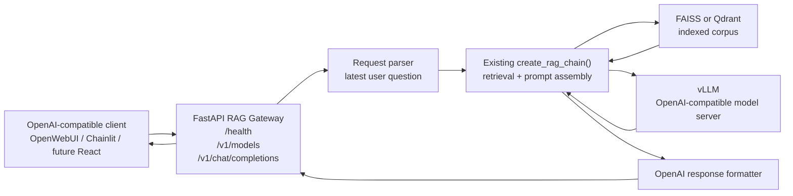

Title: RAG-Compatible API Boundary
Status: Done
Owner: agent-llm
Reviewers: n/a
Issues: n/a
Scope: repo-wide
Risk: medium

# Context & Problem

Phase 1 of `project_docs/DESIGN.md` adds the missing OpenAI-compatible boundary above the custom
RAG pipeline.

Today, vLLM already exposes an OpenAI-compatible API, but clients that call vLLM directly bypass
retrieval, prompt assembly, source governance, and MLflow runtime sampling. The FastAPI gateway
should make OpenAI-compatible clients talk to the repo-owned RAG pipeline instead of raw model
serving.

# Fit With `project_docs/DESIGN.md`

This plan implements only **Phase 1: RAG-Compatible API Boundary** from `project_docs/DESIGN.md`.

It adds the green gateway layer from the target architecture and connects it to the existing yellow
RAG layer. It does not implement later phases such as streaming, source metadata strategy,
OpenWebUI documentation, auth, deployment hardening, or the final React UI.

# Goals / Non-goals

Goals:
- Add a FastAPI RAG gateway with `GET /health`, `GET /v1/models`, and non-streaming
  `POST /v1/chat/completions`.
- Accept OpenAI-style chat completion requests and extract the latest non-empty `user` message.
- Call the existing `create_rag_chain()` path so retrieval, prompt assembly, vLLM provider calls,
  and telemetry remain unchanged.
- Return an OpenAI-compatible chat completion response with gateway model alias `oarc-rag-v1`.
- Add tests for parsing, response shape, RAG invocation, and basic error handling.

Non-goals:
- Do not replace vLLM or the custom RAG pipeline.
- Do not add streaming; reject `stream: true` clearly in Phase 1.
- Do not implement auth, source metadata extensions, conversation persistence, or deployment
  scripts.
- Do not put planning docs under `docs/`.

# Architecture Notes

Add a small gateway module under `src/rag/`, with `create_app()` and a module-level `app` for
uvicorn.

Request flow:
1. Client sends OpenAI-style `POST /v1/chat/completions`.
2. Gateway validates the request and rejects streaming.
3. Gateway extracts the latest user question.
4. Gateway invokes the existing RAG chain.
5. RAG chain retrieves context, assembles the prompt, and calls vLLM.
6. Gateway normalizes the answer and returns OpenAI-compatible JSON.

`GET /v1/models` should expose `oarc-rag-v1` as the client-facing model and include backing vLLM
model metadata when available from existing config or endpoint discovery.

# Implementation Plan

- [x] Create `.plans/2026-04-27-rag-openai-api-boundary.md` using this plan.
- [x] Add FastAPI dependencies to `pyproject.toml`: `fastapi`, `uvicorn`, and test-only `httpx` if
  needed.
- [x] Add `src/rag/api.py` or `src/rag/gateway.py` with lazy RAG chain initialization.
- [x] Add typed request/response helpers for OpenAI chat message parsing, model listing,
  completion formatting, and error responses.
- [x] Implement `GET /health` without forcing a full RAG query.
- [x] Implement `GET /v1/models` with `oarc-rag-v1` and backing vLLM metadata.
- [x] Implement non-streaming `POST /v1/chat/completions`.
- [x] Keep existing Flask, Streamlit, and HPC chat paths unchanged unless an import-safe adjustment
  is required.

# Testing Strategy

Add unit tests under `tests/unit/` using FastAPI `TestClient` and monkeypatched fake RAG chains.

Test cases:
- `GET /health` returns 200 and stable JSON.
- `GET /v1/models` returns OpenAI-style list data including `oarc-rag-v1`.
- Multiple messages extract the latest user message.
- RAG chain string result and dict result with `answer` both produce a valid assistant message.
- Completion response includes `id`, `object`, `created`, `model`, `choices`, and `usage`.
- `stream: true` returns HTTP 400.
- Missing messages, no user message, or empty user content returns validation errors.
- RAG failures return HTTP 500 with OpenAI-style error JSON and no stack trace.

Run:
- `pytest tests/unit/test_rag_gateway.py`
- Existing targeted RAG/provider tests if shared code is touched.

# Risks & Mitigations

- Risk: RAG initialization is expensive.
  - Mitigation: lazy initialization, not module-import initialization.
- Risk: clients expect streaming.
  - Mitigation: reject streaming in Phase 1 and leave SSE for Phase 2.
- Risk: exact token usage is not exposed by the current chain.
  - Mitigation: return best-effort usage using existing token-count helpers.
- Risk: clients pass complex multimodal message content.
  - Mitigation: support plain text and simple text parts only; return clear validation errors
    otherwise.

# Rollout & Telemetry

This is an additive boundary. Existing UI and HPC scripts keep working.

Operators can start vLLM as they do today, ensure `LLM_PROVIDER=vllm` and vector store settings are
configured, then serve the FastAPI gateway and point OpenAI-compatible clients at the gateway base
URL.

Existing MLflow runtime sampling remains inside `InstrumentedRAGChain`; this phase does not add new
telemetry fields.

# Rollback Plan

Stop serving the FastAPI gateway and point clients back to the existing Flask/Streamlit path or
directly to vLLM for raw model smoke tests.

Revert the gateway module, tests, and dependency additions. No data migration or index rebuild is
required.

# Outcome

Implemented the additive FastAPI gateway in `src/rag/api.py`, declared required FastAPI runtime and
test dependencies, and added focused unit coverage for the Phase 1 request/response contract and
error handling.

# Decision Log

- 2026-04-27: Plan drafted for Phase 1 RAG-compatible API boundary.
- 2026-04-27: Added architecture diagram showing how the gateway fits into `project_docs/DESIGN.md`.
- 2026-04-27: Chose `oarc-rag-v1` as the gateway-facing model alias while preserving vLLM as the
  backing model server.
- 2026-04-27: Completed Phase 1 implementation and validated the gateway contract with targeted
  tests.
