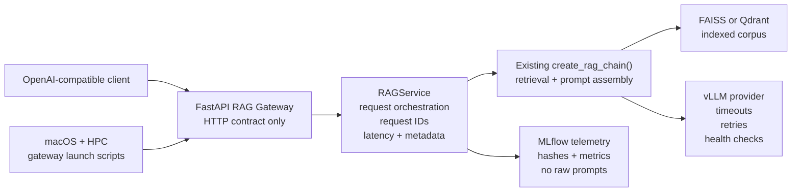

Title: RAG Service Hardening
Status: Draft
Owner: agent-llm
Reviewers: n/a
Issues: n/a
Scope: repo-wide
Risk: medium

# Context & Problem

Phases 1 and 2 added an OpenAI-compatible FastAPI RAG gateway with non-streaming and streaming chat
completion support. Phase 3 documents OpenWebUI as a demo client for that gateway.

The gateway is now usable, but the API module still owns too much runtime orchestration. Service
hardening should make the boundary clearer: FastAPI should handle HTTP shape and errors, while a
service layer owns request execution, request metadata, provider metadata, latency measurement, and
sanitized telemetry.

# Goals / Non-goals

Goals:

- Extract a `RAGService` boundary that wraps the existing custom RAG pipeline.
- Preserve `create_rag_chain()` as the retrieval, prompt assembly, and vLLM provider path.
- Preserve the public gateway API from Phases 1 and 2.
- Add stable request IDs, latency metrics, prompt hashes, retrieval IDs, and provider metadata.
- Log runtime telemetry to MLflow without raw prompts, raw user questions, or raw retrieved text.
- Improve vLLM timeout, retry, and health reporting behavior.
- Add macOS and HPC gateway startup scripts.

Non-goals:

- Do not replace vLLM.
- Do not replace the custom RAG pipeline.
- Do not add auth, persistence, final React UI, or answer-quality evaluation in this phase.
- Do not move project planning docs under `docs/`.

# Design Overview



`src/rag/api.py` should remain the OpenAI-compatible HTTP boundary. It should parse requests, frame
non-streaming and streaming responses, and map service errors to OpenAI-style JSON errors.

The new service layer should own chain initialization, request IDs, timing, source metadata, provider
metadata, sanitized telemetry payloads, and the single invocation path for streaming and
non-streaming calls.

# Implementation Plan

- [ ] Add a `RAGService` abstraction for gateway request orchestration.
- [ ] Refactor `src/rag/api.py` so route handlers delegate chain execution to `RAGService`.
- [ ] Preserve existing OpenAI-compatible response and streaming chunk shapes.
- [ ] Add stable request IDs across responses, logs, stream chunks, and telemetry records.
- [ ] Add total latency metrics and best-effort retrieval/provider timing where available.
- [ ] Record prompt hashes, retrieval IDs or chunk IDs, provider name, backing model, and health URL.
- [ ] Keep raw prompts, raw user questions, and raw retrieved document text out of MLflow.
- [ ] Reuse existing vLLM timeout and retry configuration.
- [ ] Extend health reporting to expose degraded provider status without forcing full RAG startup.
- [ ] Add macOS and HPC scripts for starting the FastAPI gateway.

# Testing Strategy

- Unit-test `RAGService` with fake RAG chains for non-streaming and streaming execution.
- Verify API routes delegate to the service while preserving Phase 1 and Phase 2 response shapes.
- Verify health checks include provider metadata and degraded vLLM status without stack traces.
- Verify sanitized telemetry includes hashes, IDs, metrics, and provider metadata, but no raw prompt
  text.
- Verify timeout and retry settings continue to flow into vLLM provider configuration.
- Verify macOS and HPC gateway scripts reference the FastAPI app entrypoint.
- Verify `project_docs/DESIGN.md` links this plan and includes the Phase 4 diagram.

Run:

```bash
uv run pytest tests/unit/test_rag_gateway.py tests/unit/test_llm_provider.py tests/unit/test_vllm_hpc_config.py
uv run ruff check src/rag/api.py tests/unit/test_rag_gateway.py
```

# Rollout & Telemetry

This is an additive hardening phase. Existing clients should keep using the same gateway base URL,
model alias, and chat completion endpoints.

Operators should start vLLM as they do today, then start the FastAPI gateway with the new macOS or
HPC script. MLflow runtime telemetry should continue to be controlled by existing MLflow settings,
with Phase 4 adding sanitized operational metadata rather than raw request content.

# Risks & Mitigations

- Risk: refactoring route handlers changes OpenAI-compatible response shapes.
  - Mitigation: preserve existing gateway tests and add delegation-focused tests.
- Risk: health checks accidentally initialize expensive RAG resources.
  - Mitigation: provider health checks should be shallow and avoid vector-store startup by default.
- Risk: telemetry leaks raw prompts or retrieved text.
  - Mitigation: test sanitized telemetry and log only hashes, IDs, timings, and provider metadata.
- Risk: deployment scripts drift from local configuration.
  - Mitigation: scripts should read environment variables and avoid hard-coded model or index paths.

# Rollback Plan

Revert the service abstraction, API refactor, telemetry additions, health-check changes, deployment
scripts, and tests. Keep the Phase 1 and Phase 2 gateway implementation active. No vector index,
model, or data migration is required.

# Decision Log

- 2026-04-27: Drafted Phase 4 service hardening plan.
