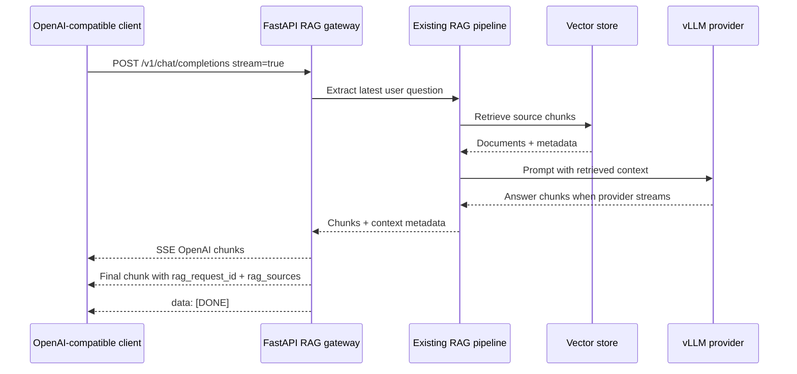

Title: RAG Streaming and Source Metadata
Status: Done
Owner: agent-llm
Reviewers: n/a
Issues: n/a
Scope: repo-wide
Risk: medium

# Context & Problem

Phase 2 of `project_docs/DESIGN.md` builds on the completed FastAPI RAG gateway by adding
OpenAI-compatible streaming and structured source metadata. Phase 1 intentionally rejected
`stream: true`; Phase 2 makes that request usable while keeping the repo-owned RAG pipeline and vLLM
backend in place.

# Fit With `project_docs/DESIGN.md`

This plan implements **Phase 2: Streaming and Source Metadata**. It extends the Phase 1 gateway
contract and keeps later work out of scope: OpenWebUI setup, auth, deployment hardening, persistent
source lookup endpoints, and final UI work remain future phases.

# Goals / Non-goals

Goals:
- Support `stream: true` on `POST /v1/chat/completions` using server-sent events.
- Preserve non-streaming behavior while adding `rag_request_id` and `rag_sources` extension fields.
- Return stable source objects with best-effort `id`, `source`, `title`, `url`, `chunk_id`, `score`,
  and `snippet` fields.
- Deduplicate repeated source documents and omit missing fields.
- Use provider streaming when a RAG chain exposes streaming, and fall back to one SSE content chunk
  when it cannot.
- Add tests for stream shape, source metadata, fallback, and error handling.

Non-goals:
- Do not replace vLLM or the custom RAG pipeline.
- Do not add auth, persistence, a `/rag/sources/{request_id}` endpoint, OpenWebUI docs, or
  deployment scripts.
- Do not store raw prompts or user identifiers as part of this phase.

# Architecture Notes

The gateway uses OpenAI-compatible SSE chunks for streaming responses. The final completion chunk
includes extension fields:

- `rag_request_id`: a request-scoped ID generated by the gateway.
- `rag_sources`: an array of structured source metadata extracted from retrieved LangChain
  documents.

The existing RAG chain remains the default integration point. When the chain exposes
`stream_answer(question)`, the gateway streams returned chunks and final source metadata. When it
does not, the gateway invokes the existing synchronous path before opening the SSE response and
emits one content chunk followed by the final metadata chunk.

# Implementation Plan

- [x] Mark Phase 1 complete in `project_docs/DESIGN.md`.
- [x] Add `.plans/2026-04-27-rag-streaming-source-metadata.md`.
- [x] Add a `.gitignore` exception for this plan file.
- [x] Add `rag_request_id` and `rag_sources` extension fields to non-streaming responses.
- [x] Add source extraction and deduplication helpers.
- [x] Add SSE streaming support for `stream: true`.
- [x] Add fallback streaming for chains without provider streaming.
- [x] Add optional chain-level `stream_answer()` support for provider-backed RAG chains.
- [x] Add tests for Phase 1 design status, streaming, source metadata, fallback, and errors.

# Testing Strategy

Targeted validation:
- `uv run pytest tests/unit/test_rag_gateway.py tests/unit/test_llm_provider.py tests/unit/test_vllm_hpc_config.py`
- `uv run ruff check src/rag/api.py src/rag/rag_pipeline.py tests/unit/test_rag_gateway.py`

Known broader-suite caveat: full `uv run pytest tests/unit` currently fails on missing `mlflow` in
`tests/unit/test_evaluator.py`, unrelated to this phase.

# Rollout & Telemetry

This is an additive API change. Non-streaming clients continue using the same endpoint and now
receive source metadata extension fields. Streaming clients can set `stream: true` and consume
OpenAI-style SSE chunks. Existing MLflow runtime sampling remains in the RAG pipeline; this phase
does not add persistent telemetry or source lookup storage.

# Rollback Plan

Revert the streaming and source metadata changes in `src/rag/api.py`, remove the optional
`stream_answer()` hook from `src/rag/rag_pipeline.py`, and restore the prior Phase 2 checklist state
if needed. No data migration or vector index rebuild is required.

# Outcome

Implemented streaming chat completions, structured `rag_sources`, request IDs, synchronous fallback
streaming, and provider-backed `stream_answer()` support. Marked Phase 1 and Phase 2 complete in
`project_docs/DESIGN.md` and validated the gateway/provider tests plus targeted Ruff checks.

# Decision Log

- 2026-04-27: Use OpenAI-compatible extension fields for source metadata instead of a companion
  endpoint.
- 2026-04-27: Stream answer chunks over SSE and include `rag_sources` only on the final completion
  chunk.
- 2026-04-27: Preserve a synchronous fallback for providers or chains that cannot stream tokens.
- 2026-04-27: Completed Phase 2 implementation and marked the plan done.
