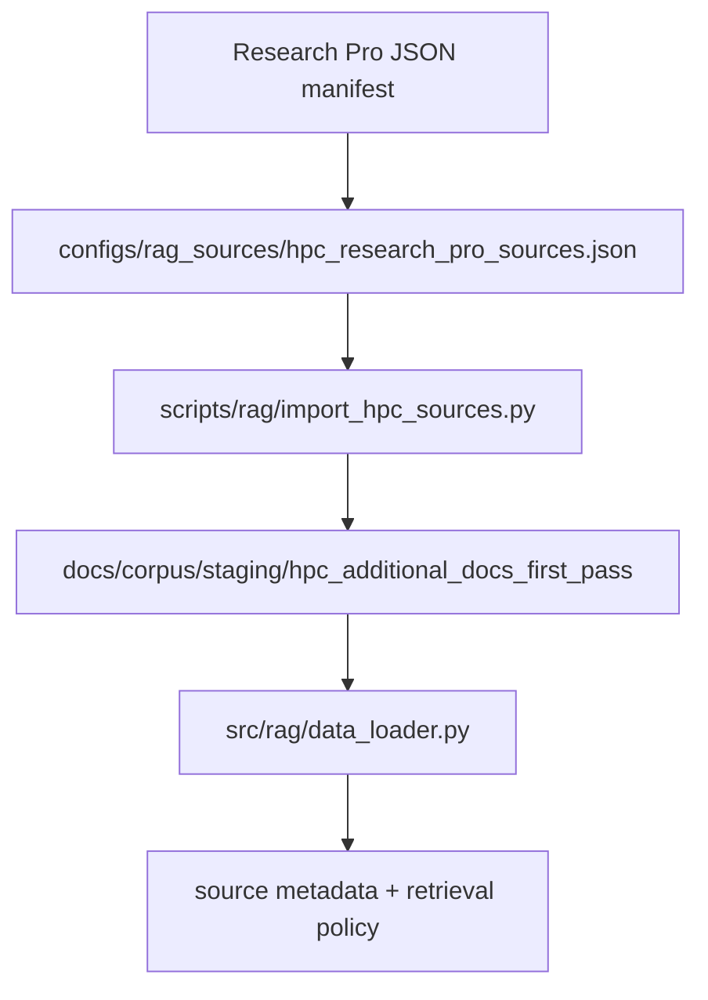

Title: HPC Research Pro source ingestion
Status: Done
Owner: agent-llm
Reviewers: n/a
Issues: n/a
Scope: repo-wide
Risk: medium

# Context & Problem

The repository already ingests the local OARC/Amarel guide, prepared ServiceNow records, and
vendored Slurm documentation. Research Pro produced a broader HPC source manifest, but the current
pipeline has no source-manifest layer, authority metadata, or policy for keeping external HPC-center
docs from answering local operational questions.

# Goals / Non-goals

- Add the Research Pro manifest as optional configuration without creating a new repository or
  replacing the current loader.
- Provide a first-pass source group that is opt-in and dry-run friendly.
- Preserve source authority metadata so local OARC guidance, Slurm docs, official upstream docs, and
  external examples keep distinct retrieval behavior.
- Do not ingest external content by default, crawl whole domains, or treat external HPC docs as local
  policy.

# Design Overview

# Implementation Plan

- [x] Create `codex/hpc-rag-research-pro-sources` branch.
- [x] Convert the canonical Research Pro manifest into repo config.
- [x] Add source-manifest loading, method normalization, group resolution, and skip reasons.
- [x] Add conservative dry-run/import CLI with same-domain, include/exclude, robots, page caps, and
      report artifacts.
- [x] Add metadata enrichment, cluster-specific detection, and retrieval authority policy.
- [x] Extend Markdown loading to support path-list `DATA_PATH`, front matter/sidecar metadata, and
      stable chunk metadata.
- [x] Add docs and unit tests.

# Data Model & Migrations

No storage migration is required. Imported docs, when explicitly enabled, are generated under
`docs/corpus/staging/hpc_additional_docs_first_pass` with Markdown front matter and report artifacts
under `logs/rag_source_imports/<run-id>/`.

# Testing Strategy

Use unit tests with local fixtures and mocked HTTP responses. Do not perform real network ingestion
in tests.

# Rollout & Telemetry

Default behavior remains unchanged. Operators opt in by running the dry-run/import CLI and adding
the generated staging directory to `DATA_PATH`.

# Risks & Mitigations

- External HPC docs may contain cluster-specific policy. Mitigate by tagging/downranking external
  cluster-specific chunks and suppressing them for local operational queries.
- License terms may require review. Mitigate by skipping license-pending sources unless an explicit
  override is used.

# Security & Privacy

No secrets or raw ServiceNow files are read. Crawling remains same-domain and path/term constrained.

# Docs to Update

`README.md`, `docs/README.md`, `docs/corpus/README.md`, and `project_docs/ARCHITECTURE.md`.

# Rollback Plan

Remove the new config, source support modules, CLI, tests, and docs updates. Existing local guide,
Slurm docs, ServiceNow preparation, and vector-store build behavior remain unchanged.

# Decision Log

- 2026-05-04: Started implementation from user-approved plan.
- 2026-05-04: Added optional source config/importer, metadata tagging, retrieval policy, docs, and
  unit coverage. Default ingestion remains unchanged and external sources remain opt-in.

# Outcome

Research Pro sources are now configured as optional first-pass inputs. Dry-run reports are available
without network ingestion, and reviewed imports can be generated into staging with authority metadata
that downranks/suppresses external HPC examples for local operational questions.
