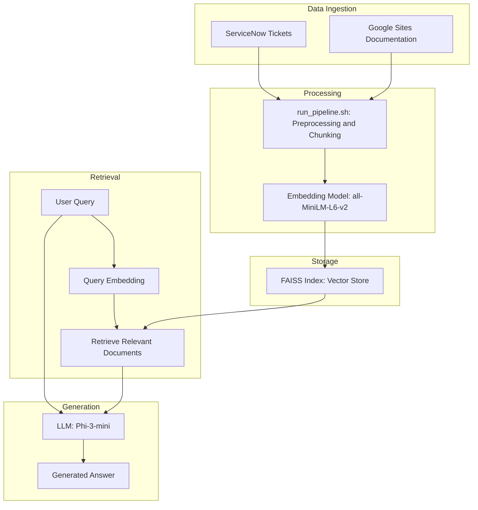
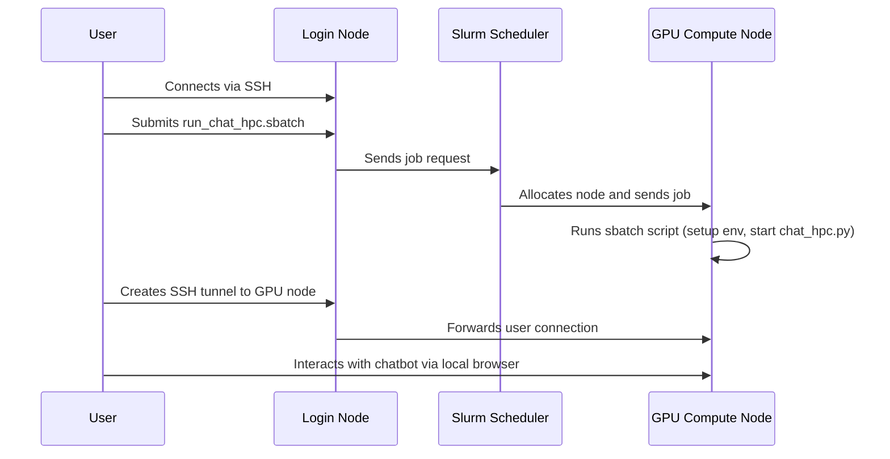

# RAG System for OARC Documentation

This project implements a Retrieval-Augmented Generation (RAG) system to answer questions about the Amarel cluster based on the OARC Google Sites guide and ServiceNow data. The architecture of the system, including the data pipeline and deployment on the HPC cluster, is detailed in the flowchart below.

## RAG Architecture Flowchart

This flowchart illustrates the general architecture of the RAG system. The HPC deployment specifically utilizes the FAISS index for storage and the Phi-3-mini model for generation, as depicted in the diagram.



### HPC Installation Notes

If you encounter OS-related errors during the installation of `llama-cpp-python` (such as GLIBC incompatibility), you may need to install it from source. The [`env_check/build_llama_cpp.sbatch`](env_check/build_llama_cpp.sbatch) script provides an example of how to do this.

The specific package requirements for the HPC environment are defined in [`requirements_hpc.txt`](requirements_hpc.txt) and [`constraints_hpc.txt`](constraints_hpc.txt). A complete list of the exact environment libraries can be found in [`env_check/oarc-ai-rag-test.sanitized.yml`](env_check/oarc-ai-rag-test.sanitized.yml).

## Architecture

The system is built with Python, LangChain, and a Hugging Face model. It supports both Qdrant and an in-memory FAISS vector store. For a detailed explanation of the architecture, please see the [`architecture/architecture.md`](./architecture/architecture.md) file.

## Configuration

The project's settings are centralized in the [`src/rag/config.py`](src/rag/config.py) file. This file defines key parameters such as data paths, model names, and vector store configurations.

Many of these settings can be overridden by environment variables (e.g., `QDRANT_HOST`, `HUGGINGFACE_API_TOKEN`), which are loaded at runtime using `python-dotenv`. This allows for flexible configuration without modifying the source code, which is particularly useful for switching between local and HPC environments.

## Setup and Installation

### 1. Prerequisites

-   Python 3.9+
-   Conda (or Mamba) and Pip for environment management.
-   Docker (Optional, for Qdrant)

### 2. Clone the Repository

```bash
git clone <repository-url>
cd <repository-name>
```

### 3. Set Up the Environment

Create a virtual environment and install the required packages:

```bash
conda create -n oarc-rag python=3.9
conda activate oarc-rag
pip install -r requirements_hpc.txt -c constraints_hpc.txt
```

### 4. Set Up the Hugging Face API Token

Create a `.env` file in the root of the project and add your Hugging Face API token:

```
HUGGINGFACE_API_TOKEN="your-token-here"
```

Then, log in to the Hugging Face Hub:

```bash
huggingface-cli login --token $HUGGINGFACE_API_TOKEN
```

### 5. Start the Qdrant Vector Database (Optional)

This step is only required if you are running the chatbot locally with the Qdrant vector store. The HPC deployment uses a FAISS vector store, which does not require a separate database server.

Run the Qdrant Docker container:

```bash
docker run -p 6333:6333 qdrant/qdrant```

### 6. Create the Vector Store

The vector store for the HPC deployment is created using a data preparation pipeline that processes the raw data and builds a FAISS index. This entire process is automated and can be run on the HPC cluster by submitting a Slurm job.

To create the vector store, run the following command:

```bash
sbatch scripts/rag/run_pipeline.sbatch
```

This script executes [`scripts/rag/run_pipeline.sh`](scripts/rag/run_pipeline.sh), which handles cleaning the data, preparing it for ingestion, and creating the final FAISS vector store in the `vector_index/faiss_amarel` directory.

## Data Preparation Pipeline
 
The `run_pipeline.sh` script automates the data preparation process, which includes cleaning the data, preparing it for ingestion, and creating the vector store.
 
To run the pipeline, execute the following command:
 
```bash
./scripts/rag/run_pipeline.sh
```
 
## Running the Chatbot

The method for running the chatbot differs depending on whether you are in a local environment (like a Mac) or on the HPC cluster.

### Running Locally

For local execution, you can run the Streamlit chatbot interface directly. The script accepts command-line arguments to select the LLM provider and the vector store.

-   `--llm-provider`: Choose between `huggingface` (default) and `ollama`.
-   `--vector-store`: Choose between `qdrant` (default) and `in_memory`.

**Examples:**

**Using Hugging Face and Qdrant (default):**
```bash
streamlit run src/rag/main.py
```

**Using Ollama and Qdrant:**
```bash
streamlit run src/rag/main.py -- --llm-provider ollama
```

**Using Hugging Face and In-Memory FAISS:**
```bash
streamlit run src/rag/main.py -- --vector-store in_memory
```

**Using Ollama and In-Memory FAISS:**
```bash
streamlit run src/rag/main.py -- --llm-provider ollama --vector-store in_memory
```

The app will be available at `http://localhost:8501`.

### Running on the HPC Cluster

To run the chatbot on the HPC cluster, please refer to the **HPC Deployment** section for instructions on submitting the job via `sbatch`.

## Deployment

### Deployment on an HPC Cluster

To deploy the chatbot on an HPC cluster, you can use the provided `sbatch` script. This script sets up the necessary environment, including loading the required modules and activating the virtual environment, and then runs the chatbot application.

**To submit the job, run the following command:**
```bash
sbatch scripts/deployment/hpc/run_chat_hpc.sbatch
```

This will submit the job to the Slurm scheduler, and the chatbot will be accessible through the compute node where the job is running.

This deployment is ideal for running the chatbot in a high-performance environment, enabling it to handle complex queries and large datasets efficiently.



To run the chatbot on the HPC cluster, submit a job to the Slurm scheduler using the provided `sbatch` script. This script requests a GPU node and sets up the necessary environment for the application to run.

```bash
sbatch scripts/deployment/hpc/run_chat_hpc.sbatch
```
