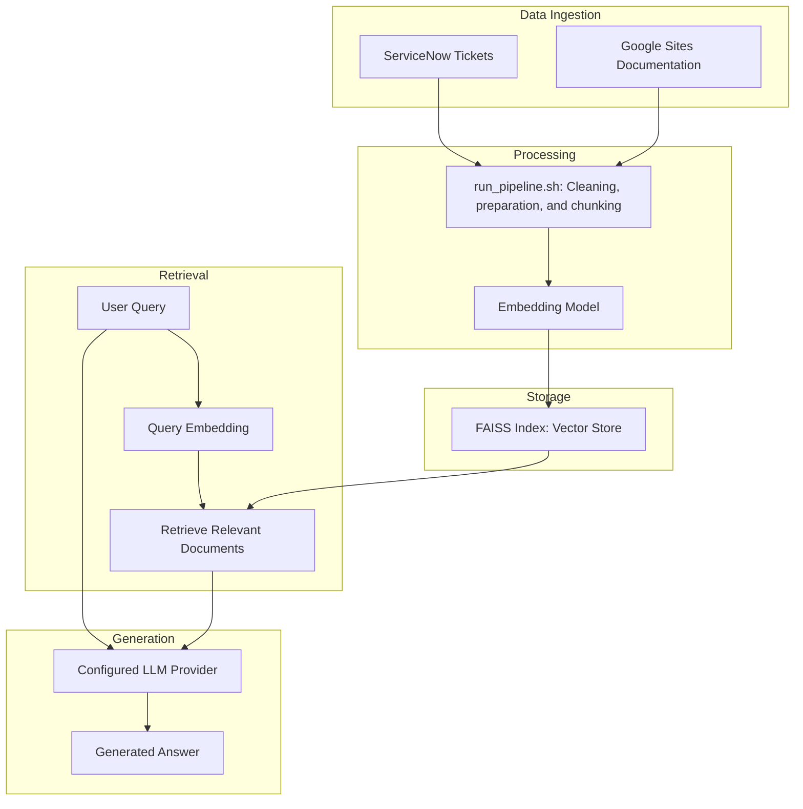
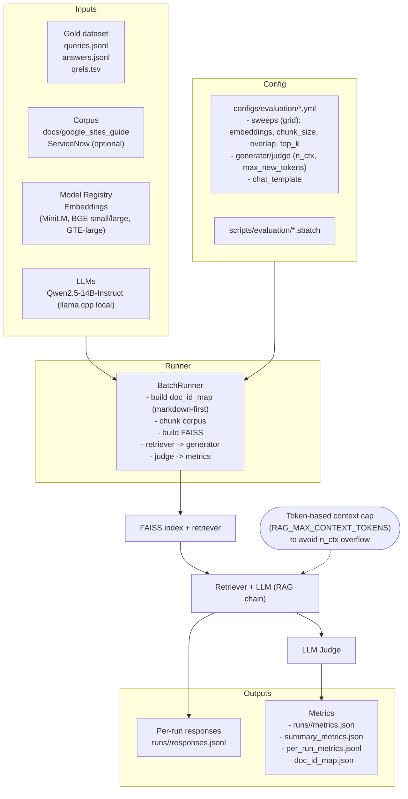
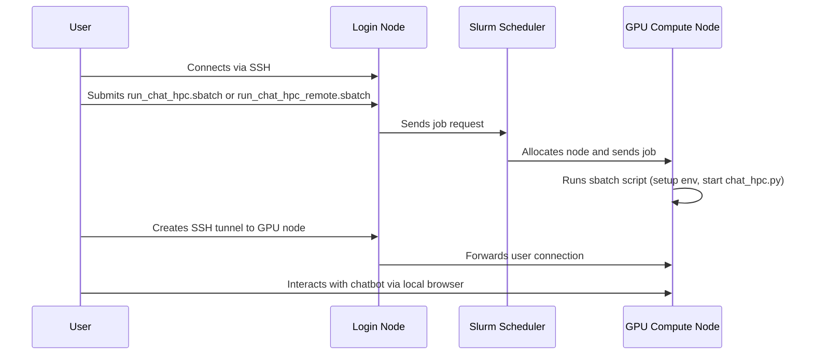

# RAG System for OARC Documentation

This project implements a Retrieval-Augmented Generation (RAG) system to answer questions about the
Amarel cluster from OARC, Slurm, and prepared ServiceNow-derived sources. The canonical current
architecture guide is [`project_docs/ARCHITECTURE.md`](project_docs/ARCHITECTURE.md).

## RAG Architecture Flowchart

This flowchart shows the main data and runtime path. See the architecture guide for the full
gateway, evaluation, telemetry, and script contracts.


```mermaid
graph TD
    subgraph Data Ingestion
        A[ServiceNow Tickets]
        B[Google Sites Documentation]
    end

    subgraph Processing
        C[run_pipeline.sh: Cleaning, preparation, and chunking]
        D[Embedding Model]
    end

    subgraph Storage
        E[FAISS Index: Vector Store]
    end

    subgraph Retrieval
        F[User Query]
        G[Query Embedding]
        H[Retrieve Relevant Documents]
    end

    subgraph Generation
        I[Configured LLM Provider]
        J[Generated Answer]
    end

    A --> C
    B --> C
    C --> D
    D --> E
    F --> G
    G --> H
    E --> H
    H --> I
    F --> I
    I --> J
```

### HPC Installation Notes

If you encounter OS-related errors during the installation of `llama-cpp-python` (such as GLIBC incompatibility), you may need to install it from source. The [`env_check/build_llama_cpp.sbatch`](env_check/build_llama_cpp.sbatch) script provides an example of how to do this.

The specific package requirements for the HPC environment are defined in [`requirements_hpc.txt`](requirements_hpc.txt) and [`constraints_hpc.txt`](constraints_hpc.txt). A complete list of the exact environment libraries can be found in [`env_check/oarc-ai-rag-test.sanitized.yml`](env_check/oarc-ai-rag-test.sanitized.yml).

Use `scripts/deployment/hpc/run_chat_hpc.sbatch` for local `llama_cpp` inference on the allocated
node. Use `scripts/deployment/hpc/run_chat_hpc_remote.sbatch` when the chat UI should call a hosted
HTTP backend such as vLLM. Hosted vLLM deployments can now be launched and discovered directly from
this repo via:

- `scripts/deployment/hpc/submit_vllm_serve.sh`
- `scripts/deployment/hpc/check_vllm_status.sh`
- `scripts/deployment/hpc/stop_vllm_serve.sh`

The hosted workflow resolves `VLLM_BASE_URL`, `VLLM_HEALTH_URL`, and `VLLM_MODEL` from explicit
environment variables first, then from `VLLM_ENDPOINT_DIR/vllm-endpoint.json` when present.

## Architecture

The system is built with Python, LangChain, FastAPI, FAISS/Qdrant, and pluggable LLM providers
including local `llama_cpp`, Hugging Face endpoints, vLLM, and SGLang. The canonical architecture
guide is [`project_docs/ARCHITECTURE.md`](project_docs/ARCHITECTURE.md). The older
[`architecture/architecture.md`](architecture/architecture.md) path is kept only as a compatibility
pointer.

## RAG Evaluation Test Suite

The evaluation “test suite” (aka Evaluation Agent) runs smoke and full bake‑off jobs on the GPU partition to compare embeddings and measure retrieval/generation quality. The diagram below is also available at `architecture/rag_test_suite.md`.


```mermaid
flowchart TB
  subgraph Inputs
    A["Gold dataset<br/>queries.jsonl<br/>answers.jsonl<br/>qrels.tsv"]
    B["Corpus<br/>docs/google_sites_guide<br/>ServiceNow (optional)"]
    C["Model Registry<br/>Embeddings<br/>(MiniLM, BGE small/large, GTE-large)"]
    D["LLMs<br/>Qwen2.5‑14B‑Instruct (llama.cpp local)"]
  end

  subgraph Config
    E1["configs/evaluation/*.yml<br/>- sweeps (grid): embeddings, chunk_size, overlap, top_k<br/>- generator/judge (n_ctx, max_new_tokens)<br/>- chat_template"]
    E2["scripts/evaluation/*.sbatch"]
  end

  Inputs --> BR
  Config --> BR

  subgraph Runner
    BR["BatchRunner<br/>- build doc_id_map (markdown-first)<br/>- chunk corpus<br/>- build FAISS<br/>- retriever -> generator<br/>- judge -> metrics"]
  end

  BR --> VS["FAISS index + retriever"]
  VS --> RAG["Retriever + LLM (RAG chain)"]
  RAG --> J["LLM Judge"]
  RAG --> RES
  J --> MET

  subgraph Outputs
    RES["Per-run responses<br/>runs/<run_id>/responses.jsonl"]
    MET["Metrics<br/>- runs/<run_id>/metrics.json<br/>- summary_metrics.json<br/>- per_run_metrics.jsonl<br/>- doc_id_map.json"]
  end

  NC(["Token-based context cap<br/>(RAG_MAX_CONTEXT_TOKENS)<br/>to avoid n_ctx overflow"])
  NC -.-> RAG
```

- Smoke run: `sbatch scripts/evaluation/run_evaluation_smoke.sbatch --config configs/evaluation/embedding_bakeoff_smoke.yml`
- Full sweep: `sbatch scripts/evaluation/run_evaluation.sbatch --config configs/evaluation/embedding_bakeoff.yml`
- Results: `results/embedding_bakeoff*/{summary_metrics.json,per_run_metrics.jsonl,runs/*}`; mapping: `doc_id_map.json`
- Tuning knobs:
  - Retrieval: `sweeps.chunk_size`, `sweeps.chunk_overlap`, `sweeps.top_k`
  - LLM: `frozen.generator.{n_ctx,max_new_tokens}`; optional `n_ctx_margin`
  - Safety: override context cap via `RAG_MAX_CONTEXT_TOKENS` (tokens) or `RAG_MAX_CONTEXT_CHARS`

What “sweeps” means

- The `sweeps` section in the YAML defines a grid of runs:
  - `embedding_models`: which embeddings to test (e.g., MiniLM, BGE small/large, GTE-large)
  - `chunk_size`, `chunk_overlap`: splitter params
  - `top_k`: retriever depth
- The runner executes every combination and writes per‑run metrics and a summary selecting the best run.

LLMs used

- Generator/Judge: `Qwen2.5‑14B‑Instruct` via local `llama.cpp` (no HF endpoint in this setup).

Future tasks

- Add LLM sweeps from the model registry (Qwen‑32B, Mixtral‑8x7B‑IT, gpt‑oss‑20b, Llama‑3) for generator and/or judge; mind GPU memory.
- Bring ServiceNow into evaluation after stronger preprocessing (strip quoted threads/footers, dedup), smaller chunks, `source_kind` metadata, and SN‑aware qrels; provide markdown‑only and mixed‑corpus tracks.
- Reproducibility and controls: optional frozen `doc_id_map` in YAML; expose a `max_context_tokens` knob in config; persist seeds and deterministic loaders.
- Results/observability: export raw vs deduped retrieved IDs; add summary tables and optional CI checks; include GPU/throughput telemetry in logs.

## Configuration

The project's settings are centralized in the [`src/rag/config.py`](src/rag/config.py) file. This file defines key parameters such as data paths, model names, and vector store configurations.

Many of these settings can be overridden by environment variables (e.g., `QDRANT_HOST`, `HUGGINGFACE_API_TOKEN`), which are loaded at runtime using `python-dotenv`. This allows for flexible configuration without modifying the source code, which is particularly useful for switching between local and HPC environments.

### Optional Slurm 23.02.7 corpus

The repository now includes a versioned Slurm corpus under `docs/slurm-23.02.7`.

- Runtime: set `DATA_PATH=docs/slurm-23.02.7/markdown`
- Evaluation: set `dataset.document_source.markdown_dir: "docs/slurm-23.02.7/markdown"`
- Default behavior is unchanged; the app still uses `docs/google_sites_guide` unless you opt in.

### Optional Research Pro HPC sources

Research Pro source recommendations are configured under
`configs/rag_sources/hpc_research_pro_sources.json`. They are not fetched or indexed by default.
The first-pass group is `hpc_additional_docs_first_pass`.

Dry-run the first-pass group:

```bash
python scripts/rag/import_hpc_sources.py \
  --manifest configs/rag_sources/hpc_research_pro_sources.json \
  --group hpc_additional_docs_first_pass \
  --dry-run
```

After license/manual review, explicitly import reviewed sources:

```bash
python scripts/rag/import_hpc_sources.py \
  --manifest configs/rag_sources/hpc_research_pro_sources.json \
  --group hpc_additional_docs_first_pass \
  --ingest \
  --allow-license-pending
```

Reports are written under `logs/rag_source_imports/<run-id>/`. Imported Markdown goes under
`docs/corpus/staging/hpc_additional_docs_first_pass` unless `--output-dir` is provided.

To build an index that includes local, Slurm, and reviewed first-pass imports, use an
`os.pathsep`-separated `DATA_PATH`:

```bash
DATA_PATH="docs/google_sites_guide:docs/slurm-23.02.7/markdown:docs/corpus/staging/hpc_additional_docs_first_pass" \
  python scripts/rag/create_vector_store.py --vector-store faiss --persist-dir vector_index/faiss_amarel
```

Authority order is enforced in metadata and retrieval post-processing: the local OARC guide wins for
Amarel-specific facts, Slurm docs win for scheduler syntax and behavior, official upstream/vendor
docs win for general tool behavior, and external HPC-center docs are examples/troubleshooting only.
External HPC chunks with local-looking paths, queues, modules, support contacts, or policies are
tagged `cluster_specific=true` and `example_only=true`.

### Choosing an LLM provider

The runtime now supports four LLM providers:

- `llama_cpp` (default): local llama.cpp binaries.
- `huggingface_api`: Hugging Face Inference endpoints.
- `vllm` / `vllm_api`: GPU-backed vLLM servers exposing the OpenAI-compatible API.
- `sglang` / `sglang_api`: SGLang servers exposing the OpenAI-compatible API.

Provider settings are read from environment variables or `.env`. Each HTTP provider can be tuned
without code changes:

```
VLLM_BASE_URL=http://127.0.0.1:8000
VLLM_MODEL=meta-llama/Llama-3-8B-Instruct
VLLM_TIMEOUT=45
VLLM_MAX_RETRIES=5
VLLM_HEALTH_URL=http://127.0.0.1:8000/health
VLLM_ENDPOINT_DIR=/shared/path/to/vllm-endpoints
VLLM_TEMPERATURE=0.0

SGLANG_BASE_URL=http://127.0.0.1:30000
SGLANG_MODEL=deepseek-ai/DeepSeek-V2.5
SGLANG_TIMEOUT=45
SGLANG_HEALTH_PORT=30001
SGLANG_TOP_P=0.95
```

All provider invocations hash prompts in logs and persist sanitized startup arguments to
`logs/provider_configs/` for reproducibility. API tokens (`HUGGINGFACE_API_TOKEN`, `VLLM_API_KEY`,
`SGLANG_API_KEY`) are automatically redacted from log output.

### Installing optional extras

With the new `pyproject.toml` you can install extras directly:

- `pip install -e .` – base dependencies (llama.cpp + Hugging Face).
- `pip install -e .[vllm]` – adds the `vllm` GPU runtime.
- `pip install -e .[sglang]` – adds the SGLang runtime.
- `pip install -e .[dev]` – linting and pytest tooling.

Existing `requirements*.txt` files remain available for reproducible HPC environments; they now
include the shared `requests` dependency used by the HTTP providers.

### Hosted vLLM on HPC

The repo can now manage a shared vLLM server lifecycle for HPC use without changing the existing
RAG provider code. The app still talks to vLLM through
`POST {resolved_base_url}/v1/chat/completions`; the new pieces only manage and discover the server.

1. Start the vLLM serve job:

```bash
export VLLM_ENDPOINT_DIR="$PWD/runtime/vllm-endpoints"
scripts/deployment/hpc/submit_vllm_serve.sh \
  --model meta-llama/Llama-3-8B-Instruct \
  --endpoint-dir "$VLLM_ENDPOINT_DIR"
```

2. Check endpoint health and metadata:

```bash
scripts/deployment/hpc/check_vllm_status.sh --endpoint-dir "$VLLM_ENDPOINT_DIR"
```

3. Launch the chat UI against the hosted endpoint:

```bash
sbatch --export=ALL,LLM_PROVIDER=vllm,VLLM_ENDPOINT_DIR="$VLLM_ENDPOINT_DIR" \
  scripts/deployment/hpc/run_chat_hpc_remote.sbatch
```

4. When you are done, stop the shared server:

```bash
scripts/deployment/hpc/stop_vllm_serve.sh --endpoint-dir "$VLLM_ENDPOINT_DIR"
```

See [`docs/hpc-vllm-runbook.md`](docs/hpc-vllm-runbook.md) for the step-by-step HPC runbook.

## Observability & Telemetry

The runtime and evaluation flows now stream sanitized metrics and artifacts to MLflow. By default,
local runs write to `file:mlruns` under the repo root; override the destination with
`MLFLOW_TRACKING_URI` to point at a shared server (e.g., an MLflow instance on the HPC control node).

- `MLFLOW_ENABLED` (default `true`): toggle all MLflow logging.
- `MLFLOW_TRACKING_URI`: set to `file:mlruns` for local dev or to `http://host:5000` for remote
  tracking.
- `MLFLOW_EXPERIMENT_NAME`: logical bucket for both runtime and evaluation runs (defaults to
  `rag-evals`).
- `MLFLOW_RUNTIME_SAMPLE_P`: probability for sampling runtime requests (default `0.1`).
- `MLFLOW_ARTIFACT_TOP_K`: cap on retrieved document identifiers persisted per request (default `5`).
- `TELEMETRY_ENABLED`: enable the background sampler (default `true`).
- `TELEMETRY_INTERVAL_S`: cadence for telemetry snapshots (default `30` seconds).

All prompts are SHA256 hashed before persistence; only the hash and the generated answer are stored.
Evaluation jobs persist `doc_id_map.json`, metrics, and prompt/retriever configs as artifacts. Runtime
invocations log latency, retrieval counts, and (if available) GPU/CPU telemetry captured via
`pynvml`, `nvidia-smi`, or `psutil` (in that order). See
[`project_docs/mlflow_logging_spec.md`](project_docs/mlflow_logging_spec.md) for the complete
parameter/metric schema.

### HPC workflow

1. Point the tracking URI at a reachable MLflow server:
   `export MLFLOW_TRACKING_URI="http://mlflow.internal:5000"`.
2. If the cluster is air-gapped, set `MLFLOW_TRACKING_URI=file:/scratch/$USER/mlruns`, execute the
   job, then `scp -r` the resulting `mlruns/` directory back to a workstation that can upload to the
   shared server (`mlflow artifacts import ...`).
3. Adjust telemetry cadence for long-running evaluations with
   `export TELEMETRY_INTERVAL_S=60` (or higher) to minimise scheduler load.

## Setup and Installation

### 1. Prerequisites

-   Python 3.10
-   `uv` installed on each machine where you work with the repo
-   Docker (Optional, for Qdrant)

### 2. Clone the Repository

```bash
git clone <repository-url>
cd <repository-name>
```

### 3. Set Up the Environment

Use a repo-local virtual environment on each machine or cluster checkout. Do not share one `.venv`
between macOS and Linux.

Primary workflow:

```bash
uv sync
source .venv/bin/activate
```

For HPC runs that need the hosted vLLM stack:

```bash
uv sync --extra dev --extra vllm
source .venv/bin/activate
```

Fallback when `uv` is unavailable:

```bash
python3 -m venv .venv
source .venv/bin/activate
pip install -r requirements.txt
```

`requirements_hpc.txt` and `requirements_mac.txt` remain available as pip-compatible fallback files,
but `pyproject.toml` plus `uv` is the primary setup path.

### 4. Set Up the Hugging Face API Token

Create a `.env` file in the root of the project and add your Hugging Face API token:

```
HUGGINGFACE_API_TOKEN="your-token-here"
```

Then, log in to the Hugging Face Hub:

```bash
huggingface-cli login --token $HUGGINGFACE_API_TOKEN
```

### 5. Start the Qdrant Vector Database (Optional)

This step is only required if you are running the chatbot locally with the Qdrant vector store. The
HPC deployment uses a FAISS vector store, which does not require a separate database server.

Run the Qdrant Docker container:

```bash
docker run -p 6333:6333 qdrant/qdrant```

### 6. Create the Vector Store

The vector store for the HPC deployment is created using a data preparation pipeline that processes the raw data and builds a FAISS index. This entire process is automated and can be run on the HPC cluster by submitting a Slurm job.

To create the vector store, run the following command:

```bash
sbatch scripts/rag/run_pipeline.sbatch
```

This script executes [`scripts/rag/run_pipeline.sh`](scripts/rag/run_pipeline.sh), which handles cleaning the data, preparing it for ingestion, and creating the final FAISS vector store in the `vector_index/faiss_amarel` directory.

## Data Preparation Pipeline
 
The `run_pipeline.sh` script automates the data preparation process, which includes cleaning the data, preparing it for ingestion, and creating the vector store.
 
To run the pipeline, execute the following command:
 
```bash
./scripts/rag/run_pipeline.sh
```
 
## Running the Chatbot

The method for running the chatbot differs depending on whether you are in a local environment
(like a Mac) or on the HPC cluster.

### Running Locally

For local execution, you can run the Streamlit chatbot interface directly. The script accepts
command-line arguments to select the LLM provider and vector store.

-   `--provider`: Choose `llama_cpp`, `huggingface_api`, `vllm`, `vllm_api`, `sglang`, or
    `sglang_api`.
-   `--vector-store`: Choose `qdrant` or `in_memory`.

**Examples:**

**Using the configured default provider and in-memory vector store:**
```bash
streamlit run src/rag/main.py
```

**Using vLLM and Qdrant:**
```bash
streamlit run src/rag/main.py -- --provider vllm --vector-store qdrant
```

**Using local llama.cpp and in-memory FAISS:**
```bash
streamlit run src/rag/main.py -- --provider llama_cpp --vector-store in_memory
```

The app will be available at `http://localhost:8501`.

### Running on the HPC Cluster

Before submitting HPC jobs, create the repo-local virtual environment on the cluster checkout:

```bash
./scripts/deployment/hpc/setup_hpc.sh
```

Then refer to the **HPC Deployment** section for the appropriate `sbatch` entrypoint.

## Deployment

### Deployment on an HPC Cluster

Use one of the following launch paths:

- Preferred OpenAI-compatible RAG gateway:

```bash
sbatch --export=ALL,PROJECT_ROOT=/scratch/$USER/oarc-ai-assistant \
  scripts/deployment/hpc/run_rag_gateway.sbatch
```

- Local `llama_cpp` on the allocated node:

```bash
sbatch scripts/deployment/hpc/run_chat_hpc.sbatch
```

- Hosted vLLM consumed by the chat UI:

```bash
sbatch --export=ALL,LLM_PROVIDER=vllm,VLLM_ENDPOINT_DIR="$VLLM_ENDPOINT_DIR" \
  scripts/deployment/hpc/run_chat_hpc_remote.sbatch
```

The local path runs model inference on the same node as the chat UI. The hosted path keeps the chat
UI separate and calls the shared vLLM REST endpoint discovered from env or
`vllm-endpoint.json`.


```mermaid
sequenceDiagram
    participant User
    participant Login Node
    participant Slurm Scheduler
    participant GPU Compute Node

    User->>Login Node: Connects via SSH
    User->>Login Node: Submits run_chat_hpc.sbatch or run_chat_hpc_remote.sbatch
    Login Node->>Slurm Scheduler: Sends job request
    Slurm Scheduler->>GPU Compute Node: Allocates node and sends job
    GPU Compute Node->>GPU Compute Node: Runs sbatch script (setup env, start chat_hpc.py)
    User->>Login Node: Creates SSH tunnel to GPU node
    Login Node->>GPU Compute Node: Forwards user connection
    User->>GPU Compute Node: Interacts with chatbot via local browser
```

For hosted vLLM, start the serve job first and point the remote chat launcher at
`VLLM_ENDPOINT_DIR` so the app can resolve the published `base_url`, `health_url`, and model.

## Documentation Maintenance

Update architecture docs, test docs, relevant developer docs, and meaningful inline comments when a
significant change alters modules, scripts, tests, fixtures, public APIs, internal abstractions,
data flow, control flow, configuration, environment variables, deployment behavior, testing
strategy, external integrations, invariants, privacy behavior, side effects, or operations.

For project architecture and developer-facing behavior, update
[`project_docs/ARCHITECTURE.md`](project_docs/ARCHITECTURE.md). Keep corpus and supporting runbook
classification in [`docs/README.md`](docs/README.md), and avoid duplicating architecture details in
multiple places.
