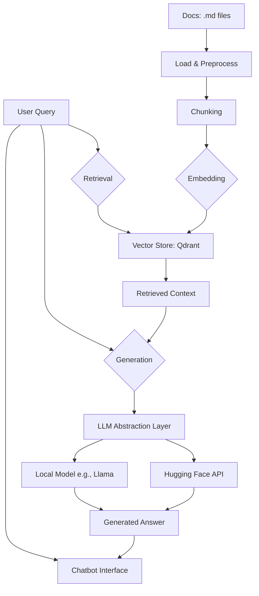

# RAG System Architecture

This document outlines the architecture for a Retrieval-Augmented Generation (RAG) system designed to answer questions based on a knowledge base of Markdown files.

## 1. System Overview

The system will use a RAG pipeline to provide answers to user queries. It will retrieve relevant information from a set of documents, augment the user's query with this context, and then use a Large Language Model (LLM) to generate a final answer. The architecture is designed to be modular, allowing for easy replacement of components, particularly the LLM.

### Workflow Diagram



## 2. System Components

### 2.1. Data Loading & Preprocessing

-   **Data Source:** Markdown (`.md`) files located in the `docs/google_sites_guide/` directory.
-   **Loading:** A `DirectoryLoader` from `langchain` will be used to load all `.md` files from the specified directory.
-   **Parsing:** The loaded documents will be parsed to extract the text content.
-   **Chunking:** The text will be split into smaller, overlapping chunks using a `RecursiveCharacterTextSplitter`. This ensures that semantic context is not lost at chunk boundaries. Chunk size and overlap will be configurable parameters.

### 2.2. Embedding & Vector Storage

-   **Embedding Model:** We will use a sentence-transformer model from Hugging Face (e.g., `all-MiniLM-L6-v2`) via `langchain.embeddings.HuggingFaceEmbeddings` to convert text chunks into dense vector embeddings.
-   **Vector Database:** `Qdrant` will be used as the vector store. It's efficient for similarity searches and can be run locally in-memory or as a separate Docker container for persistence.
-   **Indexing:** During an initial setup phase, all document chunks will be embedded and stored in a Qdrant collection.

### 2.3. Retrieval

-   **Process:** When a user submits a query, the query text is first converted into an embedding using the same model from step 2.2.
-   **Similarity Search:** A similarity search (e.g., cosine similarity) will be performed against the vectors in the Qdrant collection to find the most relevant document chunks.
-   **Output:** The top `k` most relevant chunks will be retrieved to be used as context for the generation step. `k` will be a configurable parameter.

### 2.4. Generation (LLM Integration)

This component is designed with a modular abstraction layer to support different LLMs.

-   **LLM Abstraction Layer:** We will define a simple abstract base class (ABC) or a protocol in Python that specifies the interface for any LLM.

    ```python
    from abc import ABC, abstractmethod

    class LLMProvider(ABC):
        @abstractmethod
        def generate(self, prompt: str) -> str:
            pass
    ```

-   **Prompt Engineering:** A prompt template will be used to combine the user's query and the retrieved context.

    ```
    "Answer the following question based on the provided context. If the context does not contain the answer, state that you don't know.

    Context:
    {retrieved_context}

    Question:
    {user_query}

    Answer:"
    ```

-   **Initial Implementation (Hugging Face API):** The first implementation of the `LLMProvider` will use the `langchain.llms.HuggingFaceHub` to interact with a model hosted on the Hugging Face Hub. This requires an API token.

-   **Future Implementation (Local Model):** A second implementation can be created for a local model like Llama using a library like `llama-cpp-python` or `langchain.llms.LlamaCpp`. Switching between models would only require instantiating a different `LLMProvider` class.

### 2.5. Chatbot Interface

-   **Framework:** A simple web-based chatbot interface will be created using either **Streamlit** or **Gradio**. Both are easy to set up and host locally.
-   **Functionality:**
    -   An input box for the user to type their query.
    -   A "Submit" button.
    -   A display area to show the generated answer.
    -   (Optional) A display of the retrieved source chunks for transparency.

## 3. Technology Stack

-   **Core Logic:** Python
-   **Orchestration:** LangChain
-   **Vector Database:** Qdrant
-   **Embeddings:** Hugging Face Sentence Transformers
-   **LLM (Initial):** Hugging Face Hub (API-based)
-   **Chatbot UI:** Streamlit or Gradio

## 4. Project Structure (Proposed)

```
.
├── architecture/
│   └── architecture.md
├── docs/
│   └── google_sites_guide/
│       ├── ... (md files)
├── src/
│   ├── main.py             # Main script to run the chatbot
│   ├── rag_pipeline.py     # Core RAG logic
│   ├── llm_provider.py     # LLM abstraction and implementations
│   ├── data_loader.py      # Data loading and preprocessing
│   └── config.py           # Configuration variables
└── requirements.txt        # Project dependencies