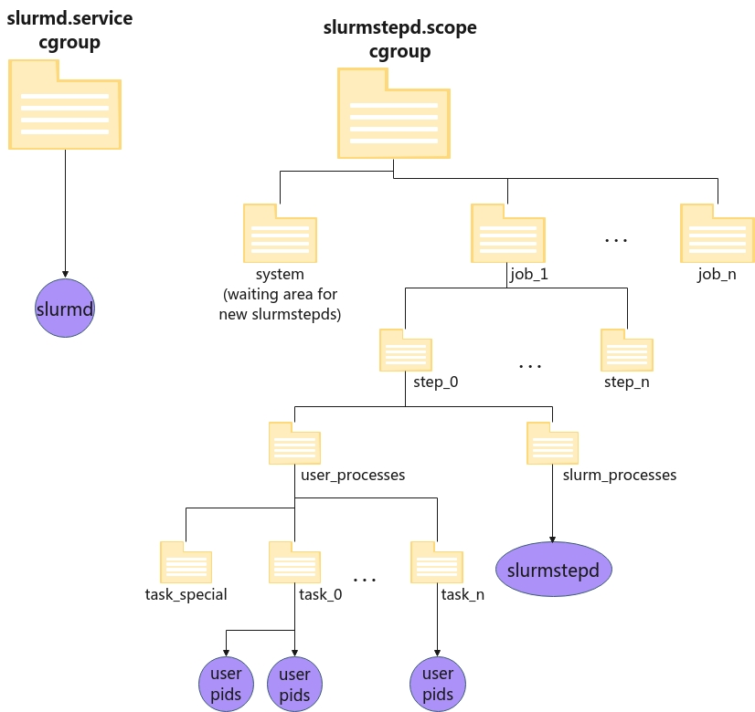

# Control Group v2 plugin

Slurm provides support for systems with Control Group v2.  
Documentation for this cgroup version can be found in kernel.org [Control Cgroup v2
Documentation](https://www.kernel.org/doc/html/latest/admin-guide/cgroup-v2.html).

The *cgroup/v2* plugin is an internal Slurm API used by other plugins, like *proctrack/cgroup*,
*task/cgroup* and *jobacctgather/cgroup*. This document gives an overview of how it is designed,
with the aim of getting a better idea of what is happening on the system when Slurm constrains
resources with this plugin.

Before reading this document we assume you have read the cgroup v2 kernel documentation and you are
familiar with most of the concepts and terminology. It is equally important to read systemd's
[Control Group Interfaces
Documentation](https://www.freedesktop.org/wiki/Software/systemd/ControlGroupInterface) since
*cgroup/v2* needs to interact with systemd and a lot of concepts will overlap. Finally, it is
recommended that you understand the concept of [eBPF technology](https://ebpf.io/what-is-ebpf),
since in cgroup v2 the device cgroup controller is eBPF-based.

## Following cgroup v2 rules

Kernel's Control Group v2 has two particularities that affect how Slurm needs to structure its
internal cgroup tree.

### Top-down Constraint

Resources are distributed top-down to the tree, so a controller is only available on a cgroup
directory if the parent node has it listed in its *cgroup.controllers* file and added to its
*cgroup.subtree_control*. Also, a controller activated in the subtree cannot be disabled if one or
more children has them enabled. For Slurm, this implies that we need to do this kind of management
over our hierarchy by modifying *cgroup.subtree_control* and enabling the required controllers for
the child.

### No Internal Process Constraint

Except for the root cgroup, parent cgroups (really called domain cgroups) can only enable
controllers for their children if they do not have any process at their own level. This means we can
create a subtree inside a cgroup directory, but before writing to *cgroup.subtree_control*, all the
pids listed in the parent's *cgroup.procs* must be migrated to the child. This requires that all
processes must live on the leaves of the tree and so it will not be possible to have pids in
non-leaf directories.

## Following systemd rules

Systemd is currently the most widely used init mechanism. For this reason Slurm needs to find a way
to coexist with the rules of systemd. The designers of systemd have conceived a new rule called the
"single-writer" rule, which implies that every cgroup has one single owner and nobody else should
write to it. Read more about this in [systemd.io Cgroup Delegation
Documentation](https://systemd.io/CGROUP_DELEGATION). In practice this means that the systemd
daemon, started when the kernel boots and which takes pid 1, will consider itself the absolute owner
and single writer of the entire cgroup tree. This means that systemd expects that no other process
should be modifying any cgroup directly, nor should another process be creating directories or
moving pids around, without systemd being aware of it.

There's one method that allows Slurm to work without issues, which is to start Slurm daemons in a
systemd *Unit* with the special systemd option *Delegate=yes*. Starting slurmd within a systemd
Unit, will give Slurm a "delegated" cgroup subtree in the filesystem where it will be able to create
directories, move pids, and manage its own hierarchy. In practice, what happens is that systemd
registers a new *Unit* in its internal database and relates the cgroup directory to it. Then for any
future "intrusive" actions of the cgroup tree, systemd will effectively ignore the "delegated"
directories.

This is similar to what happened in cgroup v1, since this is not a kernel rule, but a systemd rule.
But this fact combined with the new cgroup v2 rules, forces Slurm to choose a design which coexists
with both.

### The real problem: systemd + restarting slurmd

When designing the cgroup/v2 plugin for Slurm, the initial idea was to let slurmd setup the required
hierarchy in its own cgroup directory. Then it would place jobs and steps and move newer forked
slurmstepds into the corresponding directories.

This worked fine, until we needed to restart slurmd. Since the hierarchy was already created, the
slurmd restart just terminated the slurmd process and then started a new one, but then it would try
to put the new process directly in the root of the specific group tree. Since this directory was now
a domain controller and not a leaf anymore, systemd would fail to start the daemon.

Lacking any mechanism in systemd to tackle this situation, this left us with no other choice but to
separate slurmd and forked slurmstepds into separate subtree directories. Because of the design rule
of systemd about being the single-writer on the tree, it was not possible to just do a "mkdir" from
slurmd or the slurmstepd itself and then move the stepd process into a new and separate directory,
that would mean this directory was not controlled by systemd and would cause problems.

The only way that a "mkdir" could work was if it was done inside a "delegated" cgroup subtree, so we
needed to find a way to find a Unit with "Delegate=yes", different from the slurmd one, which would
guarantee our independence. So, we really needed to start a new unit for user jobs.

Actually, in systemd there are two types of Units that can get the "Delegate=yes" parameter and that
are directly related to a cgroup directory. One is a "Service" and the other is a "Scope". We are
interested the "scope":

- **A Systemd Scope:** systemd takes a pid as an argument, creates a cgroup directory and then adds
  the provided pid to the directory. The scope will remain until this pid is gone.

Because we wanted to keep the systemd scope for any pid, we needed to call a specific function named
"abandonScope" in systemd's dbus interface. Abandoning a scope makes it so that the scope will
continue to be alive while there's a living pid in its cgroup tree, not just the initial pid.

It is worth noting that a discussion with main systemd developers raised the *RemainAfterExit*
systemd parameter. This parameter is intended to keep the unit alive even if all the processes on it
are gone. This option is only valid for "Services" and not for "Scopes". This would be a very
interesting option to have if it was included also for Scopes. They stated that its functionality
could be extended to not only keep the unit, but to also keep the cgroup directories until the unit
was manually terminated. Currently, the unit remains alive but the cgroup is cleaned anyway.

With all this background, we're ready to show which solution was used to make Slurm get away from
the problem of the slurmd restart.

- Create a new Scope on slurmd startup for hosting new slurmstepd processes. It does one single call
  at the **first** slurmd startup. Slurmd prepares a scope for future slurmstepd pids, and the stepd
  itself moves itself there when starting. This comes without any performance issue, and
  conceptually is just like a slower "mkdir" + informing systemd from slurmd only at the first
  startup. Moving processes from one delegated unit to another delegated unit was approved by
  systemd developers. The only downside is that the scope needs processes inside or it will
  terminate and cleanup the cgroup, so slurmd needed to create a "sleep" infinity process, which we
  encoded into the "slurmstepd infinity" process, which will live forever in the scope. In the
  future, if the *RemainAfterExit* parameter is extended to scopes and allows the cgroup tree to not
  be destroyed, the need for this infinity process would be eliminated.

Finally we ended up with separating slurmd from slurmstepds, using a scope with "Delegate=yes"
option.

### Consequences of not following systemd rules

There is a known issue where systemd can decide to cleanup the cgroup hierarchy with the intention
of making it match with its internal database. For example, if there are no units in the system with
"Delegate=yes", it will go through the tree and possibly deactivate all the controllers which it
thinks are not in use. In our testing we stopped all our units with "Delegate=yes", issued a
"systemd reload" or a "systemd reset-failed" and witnessed how the *cpuset* controller disappeared
from our "manually" created directories deep in the cgroup tree. There are other situations, and the
fact that systemd developers and documentation claim that they are the unique single-writer to the
tree, made SchedMD decide to be on the safe side and have Slurm coexist with systemd.

It is worth noting that we added *IgnoreSystemd* and *IgnoreSystemdOnFailure* as cgroup.conf
parameters which will avoid any contact with systemd, and will just use a regular "mkdir" to create
the same directory structures. These parameters are for development and testing purposes only.

### What happens with Linux distros without systemd?

Slurm does not support them, but they can still work. The only requirements are to have libdbus,
ebpf and systemd packages installed in the system to compile slurm. Then you can set the
*IgnoreSystemd* parameter in cgroup.conf to manually create the */sys/fs/cgroup/system.slice/*
directory. With these requirements met, Slurm should work normally.

## cgroup/v2 overview

We will explain briefly this plugin's workflow.

### slurmd startup

Fresh system: slurmd is started. Some plugins (proctrack, jobacctgather or task) which use cgroup,
call init() function of cgroup/v2 plugin. What happens immediately is that slurmd does a call to
dbus using libdbus, and creates a new systemd "Scope". The scope name is predefined and set
depending on an internal constant SYSTEM_CGSCOPE under SYSTEM_CGSLICE. It basically ends up with the
name "slurmstepd.scope" or "nodename_slurmstepd.scope" depending on whether Slurm is compiled with
*--enable-multiple-slurmd* (prefixes node name) or not. The cgroup directory associated with this
scope will be fixed as: "/sys/fs/cgroup/system.slice/slurmstepd.scope" or
"/sys/fs/cgroup/system.slice/nodename_slurmstepd.scope".

The scope is also "abandoned" calling the dbus method of "abandonScope" with the purpose explained
[previously](#real_sysd_prob) on this page.

Since the call to dbus "startTransientUnit" requires a pid as a parameter, slurmd needs to fork a
"slurmstepd infinity" and use this parameter as the argument.

The call to dbus is asynchronous, so slurmd delivers the message to the Dbus bus and then starts an
active wait, waiting for the scope directory to show up. If the directory doesn't show up within a
hard-coded timeout, it fails. Otherwise it continues and slurmd then creates a directory for new
slurmstepds and for the infinity pid in the recently created scope directory, called "system". It
moves the infinity process into there and then enables all the required controllers in the new
cgroup directories.

As this is a regular systemd Unit, the scope will show up in "systemctl list-unit-files" and other
systemd commands, for example:

    ]$ systemctl cat gamba1_slurmstepd.scope
    # /run/systemd/transient/gamba1_slurmstepd.scope
    # This is a transient unit file, created programmatically via the systemd API. Do not edit.
    [Scope]
    Delegate=yes
    TasksMax=infinity

    ]$ systemctl list-unit-files gamba1_slurmstepd.scope
    UNIT FILE               STATE     VENDOR PRESET
    gamba1_slurmstepd.scope transient -

    1 unit files listed.

    ]$ systemctl status gamba1_slurmstepd.scope
    ● gamba1_slurmstepd.scope
         Loaded: loaded (/run/systemd/transient/gamba1_slurmstepd.scope; transient)
      Transient: yes
         Active: active (abandoned) since Wed 2022-04-06 14:17:46 CEST; 2h 47min ago
          Tasks: 1
         Memory: 1.6M
            CPU: 258ms
         CGroup: /system.slice/gamba1_slurmstepd.scope
                 └─system
                   └─113094 /home/lipi/slurm/master/inst/sbin/slurmstepd infinity

    apr 06 14:17:46 llit systemd[1]: Started gamba1_slurmstepd.scope.

Another action of slurmd init will be to detect which controllers are available in the system (in
/sys/fs/cgroup), and recursively enable the needed ones until reaching its level. It will enable
them for the recently created slurmstepd scope.

    ]$ cat /sys/fs/cgroup/system.slice/gamba1_slurmstepd.scope/cgroup.controllers
    cpuset cpu io memory pids

    ]$ cat /sys/fs/cgroup/system.slice/gamba1_slurmstepd.scope/cgroup.subtree_control
    cpuset cpu memory

If resource specialization is enabled, slurmd will set its memory and/or cpu constraints at its own
level too.

### slurmd restart

Slurmd restarts as usual. When restarted, it will detect if the "scope" directory already exists,
and will do nothing if it does. Otherwise it will try to setup the scope again.

### slurmstepd start

When a new step needs to be created, whether part of a new job or as part of an existing job, slurmd
will fork the slurmstepd process in its own cgroup directory. Instantly slurmstepd will start
initializing and (if cgroup plugins are enabled) it will infer the scope directory and will move
itself into the "waiting" area, which is the
*/sys/fs/cgroup/system.slice/slurmstepd_nodename.scope/system* directory. Immediately it will
initialize the job and step cgroup directories and will move itself into them, setting the
subtree_controllers as required.

### Termination and cleanup

When a job ends, slurmstepd will take care of removing all the created directories. The
slurmstepd.scope directory will **never** be removed or stopped by Slurm, and the "slurmstepd
infinity" process will never be killed by Slurm.

When slurmd ends (since on supported systems it has been started by systemd) its cgroup will just be
cleaned up by systemd.

### Hierarchy overview

Hierarchy will take this form:   
Figure 1. Slurm cgroup v2 hierarchy.

On the left side we have the slurmd service, started with systemd and living alone in its own
delegated cgroup.

On the right side we see the slurmstepd scope, a directory in the cgroup tree also delegated where
all slurmstepd and user jobs will reside. The slurmstepd is migrated initially in the waiting area
for new stepds, *system* directory, and immediately, when it initializes the job hierarchy, it will
move itself into the corresponding *job_x/step_y/slurm_processes* directory.

User processes will be spawned by slurmstepd and moved into the appropriate task directory.

At this point it should be possible to check which processes are running in a slurmstepd scope by
issuing this command:

    ]$ systemctl status slurmstepd.scope
    ● slurmstepd.scope
         Loaded: loaded (/run/systemd/transient/slurmstepd.scope; transient)
      Transient: yes
         Active: active (abandoned) since Wed 2022-04-06 14:17:46 CEST; 2min 47s ago
          Tasks: 24
         Memory: 18.7M
            CPU: 141ms
         CGroup: /system.slice/slurmstepd.scope
                 ├─job_3385
                 │ ├─step_0
                 │ │ ├─slurm
                 │ │ │ └─113630 slurmstepd: [3385.0]
                 │ │ └─user
                 │ │   └─task_0
                 │ │     └─113635 /usr/bin/sleep 123
                 │ ├─step_extern
                 │ │ ├─slurm
                 │ │ │ └─113565 slurmstepd: [3385.extern]
                 │ │ └─user
                 │ │   └─task_0
                 │ │     └─113569 sleep 100000000
                 │ └─step_interactive
                 │   ├─slurm
                 │   │ └─113584 slurmstepd: [3385.interactive]
                 │   └─user
                 │     └─task_0
                 │       ├─113590 /bin/bash
                 │       ├─113620 srun sleep 123
                 │       └─113623 srun sleep 123
                 └─system
                   └─113094 /home/lipi/slurm/master/inst/sbin/slurmstepd infinity

**NOTE**: If running on a development system with *--enable-multiple-slurmd*, the slurmstepd.scope
will have the nodename prepended to it.

## Working at the task level

There is a directory called *task_special* in the user job hierarchy. The *jobacctgather/cgroup* and
*task/cgroup* plugins respectively get statistics and constrain resources at the task level. Other
plugins like *proctrack/cgroup* just work at the step level. To unify the hierarchy and make it work
for all different plugins, when a plugin asks to add a pid to a step but not to a task, the pid will
be put into a special directory called *task_special*. If another plugin adds this pid to a task, it
will be migrated from there. Normally this happens with the proctrack plugin when a call is done to
add a pid to a step with *proctrack_g_add_pid*.

## The eBPF based devices controller

In Control Group v2, the devices controller interfaces has been removed. Instead of controlling it
through files, now it is required to create a bpf program of type BPF_PROG_TYPE_CGROUP_DEVICE and
attach it to the desired cgroup. This program is created by slurmstepd dynamically and inserted into
the kernel with a bpf syscall, and describes which devices are allowed or denied for the job, step
and task.

The only devices that are managed are the ones described in the gres.conf file.

The insertion and removal of such programs will be logged in the system log:

    apr 06 17:20:14 node1 audit: BPF prog-id=564 op=LOAD
    apr 06 17:20:14 node1 audit: BPF prog-id=565 op=LOAD
    apr 06 17:20:14 node1 audit: BPF prog-id=566 op=LOAD
    apr 06 17:20:14 node1 audit: BPF prog-id=567 op=LOAD
    apr 06 17:20:14 node1 audit: BPF prog-id=564 op=UNLOAD
    apr 06 17:20:14 node1 audit: BPF prog-id=567 op=UNLOAD
    apr 06 17:20:14 node1 audit: BPF prog-id=566 op=UNLOAD
    apr 06 17:20:14 node1 audit: BPF prog-id=565 op=UNLOAD

## Running different nodes with different cgroup versions

The cgroup version to be used is entirely dependent on the node. Because of this, it is possible to
run the same job on different nodes with different cgroup plugins. The configuration is done per
node in cgroup.conf.

What can not be done is to swap the version of cgroup plugin in cgroup.conf without rebooting and
configuring the node. Since we do not support "hybrid" systems with mixed controller versions, a
node must be booted with one specific cgroup version.

## Configuration

In terms of configuration, setup does not differ much from the previous *cgroup/v1* plugin, but the
following considerations must be taken into account when configuring the cgroup plugin in
*cgroup.conf*:

### Cgroup Plugin

This option allows the sysadmin to specify which cgroup version will be run on the node. It is
recommended to use *autodetect* and forget about it, but this can be forced to the plugin version
too.

**CgroupPlugin=\[autodetect\|cgroup/v1\|cgroup/v2\]**

### Developer options

- **IgnoreSystemd=\[yes\|no\]**: This option is used to avoid any call to dbus for contacting
  systemd. Instead of requesting the creation of a new scope when slurmd starts up, it will only use
  "mkdir" to prepare the cgroup directories for the slurmstepds. Use of this option in production
  systems with systemd is not supported for the reasons mentioned [above](#consequences_nosysd).
  This option can be useful for systems without systemd though.
- **IgnoreSystemdOnFailure=\[yes\|no\]**: This option will fallback to manual mode for creating the
  cgroup directories without creating a systemd "scope". This is only if a call to dbus returned an
  error, as it would be with **IgnoreSystemd**.
- **CgroupAutomount=\[yes\|no\]**: This option is only used when **IgnoreSystemd** is set. If both
  are set slurmd will check all the available controllers in */sys/fs/cgroup* and will enable them
  recursively until it reaches the slurmd level. This will imply that the manually created
  slurmstepd directories will also have these controllers set.
- **CgroupMountPoint=/path/to/mount/point**: In most cases with cgroup v2, this parameter should not
  be used because */sys/fs/cgroup* will be the only cgroup directory.

### Ignored parameters

Since Cgroup v2 doesn't provide the Kmem\* or swappiness interfaces anymore in the memory
controller, the following parameters in cgroup.conf will be ignored:

    AllowedKmemSpace=
    MemorySwappiness=
    MaxKmemPercent=
    MinKmemSpace=

## Requirements

For building *cgroup/v2* there are two required libraries checked at configure time. Look at your
config.log when configuring to see if they were correctly detected on your system.

|  |  |  |  |  |
|----|----|----|----|----|
| <u>**Library**</u> | <u>**Header file**</u> | <u>**Package provides**</u> | <u>**Configure option**</u> | <u>**Purpose**</u> |
| eBPF | include/linux/bpf.h | kernel-headers | --with-bpf= | Constrain devices to a job/step/task |
| dBus | dbus-1.0/dbus/dbus.h | dbus-devel | n/a | dBus API for contacting systemd |

  

**NOTE**: In systems without systemd, these libraries are also needed to compile Slurm. If some
other requirement exists, like not including the dbus or systemd package requirement, the configure
files would have to be modified.

## PAM Slurm Adopt plugin on cgroup v2

The [pam_slurm_adopt plugin](pam_slurm_adopt.md) has a dependency with the API of *cgroup/v1*
because in some situations it relied on the job's cgroup creation time for choosing which job id
should be picked to add your sshd pid into. With v2 we wanted to remove this dependency and not rely
on the cgroup filesystem, but simply on the job id. This won't guarantee that the sshd session is
inserted into the youngest job, but will guarantee it will be put into the largest job id. Thanks to
this we removed the dependency of the plugin against the specific cgroup hierarchy.

Last modified 16 June 2022
