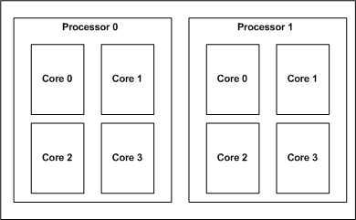
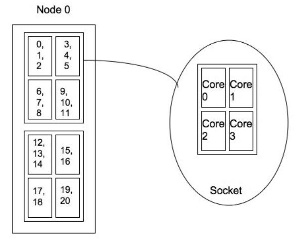

# Plane distribution: *-m plane=plane_size*

The plane distribution allocates tasks in blocks of size *plane_size* in a round-robin fashion
across allocated nodes.

To specify the plane distribution add to the srun command line *--distribution=plane=plane_size* or
*-m plane=plane_size* where *plane_size* is the requested plane/block size.

## Examples of plane distributions

In the examples below we assume we have 21 tasks and that the task list is: 0, 1, 2, 3, 4, ..., 19,
20.

On <u>one (1)</u> node: *srun -N 1-1 -n 21 -m plane=4 \<...\>*.

Even though the user specified a *plane_size* of 4 the final plane distribution results in a
*plane_size* of 21, since all the tasks landed on one node.

Figure 1: Process layout for *srun -N 1-1 -n 21 -m plane=4 \<...\>*

  

On <u>four (4)</u> nodes: *srun -N 4-4 -n 21 -m plane=4 \<...\>*.

The plane distribution with a *plane_size* of 4 results in the following allocation of the task ids:

Figure 2: Process layout for *srun -N 4-4 -n 21 -m plane=4 \<...\>*

  

On <u>four (4)</u> nodes: *srun -N 4-4 -n 21 -m plane=2 \<...\>* .

The plane distribution with a *plane_size* of 2 results in the following allocation of the task ids:

Figure 3: Process layout for *srun -N 4-4 -n 21 -m plane=2 \<...\>*

## Plane distribution and task affinity

The concept behind this distribution is to divide the clusters into planes. Each plane includes a
number of the lowest level of logical processors (CPU, cores, threads depending on the architecture)
on each node. We then schedule within each plane first and then across planes.

We ensure that the processes are located correctly by setting the process affinity to the
specified/appropriate logical processor. Process affinity is available in Slurm when the
task/affinity plug-in is enabled.

On a dual-processor node with quad-core processors (see figure 4) the plane distribution results in:

- One plane if the *plane_size=8*. In this case the processors are scheduled by first filling up the
  nodes and then scheduled across the nodes.
- Eight planes if the *plane_size=1*. In this case we would always schedule across the node first.

Figure 4: Quad-core dual-processor system

  

In a multi-core/hyper-threaded environment, two planes would provide better locality but potentially
more contention for other resources.

On the other hand, four planes (scheduling across processors) would minimize contention for cache
and memory.

## Examples of plane distributions with process affinity enabled

In the examples below we assume we have 21 tasks and that the task list is: 0, 1, 2, 3, 4, ..., 19,
20.

On <u>one (1)</u> node: *srun -N 1-1 -n 21 -m plane=4 --cpu-bind=core \<...\>*. Even though the user
specified a *plane_size* of 4 the final plane distribution results in a plane distribution with
*plane_size=8*.

Figure 5: Process layout for *srun -N 1-1 -n 21 -m plane=4 --cpu-bind=core \<...\>*.

  

On <u>four (4)</u> nodes: *srun -N 4-4 -n 21 -m plane=4 --cpu-bind=core \<...\>*. The plane
distribution with a *plane_size* of 4 results in the following allocation of the task ids:

Figure 6: Process layout for *srun -N 4-4 -n 21 -m plane=4 --cpu-bind=core \<...\>*.

  

On <u>four (4)</u> nodes: *srun -N 4-4 -n 21 -m plane=2 --cpu-bind=core \<...\>* . The plane
distribution with a *plane_size* of 2 results in the following allocation of the task ids:

Figure 7: Process layout for *srun -N 4-4 -n 21 -m plane=2 --cpu-bind=core \<...\>*.

  

Last modified 22 April 2021
