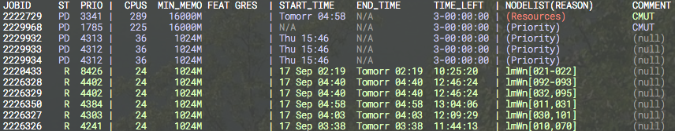

# Frequently Asked Questions

## For Management

- [Why should I use Slurm or other Free Open Source Software (FOSS)?](#foss)
- [What does "Slurm" stand for?](#acronym)

## For Researchers

- [How should I cite work involving Slurm?](#cite)

## For Users

- [Why is my job/node in a COMPLETING state?](#comp)
- [Why are my resource limits not propagated?](#rlimit)
- [Why is my job not running?](#pending)
- [Why does the srun --overcommit option not permit multiple jobs to run on nodes?](#sharing)
- [Why is my job killed prematurely?](#purge)
- [Why are my srun options ignored?](#opts)
- [Why is the Slurm backfill scheduler not starting my job?](#backfill)
- [How can I run multiple jobs from within a single script?](#steps)
- [How can I run a job within an existing job allocation?](#multi_batch)
- [How does Slurm establish the environment for my job?](#user_env)
- [How can I get shell prompts in interactive mode?](#prompt)
- [How can I get the task ID in the output or error file name for a batch job?](#batch_out)
- [Can the *make* command utilize the resources allocated to a Slurm job?](#parallel_make)
- [Can tasks be launched with a remote (pseudo) terminal?](#terminal)
- [What does "srun: Force Terminated job" indicate?](#force)
- [What does this mean: "srun: First task exited 30s ago" followed by "srun Job
  Failed"?](#early_exit)
- [Why is my MPI job failing due to the locked memory (memlock) limit being too low?](#memlock)
- [Why is my batch job that launches no job steps being killed?](#inactive)
- [How do I run specific tasks on certain nodes in my allocation?](#arbitrary)
- [How can I temporarily prevent a job from running (e.g. place it into a *hold* state)?](#hold)
- [Why are jobs not getting the appropriate memory limit?](#mem_limit)
- [Is an archive available of messages posted to the *slurm-users* mailing list?](#mailing_list)
- [Can I change my job's size after it has started running?](#job_size)
- [Why is my MPICH2 or MVAPICH2 job not running with Slurm? Why does the DAKOTA program not run with
  Slurm?](#mpi_symbols)
- [Why does squeue (and "scontrol show jobid") sometimes not display a job's estimated start
  time?](#estimated_start_time)
- [How can I run an Ansys program with Slurm?](#ansys)
- [How can a job in a complete or failed state be requeued?](#req)
- [Slurm documentation refers to CPUs, cores and threads. What exactly is considered a
  CPU?](#cpu_count)
- [What is the difference between the sbatch and srun commands?](#sbatch_srun)
- [Can squeue output be color coded?](#squeue_color)
- [Can Slurm export an X11 display on an allocated compute node?](#x11)
- [Why is the srun --u/--unbuffered option adding a carriage return to my output?](#unbuffered_cr)
- [Why is sview not coloring/highlighting nodes properly?](#sview_colors)

## For Administrators

- [How is job suspend/resume useful?](#suspend)
- [Why is a node shown in state DOWN when the node has registered for service?](#return_to_service)
- [What happens when a node crashes?](#down_node)
- [How can I control the execution of multiple jobs per node?](#multi_job)
- [When the Slurm daemon starts, it prints "cannot resolve X plugin operations" and exits. What does
  this mean?](#inc_plugin)
- [How can I exclude some users from pam_slurm?](#pam_exclude)
- [How can I dry up the workload for a maintenance period?](#maint_time)
- [How can PAM be used to control a user's limits on or access to compute nodes?](#pam)
- [Why are jobs allocated nodes and then unable to initiate programs on some nodes?](#time)
- [Why does *slurmctld* log that some nodes are not responding even if they are not in any
  partition?](#ping)
- [How should I relocate the primary or backup controller?](#controller)
- [Can multiple Slurm systems be run in parallel for testing purposes?](#multi_slurm)
- [Can Slurm emulate a larger cluster?](#multi_slurmd)
- [Can Slurm emulate nodes with more resources than physically exist on the node?](#extra_procs)
- [What does a "credential replayed" error in the *SlurmdLogFile* indicate?](#credential_replayed)
- [What does "Warning: Note very large processing time" in the *SlurmctldLogFile*
  indicate?](#large_time)
- [Is resource limit propagation useful on a homogeneous cluster?](#limit_propagation)
- [Do I need to maintain synchronized clocks on the cluster?](#clock)
- [Why are "Invalid job credential" errors generated?](#cred_invalid)
- [Why are "Task launch failed on node ... Job credential replayed" errors generated?](#cred_replay)
- [Can Slurm be used with Globus?](#globus)
- [What causes the error "Unable to accept new connection: Too many open files"?](#file_limit)
- [Why does the setting of *SlurmdDebug* fail to log job step information at the appropriate
  level?](#slurmd_log)
- [Why aren't pam_slurm.so, auth_none.so, or other components in a Slurm RPM?](#rpm)
- [Why should I use the slurmdbd instead of the regular database plugins?](#slurmdbd)
- [How can I build Slurm with debugging symbols?](#debug)
- [How can I easily preserve drained node information between major Slurm updates?](#state_preserve)
- [Why doesn't the *HealthCheckProgram* execute on DOWN nodes?](#health_check)
- [What is the meaning of the error "Batch JobId=# missing from batch node \<node\> (not found
  BatchStartTime after startup)"?](#batch_lost)
- [What does the message "srun: error: Unable to accept connection: Resources temporarily
  unavailable" indicate?](#accept_again)
- [How could I automatically print a job's Slurm job ID to its standard output?](#task_prolog)
- [Why are user processes and *srun* running even though the job is supposed to be
  completed?](#orphan_procs)
- [How can I prevent the *slurmd* and *slurmstepd* daemons from being killed when a node's memory is
  exhausted?](#slurmd_oom)
- [I see the host of my calling node as 127.0.1.1 instead of the correct IP address. Why is
  that?](#ubuntu)
- [How can I stop Slurm from scheduling jobs?](#stop_sched)
- [Can I update multiple jobs with a single *scontrol* command?](#scontrol_multi_jobs)
- [Can Slurm be used to run jobs on Amazon's EC2?](#amazon_ec2)
- [If a Slurm daemon core dumps, where can I find the core file?](#core_dump)
- [How can TotalView be configured to operate with Slurm?](#totalview)
- [How can a patch file be generated from a Slurm commit in GitHub?](#git_patch)
- [Why are the resource limits set in the database not being enforced?](#enforce_limits)
- [After manually setting a job priority value, how can its priority value be returned to being
  managed by the priority/multifactor plugin?](#restore_priority)
- [Does anyone have an example node health check script for Slurm?](#health_check_example)
- [What process should I follow to add nodes to Slurm?](#add_nodes)
- [What process should I follow to remove nodes from Slurm?](#rem_nodes)
- [Can Slurm be configured to manage licenses?](#licenses)
- [Can the salloc command be configured to launch a shell on a node in the job's
  allocation?](#salloc_default_command)
- [What should I be aware of when upgrading Slurm?](#upgrade)
- [How easy is it to switch from PBS or Torque to Slurm?](#torque)
- [How can I get SSSD to work with Slurm?](#sssd)
- [How critical is configuring high availability for my database?](#ha_db)
- [How can I use double quotes in MySQL queries?](#sql)
- [Why is a compute node down with the reason set to "Node unexpectedly rebooted"?](#reboot)
- [How can a job which has exited with a specific exit code be requeued?](#reqspec)
- [Can a user's account be changed in the database?](#user_account)
- [What might account for MPI performance being below the expected level?](#mpi_perf)
- [How could some jobs submitted immediately before the slurmctld daemon crashed be
  lost?](#state_info)
- [How do I safely remove partitions?](#delete_partition)
- [Why is Slurm unable to set the CPU frequency for jobs?](#cpu_freq)
- [When adding a new cluster, how can the Slurm cluster configuration be copied from an existing
  cluster to the new cluster?](#cluster_acct)
- [How can I update Slurm on a Cray DVS file system without rebooting the nodes?](#cray_dvs)
- [How can I rebuild the database hierarchy?](#dbd_rebuild)
- [Is there anything exceptional to be aware of when upgrading my database server?](#db_upgrade)
- [How can a routing queue be configured?](#routing_queue)
- [How can I suspend, resume, hold or release all of the jobs belonging to a specific user,
  partition, etc?](#squeue_script)
- [I had to change a user's UID and now they cannot submit jobs. How do I get the new UID to take
  effect?](#changed_uid)
- [Slurmdbd is failing to start with a 'Duplicate entry' error in the database. How do I fix
  that?](#mysql_duplicate)
- [Why are applications on my Cray XC system failing with SIGBUS (bus error)?](#cray_sigbus)
- [How do I configure Slurm to work with System V IPC enabled applications?](#sysv_memory)
- [Why is Multi-Instance GPU not working with Slurm and PMIx, and complaining about GPUs being 'In
  use by another client'?](#opencl_pmix)
- [How can I set up a private /tmp and /dev/shm for jobs on my machine?](#tmpfs_jobcontainer)
- [Why am I getting the following error: "Unable to find plugin:
  serializer/json"?](#json_serializer)
- [Why am I being offered an automatic update for Slurm?](#epel)
- [How to convert my nodes to Control Group v2?](#cgroupv2)
- [Is it possible to write to user stdout?](#write_to_job_stdout)

## For Management

**Why should I use Slurm or other Free Open Source Software (FOSS)?**  
Free Open Source Software (FOSS) does not mean that it is without cost. It does mean that the you
have access to the code so that you are free to use it, study it, and/or enhance it. These reasons
contribute to Slurm (and FOSS in general) being subject to active research and development
worldwide, displacing proprietary software in many environments. If the software is large and
complex, like Slurm or the Linux kernel, then while there is no license fee, its use is not without
cost.

If your work is important, you'll want the leading Slurm experts at your disposal to keep your
systems operating at peak efficiency. While Slurm has a global development community incorporating
leading edge technology, [SchedMD](https://www.schedmd.com) personnel have developed most of the
code and can provide competitively priced commercial support. SchedMD works with various
organizations to provide a range of support options ranging from remote level-3 support to 24x7
on-site personnel. Customers switching from commercial workload mangers to Slurm typically report
higher scalability, better performance and lower costs.

**What does "Slurm" stand for?**  
Nothing.

Originally, "SLURM" (completely capitalized) was an acronym for "Simple Linux Utility for Resource
Management". In 2012 the preferred capitalization was changed to Slurm, and the acronym was dropped
— the developers preferred to think of Slurm as "sophisticated" rather than "Simple" by this point.
And, as Slurm continued to expand it's scheduling capabilities, the "Resource Management" label was
also viewed as outdated.

## For Researchers

**How should I cite work involving Slurm?**  

We recommend citing the peer-reviewed paper from JSSPP 2023: [Architecture of the Slurm Workload
Manager.](https://doi.org/10.1007/978-3-031-43943-8_1)

    Jette, M.A., Wickberg, T. (2023). Architecture of the Slurm Workload Manager.
    In: Klusáček, D., Corbalán, J., Rodrigo, G.P. (eds) Job Scheduling Strategies
    for Parallel Processing. JSSPP 2023. Lecture Notes in Computer Science,
    vol 14283. Springer, Cham. https://doi.org/10.1007/978-3-031-43943-8_1

## For Users

**Why is my job/node in a COMPLETING state?**  
When a job is terminating, both the job and its nodes enter the COMPLETING state. As the Slurm
daemon on each node determines that all processes associated with the job have terminated, that node
changes state to IDLE or some other appropriate state for use by other jobs. When every node
allocated to a job has determined that all processes associated with it have terminated, the job
changes state to COMPLETED or some other appropriate state (e.g. FAILED). Normally, this happens
within a second. However, if the job has processes that cannot be terminated with a SIGKILL signal,
the job and one or more nodes can remain in the COMPLETING state for an extended period of time.
This may be indicative of processes hung waiting for a core file to complete I/O or operating system
failure. If this state persists, the system administrator should check for processes associated with
the job that cannot be terminated then use the scontrol command to
change the node's state to DOWN (e.g. "scontrol update NodeName=*name* State=DOWN
Reason=hung_completing"), reboot the node, then reset the node's state to IDLE (e.g. "scontrol
update NodeName=*name* State=RESUME"). Note that setting the node DOWN will terminate all running or
suspended jobs associated with that node. An alternative is to set the node's state to DRAIN until
all jobs associated with it terminate before setting it DOWN and re-booting.

Note that Slurm has two configuration parameters that may be used to automate some of this process.
*UnkillableStepProgram* specifies a program to execute when non-killable processes are identified.
*UnkillableStepTimeout* specifies how long to wait for processes to terminate. See the "man
slurm.conf" for more information about these parameters.

**Why are my resource limits not propagated?**  
When the srun command executes, it captures the resource limits in
effect at submit time on the node where srun executes. These limits are propagated to the allocated
nodes before initiating the user's job. The Slurm daemons running on the allocated nodes then try to
establish identical resource limits for the job being initiated. There are several possible reasons
for not being able to establish those resource limits.

- The hard resource limits applied to Slurm's slurmd daemon are lower than the user's soft resources
  limits on the submit host. Typically the slurmd daemon is initiated by the init daemon with the
  operating system default limits. This may be addressed either through use of the ulimit command in
  the /etc/sysconfig/slurm file or enabling [PAM in Slurm](#pam).
- The user's hard resource limits on the allocated node are lower than the same user's soft hard
  resource limits on the node from which the job was submitted. It is recommended that the system
  administrator establish uniform hard resource limits for users on all nodes within a cluster to
  prevent this from occurring.
- PropagateResourceLimits or PropagateResourceLimitsExcept parameters are configured in slurm.conf
  and avoid propagation of specified limits.

**NOTE**: This may produce the error message "Can't propagate RLIMIT\_...". The error message is
printed only if the user explicitly specifies that the resource limit should be propagated or the
srun command is running with verbose logging of actions from the slurmd daemon (e.g. "srun -d6
...").

**Why is my job not running?**  
The answer to this question depends on a lot of factors. The main one is which scheduler is used by
Slurm. Executing the command

> scontrol show config \| grep SchedulerType

will supply this information. If the scheduler type is **builtin**, then jobs will be executed in
the order of submission for a given partition. Even if resources are available to initiate your job
immediately, it will be deferred until no previously submitted job is pending. If the scheduler type
is **backfill**, then jobs will generally be executed in the order of submission for a given
partition with one exception: later submitted jobs will be initiated early if doing so does not
delay the expected execution time of an earlier submitted job. In order for backfill scheduling to
be effective, users' jobs should specify reasonable time limits. If jobs do not specify time limits,
then all jobs will receive the same time limit (that associated with the partition), and the ability
to backfill schedule jobs will be limited. The backfill scheduler does not alter job specifications
of required or excluded nodes, so jobs which specify nodes will substantially reduce the
effectiveness of backfill scheduling. See the [backfill](#backfill) section for more details. For
any scheduler, you can check priorities of jobs using the command scontrol
show job. Other reasons can include waiting for resources, memory, qos, reservations, etc. As
a guideline, issue an scontrol show job \<jobid\> and look at the
field *State* and *Reason* to investigate the cause. A full list and explanation of the different
Reasons can be found in the [resource limits](resource_limits.md#reasons) page.

**Why does the srun --overcommit option not permit multiple jobs to run on
nodes?**  
The **--overcommit** option is a means of indicating that a job or job step is willing to execute
more than one task per processor in the job's allocation. For example, consider a cluster of two
processor nodes. The srun execute line may be something of this sort

> srun --ntasks=4 --nodes=1 a.out

This will result in not one, but two nodes being allocated so that each of the four tasks is given
its own processor. Note that the srun **--nodes** option specifies a minimum node count and
optionally a maximum node count. A command line of

> srun --ntasks=4 --nodes=1-1 a.out

would result in the request being rejected. If the **--overcommit** option is added to either
command line, then only one node will be allocated for all four tasks to use.

More than one job can execute simultaneously on the same compute resource (e.g. CPU) through the use
of srun's **--oversubscribe** option in conjunction with the **OverSubscribe** parameter in Slurm's
partition configuration. See the man pages for srun and slurm.conf for more information.

**Why is my job killed prematurely?**  
Slurm has a job purging mechanism to remove inactive jobs (resource allocations) before reaching its
time limit, which could be infinite. This inactivity time limit is configurable by the system
administrator. You can check its value with the command

> scontrol show config \| grep InactiveLimit

The value of InactiveLimit is in seconds. A zero value indicates that job purging is disabled. A job
is considered inactive if it has no active job steps or if the srun command creating the job is not
responding. In the case of a batch job, the srun command terminates after the job script is
submitted. Therefore batch job pre- and post-processing is limited to the InactiveLimit. Contact
your system administrator if you believe the InactiveLimit value should be changed.

**Why are my srun options ignored?**  
Everything after the command srun is examined to determine if it is
a valid option for srun. The first token that is not a valid option for srun is considered the
command to execute and everything after that is treated as an option to the command. For example:

> srun -N2 hostname -pdebug

srun processes "-N2" as an option to itself. "hostname" is the command to execute and "-pdebug" is
treated as an option to the hostname command. This will change the name of the computer on which
Slurm executes the command - Very bad, **Don't run this command as user root!**

**Why is the Slurm backfill scheduler not starting my job?**  
The most common problem is failing to set job time limits. If all jobs have the same time limit (for
example the partition's time limit), then backfill will not be effective. Note that partitions can
have both default and maximum time limits, which can be helpful in configuring a system for
effective backfill scheduling.

In addition, there are a multitude of backfill scheduling parameters which can impact which jobs are
considered for backfill scheduling, such as the maximum number of jobs tested per user. For more
information see the slurm.conf man page and check the configuration of SchedulerParameters on your
system.

**How can I run multiple jobs from within a single script?**  
A Slurm job is just a resource allocation. You can execute many job steps within that allocation,
either in parallel or sequentially. Some jobs actually launch thousands of job steps this way. The
job steps will be allocated nodes that are not already allocated to other job steps. This
essentially provides a second level of resource management within the job for the job steps.

**How can I run a job within an existing job allocation?**  
There is an srun option *--jobid* that can be used to specify a job's ID. For a batch job or within
an existing resource allocation, the environment variable *SLURM_JOB_ID* has already been defined,
so all job steps will run within that job allocation unless otherwise specified. The one exception
to this is when submitting batch jobs. When a batch job is submitted from within an existing batch
job, it is treated as a new job allocation request and will get a new job ID unless explicitly set
with the *--jobid* option. If you specify that a batch job should use an existing allocation, that
job allocation will be released upon the termination of that batch job.

**How does Slurm establish the environment for my job?**  
Slurm processes are not run under a shell, but directly exec'ed by the *slurmd* daemon (assuming
*srun* is used to launch the processes). The environment variables in effect at the time the *srun*
command is executed are propagated to the spawned processes. The *~/.profile* and *~/.bashrc*
scripts are not executed as part of the process launch. You can also look at the *--export* option
of srun and sbatch. See man pages for details.

**How can I get shell prompts in interactive mode?**  

Starting in 20.11, the recommended way to get an interactive shell prompt is to configure
**use_interactive_step** in *slurm.conf*:

    LaunchParameters=use_interactive_step

This configures `salloc` to automatically launch an interactive shell via `srun` on a node in the
allocation whenever `salloc` is called without a program to execute.

By default, **use_interactive_step** creates an *interactive step* on a node in the allocation and
runs the shell in that step. An interactive step is to an interactive shell what a batch step is to
a batch script - both have access to all resources in the allocation on the node they are running
on, but do not "consume" them.

Note that beginning in 20.11, steps created by srun are now exclusive. This means that the
previously-recommended way to get an interactive shell, srun --pty
\$SHELL, will no longer work, as the shell's step will now consume all resources on the node
and cause subsequent srun calls to pend.

**How can I get the task ID in the output or error file name for a batch
job?**  
If you want separate output by task, you will need to build a script containing this specification.
For example:

    $ cat test
    #!/bin/sh
    echo begin_test
    srun -o out_%j_%t hostname

    $ sbatch -n7 -o out_%j test
    sbatch: Submitted batch job 65541

    $ ls -l out*
    -rw-rw-r--  1 jette jette 11 Jun 15 09:15 out_65541
    -rw-rw-r--  1 jette jette  6 Jun 15 09:15 out_65541_0
    -rw-rw-r--  1 jette jette  6 Jun 15 09:15 out_65541_1
    -rw-rw-r--  1 jette jette  6 Jun 15 09:15 out_65541_2
    -rw-rw-r--  1 jette jette  6 Jun 15 09:15 out_65541_3
    -rw-rw-r--  1 jette jette  6 Jun 15 09:15 out_65541_4
    -rw-rw-r--  1 jette jette  6 Jun 15 09:15 out_65541_5
    -rw-rw-r--  1 jette jette  6 Jun 15 09:15 out_65541_6

    $ cat out_65541
    begin_test

    $ cat out_65541_2
    tdev2

**Can the *make* command utilize the resources allocated to a Slurm
job?**  
Yes. There is a patch available for GNU make version 3.81 available as part of the Slurm
distribution in the file *contribs/make-3.81.slurm.patch*. For GNU make version 4.0 you can use the
patch in the file *contribs/make-4.0.slurm.patch*. This patch will use Slurm to launch tasks across
a job's current resource allocation. Depending upon the size of modules to be compiled, this may or
may not improve performance. If most modules are thousands of lines long, the use of additional
resources should more than compensate for the overhead of Slurm's task launch. Use with make's *-j*
option within an existing Slurm allocation. Outside of a Slurm allocation, make's behavior will be
unchanged.

**Can tasks be launched with a remote (pseudo) terminal?**  
You have several ways to do so, the recommended ones are the following:  
The simplest method is to make use of srun's *--pty* option, (e.g. *srun --pty bash -i*). Srun's
*--pty* option runs task zero in pseudo terminal mode. Bash's *-i* option instructs it to run in
interactive mode (with prompts).  
In addition to that method you have the option to automatically have salloc place terminals on the
compute nodes by setting "use_interactive_step" as an option in LaunchParameters.

**What does "srun: Force Terminated job" indicate?**  
The srun command normally terminates when the standard output and error I/O from the spawned tasks
end. This does not necessarily happen at the same time that a job step is terminated. For example, a
file system problem could render a spawned task non-killable at the same time that I/O to srun is
pending. Alternately a network problem could prevent the I/O from being transmitted to srun. In any
event, the srun command is notified when a job step is terminated, either upon reaching its time
limit or being explicitly killed. If the srun has not already terminated, the message "srun: Force
Terminated job" is printed. If the job step's I/O does not terminate in a timely fashion thereafter,
pending I/O is abandoned and the srun command exits.

**What does this mean: "srun: First task exited 30s ago" followed by "srun Job
Failed"?**  
The srun command monitors when tasks exit. By default, 30 seconds after the first task exits, the
job is killed. This typically indicates some type of job failure and continuing to execute a
parallel job when one of the tasks has exited is not normally productive. This behavior can be
changed using srun's *--wait=\<time\>* option to either change the timeout period or disable the
timeout altogether. See srun's man page for details.

**Why is my MPI job failing due to the locked memory (memlock) limit being too
low?**  
By default, Slurm propagates all of your resource limits at the time of job submission to the
spawned tasks. This can be disabled by specifically excluding the propagation of specific limits in
the *slurm.conf* file. For example *PropagateResourceLimitsExcept=MEMLOCK* might be used to prevent
the propagation of a user's locked memory limit from a login node to a dedicated node used for his
parallel job. If the user's resource limit is not propagated, the limit in effect for the *slurmd*
daemon will be used for the spawned job. A simple way to control this is to ensure that user *root*
has a sufficiently large resource limit and ensuring that *slurmd* takes full advantage of this
limit. For example, you can set user root's locked memory limit ulimit to be unlimited on the
compute nodes (see *"man limits.conf"*) and ensuring that *slurmd* takes full advantage of this
limit (e.g. by adding *"LimitMEMLOCK=infinity"* to your systemd's *slurmd.service* file). It may
also be desirable to lock the slurmd daemon's memory to help ensure that it keeps responding if
memory swapping begins. A sample */etc/sysconfig/slurm* which can be read from systemd is shown
below. Related information about [PAM](#pam) is also available.

    #
    # Example /etc/sysconfig/slurm
    #
    # Memlocks the slurmd process's memory so that if a node
    # starts swapping, the slurmd will continue to respond
    SLURMD_OPTIONS="-M"

**Why is my batch job that launches no job steps being killed?**  
Slurm has a configuration parameter *InactiveLimit* intended to kill jobs that do not spawn any job
steps for a configurable period of time. Your system administrator may modify the *InactiveLimit* to
satisfy your needs. Alternately, you can just spawn a job step at the beginning of your script to
execute in the background. It will be purged when your script exits or your job otherwise
terminates. A line of this sort near the beginning of your script should suffice:  
*srun -N1 -n1 sleep 999999 &*

**How do I run specific tasks on certain nodes in my allocation?**  
One of the distribution methods for srun '**-m** or **--distribution**' is 'arbitrary'. This means
you can tell Slurm to layout your tasks in any fashion you want. For instance if I had an allocation
of 2 nodes and wanted to run 4 tasks on the first node and 1 task on the second and my nodes
allocated from SLURM_JOB_NODELIST where tux\[0-1\] my srun line would look like this:  
  
*srun -n5 -m arbitrary -w tux\[0,0,0,0,1\] hostname*  
  
If I wanted something similar but wanted the third task to be on tux 1 I could run this:  
  
*srun -n5 -m arbitrary -w tux\[0,0,1,0,0\] hostname*  
  
Here is a simple Perl script named arbitrary.pl that can be ran to easily lay out tasks on nodes as
they are in SLURM_JOB_NODELIST.

    #!/usr/bin/perl
    my @tasks = split(',', $ARGV[0]);
    my @nodes = `scontrol show hostnames $SLURM_JOB_NODELIST`;
    my $node_cnt = $#nodes + 1;
    my $task_cnt = $#tasks + 1;

    if ($node_cnt < $task_cnt) {
        print STDERR "ERROR: You only have $node_cnt nodes, but requested layout on $task_cnt nodes.\n";
        $task_cnt = $node_cnt;
    }

    my $cnt = 0;
    my $layout;
    foreach my $task (@tasks) {
        my $node = $nodes[$cnt];
        last if !$node;
        chomp($node);
        for(my $i=0; $i < $task; $i++) {
            $layout .= "," if $layout;
            $layout .= "$node";
        }
        $cnt++;
    }
    print $layout;

We can now use this script in our srun line in this fashion.  
  
*srun -m arbitrary -n5 -w \`arbitrary.pl 4,1\` -l hostname*  
  

This will layout 4 tasks on the first node in the allocation and 1 task on the second node.

**How can I temporarily prevent a job from running (e.g. place it into a *hold*
state)?**  
The easiest way to do this is to change a job's earliest begin time (optionally set at job submit
time using the *--begin* option). The example below places a job into hold state (preventing its
initiation for 30 days) and later permitting it to start now.

    $ scontrol update JobId=1234 StartTime=now+30days
    ... later ...
    $ scontrol update JobId=1234 StartTime=now

**Why are jobs not getting the appropriate memory limit?**  
This is probably a variation on the [locked memory limit](#memlock) problem described above. Use the
same solution for the AS (Address Space), RSS (Resident Set Size), or other limits as needed.

**Is an archive available of messages posted to the *slurm-users* mailing
list?**  
Yes, it is at <http://groups.google.com/group/slurm-users>

**Can I change my job's size after it has started running?**  
Slurm supports the ability to decrease the size of jobs. Requesting fewer hardware resources, and
changing partition, qos, reservation, licenses, etc. is only allowed for pending jobs.

Use the *scontrol* command to change a job's size either by specifying a new node count
(*NumNodes=*) for the job or identify the specific nodes (*NodeList=*) that you want the job to
retain. Any job steps running on the nodes which are relinquished by the job will be killed unless
initiated with the *--no-kill* option. After the job size is changed, some environment variables
created by Slurm containing information about the job's environment will no longer be valid and
should either be removed or altered (e.g. SLURM_JOB_NUM_NODES, SLURM_JOB_NODELIST and SLURM_NTASKS).
The *scontrol* command will generate a script that can be executed to reset local environment
variables. You must retain the SLURM_JOB_ID environment variable in order for the *srun* command to
gather information about the job's current state and specify the desired node and/or task count in
subsequent *srun* invocations. A new accounting record is generated when a job is resized, showing
the job to have been resubmitted and restarted at the new size. An example is shown below.

    #!/bin/bash
    srun my_big_job
    scontrol update JobId=$SLURM_JOB_ID NumNodes=2
    . slurm_job_${SLURM_JOB_ID}_resize.sh
    srun -N2 my_small_job
    rm slurm_job_${SLURM_JOB_ID}_resize.*

**Why is my MPICH2 or MVAPICH2 job not running with Slurm? Why does the
DAKOTA program not run with Slurm?**  
The Slurm library used to support MPICH2 or MVAPICH2 references a variety of symbols. If those
symbols resolve to functions or variables in your program rather than the appropriate library, the
application will fail. For example [DAKOTA](http://dakota.sandia.gov), versions 5.1 and older,
contains a function named regcomp, which will get used rather than the POSIX regex functions. Rename
DAKOTA's function and references from regcomp to something else to make it work properly.

**Why does squeue (and "scontrol show jobid") sometimes not display
a job's estimated start time?**  
When the backfill scheduler is configured, it provides an estimated start time for jobs that are
candidates for backfill. Pending jobs with dependencies will not have an estimate as it is difficult
to predict what resources will be available when the jobs they are dependent on terminate. Also note
that the estimate is better for jobs expected to start soon, as most running jobs end before their
estimated time. There are other restrictions on backfill that may apply. See the
[backfill](#backfill) section for more details.

**How can I run an Ansys program with Slurm?**  
If you are talking about an interactive run of the Ansys app, then you can use this simple script
(it is for Ansys Fluent):

    $ cat ./fluent-srun.sh
    #!/usr/bin/env bash
    HOSTSFILE=.hostlist-job$SLURM_JOB_ID
    if [ "$SLURM_PROCID" == "0" ]; then
       srun hostname -f > $HOSTSFILE
       fluent -t $SLURM_NTASKS -cnf=$HOSTSFILE -ssh 3d
       rm -f $HOSTSFILE
    fi
    exit 0

To run an interactive session, use srun like this:

    $ srun -n <tasks> ./fluent-srun.sh

**How can a job in a complete or failed state be requeued?**  
Slurm supports requeuing jobs in a done or failed state. Use the command:

**scontrol requeue job_id**

The job will then be requeued back in the PENDING state and scheduled again. See man(1) scontrol.

Consider a simple job like this:

    $cat zoppo
    #!/bin/sh
    echo "hello, world"
    exit 10

    $sbatch -o here ./zoppo
    Submitted batch job 10

The job finishes in FAILED state because it exits with a non zero value. We can requeue the job back
to the PENDING state and the job will be dispatched again.

    $ scontrol requeue 10
    $ squeue
         JOBID PARTITION  NAME     USER   ST   TIME  NODES NODELIST(REASON)
          10      mira    zoppo    david  PD   0:00    1   (NonZeroExitCode)
    $ squeue
        JOBID PARTITION   NAME     USER ST     TIME  NODES NODELIST(REASON)
          10      mira    zoppo    david  R    0:03    1      alanz1

Slurm supports requeuing jobs in a hold state with the command:

**scontrol requeuehold job_id**

The job can be in state RUNNING, SUSPENDED, COMPLETED or FAILED before being requeued.

    $ scontrol requeuehold 10
    $ squeue
        JOBID PARTITION  NAME     USER ST       TIME  NODES NODELIST(REASON)
        10      mira    zoppo    david PD       0:00      1 (JobHeldUser)

**Slurm documentation refers to CPUs, cores and threads. What exactly is
considered a CPU?**  
If your nodes are configured with hyperthreading, then a CPU is equivalent to a hyperthread.
Otherwise a CPU is equivalent to a core. You can determine if your nodes have more than one thread
per core using the command "scontrol show node" and looking at the values of "ThreadsPerCore".

Note that even on systems with hyperthreading enabled, the resources will generally be allocated to
jobs at the level of a core (see NOTE below). Two different jobs will not share a core except
through the use of a partition OverSubscribe configuration parameter. For example, a job requesting
resources for three tasks on a node with ThreadsPerCore=2 will be allocated two full cores. Note
that Slurm commands contain a multitude of options to control resource allocation with respect to
base boards, sockets, cores and threads.

(**NOTE**: An exception to this would be if the system administrator configured
SelectTypeParameters=CR_CPU and each node's CPU count without its socket/core/thread specification.
In that case, each thread would be independently scheduled as a CPU. This is not a typical
configuration.)

**What is the difference between the sbatch and srun commands?**  
The srun command has two different modes of operation. First, if not run within an existing job
(i.e. not within a Slurm job allocation created by salloc or sbatch), then it will create a job
allocation and spawn an application. If run within an existing allocation, the srun command only
spawns the application. For this question, we will only address the first mode of operation and
compare creating a job allocation using the sbatch and srun commands.

The srun command is designed for interactive use, with someone monitoring the output. The output of
the application is seen as output of the srun command, typically at the user's terminal. The sbatch
command is designed to submit a script for later execution and its output is written to a file.
Command options used in the job allocation are almost identical. The most noticeable difference in
options is that the sbatch command supports the concept of [job arrays](job_array.md), while srun
does not. Another significant difference is in fault tolerance. Failures involving sbatch jobs
typically result in the job being requeued and executed again, while failures involving srun
typically result in an error message being generated with the expectation that the user will respond
in an appropriate fashion.

**Can squeue output be color coded?**  
The squeue command output is not color coded, but other tools can be used to add color. One such
tool is ColorWrapper (<https://github.com/rrthomas/cw>). A sample ColorWrapper configuration file
and output are shown below.

    path /bin:/usr/bin:/sbin:/usr/sbin:<env>
    usepty
    base green+
    match red:default (Resources)
    match black:default (null)
    match black:cyan N/A
    regex cyan:default  PD .*$
    regex red:default ^\d*\s*C .*$
    regex red:default ^\d*\s*CG .*$
    regex red:default ^\d*\s*NF .*$
    regex white:default ^JOBID.*

**Can Slurm export an X11 display on an allocated compute node?**  
You can use the X11 builtin feature starting at version 17.11. It is enabled by setting
*PrologFlags=x11* in *slurm.conf*. Other X11 plugins must be deactivated.  
Run it as shown:

    $ ssh -X user@login1
    $ srun -n1 --pty --x11 xclock

An alternative for older versions is to build and install an optional SPANK plugin for that
functionality. Instructions to build and install the plugin follow. This SPANK plugin will not work
if used in combination with native X11 support so you must disable it compiling Slurm with
*--disable-x11*. This plugin relies on openssh library and it provides features such as GSSAPI
support.  
Update the Slurm installation path as needed:

    # It may be obvious, but don't forget the -X on ssh
    $ ssh -X alex@testserver.com

    # Get the plugin
    $ mkdir git
    $ cd git
    $ git clone https://github.com/hautreux/slurm-spank-x11.git
    $ cd slurm-spank-x11

    # Manually edit the X11_LIBEXEC_PROG macro definition
    $ vi slurm-spank-x11.c
    $ vi slurm-spank-x11-plug.c
    $ grep "define X11_" slurm-spank-x11.c
    #define X11_LIBEXEC_PROG "/opt/slurm/17.02/libexec/slurm-spank-x11"
    $ grep "define X11_LIBEXEC_PROG" slurm-spank-x11-plug.c
    #define X11_LIBEXEC_PROG "/opt/slurm/17.02/libexec/slurm-spank-x11"

    # Compile
    $ gcc -g -o slurm-spank-x11 slurm-spank-x11.c
    $ gcc -g -I/opt/slurm/17.02/include -shared -fPIC -o x11.so slurm-spank-x11-plug.c

    # Install
    $ mkdir -p /opt/slurm/17.02/libexec
    $ install -m 755 slurm-spank-x11 /opt/slurm/17.02/libexec
    $ install -m 755 x11.so /opt/slurm/17.02/lib/slurm

    # Configure
    $ echo -e "optional x11.so" >> /opt/slurm/17.02/etc/plugstack.conf
    $ cd ~/tests

    # Run
    $ srun -n1 --pty --x11 xclock
    alex@node1's password:

**Why is the srun --u/--unbuffered option adding a carriage character
return to my output?**  
The libc library used by many programs internally buffers output rather than writing it immediately.
This is done for performance reasons. The only way to disable this internal buffering is to
configure the program to write to a pseudo terminal (PTY) rather than to a regular file. This
configuration causes <u>some</u> implementations of libc to prepend the carriage return character
before all line feed characters. Removing the carriage return character would result in desired
formatting in some instances, while causing bad formatting in other cases. In any case, Slurm is not
adding the carriage return character, but displaying the actual program's output.

**Why is sview not coloring/highlighting nodes properly?**  
sview color-coding is affected by the GTK theme. The node status grid is made up of button widgets
and certain GTK themes don't show the color setting as desired. Changing GTK themes can restore
proper color-coding.

## For Administrators

**How is job suspend/resume useful?**  
Job suspend/resume is most useful to get particularly large jobs initiated in a timely fashion with
minimal overhead. Say you want to get a full-system job initiated. Normally you would need to either
cancel all running jobs or wait for them to terminate. Canceling jobs results in the loss of their
work to that point from their beginning. Waiting for the jobs to terminate can take hours, depending
upon your system configuration. A more attractive alternative is to suspend the running jobs, run
the full-system job, then resume the suspended jobs. This can easily be accomplished by configuring
a special queue for full-system jobs and using a script to control the process. The script would
stop the other partitions, suspend running jobs in those partitions, and start the full-system
partition. The process can be reversed when desired. One can effectively gang schedule (time-slice)
multiple jobs using this mechanism, although the algorithms to do so can get quite complex.
Suspending and resuming a job makes use of the SIGSTOP and SIGCONT signals respectively, so swap and
disk space should be sufficient to accommodate all jobs allocated to a node, either running or
suspended.

**Why is a node shown in state DOWN when the node has registered for
service?**  
The configuration parameter *ReturnToService* in *slurm.conf* controls how DOWN nodes are handled.
Set its value to one in order for DOWN nodes to automatically be returned to service once the
*slurmd* daemon registers with a valid node configuration. A value of zero is the default and
results in a node staying DOWN until an administrator explicitly returns it to service using the
command "scontrol update NodeName=whatever State=RESUME". See "man slurm.conf" and "man scontrol"
for more details.

**What happens when a node crashes?**  
A node is set DOWN when the slurmd daemon on it stops responding for *SlurmdTimeout* as defined in
*slurm.conf*. The node can also be set DOWN when certain errors occur or the node's configuration is
inconsistent with that defined in *slurm.conf*. Any active job on that node will be killed unless it
was submitted with the srun option *--no-kill*. Any active job step on that node will be killed. See
the slurm.conf and srun man pages for more information.

**How can I control the execution of multiple jobs per node?**  
There are two mechanisms to control this. If you want to allocate individual processors on a node to
jobs, configure *SelectType=select/cons_res*. See [Consumable Resources in Slurm](cons_res.md) for
details about this configuration. If you want to allocate whole nodes to jobs, configure configure
*SelectType=select/linear*. Each partition also has a configuration parameter *OverSubscribe* that
enables more than one job to execute on each node. See *man slurm.conf* for more information about
these configuration parameters.

**When the Slurm daemon starts, it prints "cannot resolve X plugin operations"
and exits. What does this mean?**  
This means that symbols expected in the plugin were not found by the daemon. This typically happens
when the plugin was built or installed improperly or the configuration file is telling the plugin to
use an old plugin (say from the previous version of Slurm). Restart the daemon in verbose mode for
more information (e.g. "slurmctld -Dvvvvv").

**How can I exclude some users from pam_slurm?**  
**CAUTION:** Please test this on a test machine/VM before you actually do this on your Slurm
computers.

**Step 1.** Make sure pam_listfile.so exists on your system. The following command is an example on
Redhat 6:

    ls -la /lib64/security/pam_listfile.so

**Step 2.** Create user list (e.g. /etc/ssh/allowed_users):

    # /etc/ssh/allowed_users
    root
    myadmin

And, change file mode to keep it secret from regular users(Optional):

    chmod 600 /etc/ssh/allowed_users

**NOTE**: root is not necessarily listed on the allowed_users, but I feel somewhat safe if it's on
the list.

**Step 3.** On /etc/pam.d/sshd, add pam_listfile.so with sufficient flag before pam_slurm.so (e.g.
my /etc/pam.d/sshd looks like this):

    #%PAM-1.0
    auth       required     pam_sepermit.so
    auth       include      password-auth
    account    sufficient   pam_listfile.so item=user sense=allow file=/etc/ssh/allowed_users onerr=fail
    account    required     pam_slurm.so
    account    required     pam_nologin.so
    account    include      password-auth
    password   include      password-auth
    # pam_selinux.so close should be the first session rule
    session    required     pam_selinux.so close
    session    required     pam_loginuid.so
    # pam_selinux.so open should only be followed by sessions to be executed in the user context
    session    required     pam_selinux.so open env_params
    session    optional     pam_keyinit.so force revoke
    session    include      password-auth

(Information courtesy of Koji Tanaka, Indiana University)

**How can I dry up the workload for a maintenance period?**  
Create a resource reservation as described b. Slurm's [Resource Reservation Guide](reservations.md).

**How can PAM be used to control a user's limits on or access to compute
nodes?**  
To control a user's limits on a compute node:  

First, enable Slurm's use of PAM by setting *UsePAM=1* in *slurm.conf*.

Second, establish PAM configuration file(s) for Slurm in */etc/pam.conf* or the appropriate files in
the */etc/pam.d* directory (e.g. */etc/pam.d/sshd* by adding the line "account required
pam_slurm.so". A basic configuration you might use is:

    account  required  pam_unix.so
    account  required  pam_slurm.so
    auth     required  pam_localuser.so
    session  required  pam_limits.so

Third, set the desired limits in */etc/security/limits.conf*. For example, to set the locked memory
limit to unlimited for all users:

    *   hard   memlock   unlimited
    *   soft   memlock   unlimited

Finally, you need to disable Slurm's forwarding of the limits from the session from which the *srun*
initiating the job ran. By default all resource limits are propagated from that session. For
example, adding the following line to *slurm.conf* will prevent the locked memory limit from being
propagated:*PropagateResourceLimitsExcept=MEMLOCK*.

To control a user's access to a compute node:

The pam_slurm_adopt and pam_slurm modules prevent users from logging into nodes that they have not
been allocated (except for user root, which can always login). They are both included with the Slurm
distribution.

The pam_slurm_adopt module is highly recommended for most installations, and is documented in its
[own guide](pam_slurm_adopt.md).

pam_slurm is older and less functional. These modules are built by default for RPM packages, but can
be disabled using the .rpmmacros option "%\_without_pam 1" or by entering the command line option
"--without pam" when the configure program is executed. Their source code is in the "contribs/pam"
and "contribs/pam_slurm_adopt" directories respectively.

The use of either pam_slurm_adopt or pam_slurm does not require *UsePAM* being set. The two uses of
PAM are independent.

**Why are jobs allocated nodes and then unable to initiate programs on some
nodes?**  
This typically indicates that the time on some nodes is not consistent with the node on which the
*slurmctld* daemon executes. In order to initiate a job step (or batch job), the *slurmctld* daemon
generates a credential containing a time stamp. If the *slurmd* daemon receives a credential
containing a time stamp later than the current time or more than a few minutes in the past, it will
be rejected. If you check in the *SlurmdLogFile* on the nodes of interest, you will likely see
messages of this sort: "*Invalid job credential from \<some IP address\>: Job credential expired*."
Make the times consistent across all of the nodes and all should be well.

**Why does *slurmctld* log that some nodes are not responding even if they are not
in any partition?**  
The *slurmctld* daemon periodically pings the *slurmd* daemon on every configured node, even if not
associated with any partition. You can control the frequency of this ping with the *SlurmdTimeout*
configuration parameter in *slurm.conf*.

**How should I relocate the primary or backup controller?**  
If the cluster's computers used for the primary or backup controller will be out of service for an
extended period of time, it may be desirable to relocate them. In order to do so, follow this
procedure:

1.  Drain the cluster of running jobs
2.  Stop all Slurm daemons
3.  Modify the *SlurmctldHost* values in the *slurm.conf* file
4.  Distribute the updated *slurm.conf* file to all nodes
5.  Copy the *StateSaveLocation* directory to the new host and make sure the permissions allow the
    *SlurmUser* to read and write it.
6.  Restart all Slurm daemons

Jobs that were started by the old controller will attempt to contact that controller to report their
completion, so the cluster should be drained of running jobs for this procedure. There should be no
loss of any pending jobs. Ensure that any nodes added to the cluster have a current *slurm.conf*
file installed. **CAUTION:** If two nodes are simultaneously configured as the primary controller
(two nodes on which *SlurmctldHost* specify the local host and the *slurmctld* daemon is executing
on each), system behavior will be destructive. If a compute node has an incorrect *SlurmctldHost*
parameter, that node may be rendered unusable, but no other harm will result.

**Can multiple Slurm systems be run in parallel for testing
purposes?**  
Yes, this is a great way to test new versions of Slurm. Just install the test version in a different
location with a different *slurm.conf*. The test system's *slurm.conf* should specify different
pathnames and port numbers to avoid conflicts. The only problem is if more than one version of Slurm
is configured with *burst_buffer/\** plugins or others that may interact with external system APIs.
In that case, there can be conflicting API requests from the different Slurm systems. This can be
avoided by configuring the test system with *burst_buffer/none*.

**Can Slurm emulate a larger cluster?**  
Yes, this can be useful for testing purposes. It has also been used to partition "fat" nodes into
multiple Slurm nodes. There are two ways to do this. The best method for most conditions is to run
one *slurmd* daemon per emulated node in the cluster as follows.

1.  When executing the *configure* program, use the option *--enable-multiple-slurmd* (or add that
    option to your *~/.rpmmacros* file).
2.  Build and install Slurm in the usual manner.
3.  In *slurm.conf* define the desired node names (arbitrary names used only by Slurm) as *NodeName*
    along with the actual address of the physical node in *NodeHostname*. Multiple *NodeName* values
    can be mapped to a single *NodeHostname*. Note that each *NodeName* on a single physical node
    needs to be configured to use a different port number (set *Port* to a unique value on each line
    for each node). You will also want to use the "%n" symbol in slurmd related path options in
    slurm.conf (*SlurmdLogFile* and *SlurmdPidFile*).
4.  When starting the *slurmd* daemon, include the *NodeName* of the node that it is supposed to
    serve on the execute line (e.g. "slurmd -N hostname").
5.  This is an example of the *slurm.conf* file with the emulated nodes and ports configuration. Any
    valid value for the CPUs, memory or other valid node resources can be specified.

<!-- -->

    NodeName=dummy26[1-100] NodeHostName=achille Port=[6001-6100] NodeAddr=127.0.0.1 CPUs=4 RealMemory=6000
    PartitionName=mira Default=yes Nodes=dummy26[1-100]

See the [Programmers Guide](programmer_guide.md#multiple_slurmd_support) for more details about
configuring multiple slurmd support.

In order to emulate a really large cluster, it can be more convenient to use a single *slurmd*
daemon. That daemon will not be able to launch many tasks, but can suffice for developing or testing
scheduling software. Do not run job steps with more than a couple of tasks each or execute more than
a few jobs at any given time. Doing so may result in the *slurmd* daemon exhausting its memory and
failing. **Use this method with caution.**

1.  Execute the *configure* program with your normal options plus *--enable-front-end* (this will
    define HAVE_FRONT_END in the resulting *config.h* file.
2.  Build and install Slurm in the usual manner.
3.  In *slurm.conf* define the desired node names (arbitrary names used only by Slurm) as *NodeName*
    along with the actual name and address of the **one** physical node in *NodeHostName* and
    *NodeAddr*. Up to 64k nodes can be configured in this virtual cluster.
4.  Start your *slurmctld* and one *slurmd* daemon. It is advisable to use the "-c" option to start
    the daemons without trying to preserve any state files from previous executions. Be sure to use
    the "-c" option when switching from this mode too.
5.  Create job allocations as desired, but do not run job steps with more than a couple of tasks.

<!-- -->

    $ ./configure --enable-debug --enable-front-end --prefix=... --sysconfdir=...
    $ make install
    $ grep NodeHostName slurm.conf
    NodeName=dummy[1-1200] NodeHostName=localhost NodeAddr=127.0.0.1
    $ slurmctld -c
    $ slurmd -c
    $ sinfo
    PARTITION AVAIL  TIMELIMIT NODES  STATE NODELIST
    pdebug*      up      30:00  1200   idle dummy[1-1200]
    $ cat tmp
    #!/bin/bash
    sleep 30
    $ srun -N200 -b tmp
    srun: jobid 65537 submitted
    $ srun -N200 -b tmp
    srun: jobid 65538 submitted
    $ srun -N800 -b tmp
    srun: jobid 65539 submitted
    $ squeue
    JOBID PARTITION  NAME   USER  ST  TIME  NODES NODELIST(REASON)
    65537    pdebug   tmp  jette   R  0:03    200 dummy[1-200]
    65538    pdebug   tmp  jette   R  0:03    200 dummy[201-400]
    65539    pdebug   tmp  jette   R  0:02    800 dummy[401-1200]

**Can Slurm emulate nodes with more resources than physically exist on the
node?**  
Yes. In the slurm.conf file, configure *SlurmdParameters=config_overrides* and specify any desired
node resource specifications (*CPUs*, *Sockets*, *CoresPerSocket*, *ThreadsPerCore*, and/or
*TmpDisk*). Slurm will use the resource specification for each node that is given in *slurm.conf*
and will not check these specifications against those actually found on the node. The system would
best be configured with *TaskPlugin=task/none*, so that launched tasks can run on any available CPU
under operating system control.

**What does a "credential replayed" error in the *SlurmdLogFile*
indicate?**  
This error is indicative of the *slurmd* daemon not being able to respond to job initiation requests
from the *srun* command in a timely fashion (a few seconds). *Srun* responds by resending the job
initiation request. When the *slurmd* daemon finally starts to respond, it processes both requests.
The second request is rejected and the event is logged with the "credential replayed" error. If you
check the *SlurmdLogFile* and *SlurmctldLogFile*, you should see signs of the *slurmd* daemon's
non-responsiveness. A variety of factors can be responsible for this problem including

- Diskless nodes encountering network problems
- Very slow Network Information Service (NIS)
- The *Prolog* script taking a long time to complete

Configure *MessageTimeout* in slurm.conf to a value higher than the default 10 seconds.

**What does "Warning: Note very large processing time" in the
*SlurmctldLogFile* indicate?**  
This error is indicative of some operation taking an unexpectedly long time to complete, over one
second to be specific. Setting the value of the *SlurmctldDebug* configuration parameter to *debug2*
or higher should identify which operation(s) are experiencing long delays. This message typically
indicates long delays in file system access (writing state information or getting user information).
Another possibility is that the node on which the slurmctld daemon executes has exhausted memory and
is paging. Try running the program *top* to check for this possibility.

**Is resource limit propagation useful on a homogeneous
cluster?**  
Resource limit propagation permits a user to modify resource limits and submit a job with those
limits. By default, Slurm automatically propagates all resource limits in effect at the time of job
submission to the tasks spawned as part of that job. System administrators can utilize the
*PropagateResourceLimits* and *PropagateResourceLimitsExcept* configuration parameters to change
this behavior. Users can override defaults using the *srun --propagate* option. See *"man
slurm.conf"* and *"man srun"* for more information about these options.

**Do I need to maintain synchronized clocks on the cluster?**  
In general, yes. Having inconsistent clocks may cause nodes to be unusable. Slurm log files should
contain references to expired credentials. For example:

    error: Munge decode failed: Expired credential
    ENCODED: Wed May 12 12:34:56 2008
    DECODED: Wed May 12 12:01:12 2008

**Why are "Invalid job credential" errors generated?**  
This error is indicative of Slurm's job credential files being inconsistent across the cluster. All
nodes in the cluster must have the matching public and private keys as defined by
**JobCredPrivateKey** and **JobCredPublicKey** in the Slurm configuration file **slurm.conf**.

**Why are "Task launch failed on node ... Job credential replayed" errors
generated?**  
This error indicates that a job credential generated by the slurmctld daemon corresponds to a job
that the slurmd daemon has already revoked. The slurmctld daemon selects job ID values based upon
the configured value of **FirstJobId** (the default value is 1) and each job gets a value one larger
than the previous job. On job termination, the slurmctld daemon notifies the slurmd on each
allocated node that all processes associated with that job should be terminated. The slurmd daemon
maintains a list of the jobs which have already been terminated to avoid replay of task launch
requests. If the slurmctld daemon is cold-started (with the "-c" option or "/etc/init.d/slurm
startclean"), it starts job ID values over based upon **FirstJobId**. If the slurmd is not also
cold-started, it will reject job launch requests for jobs that it considers terminated. This
solution to this problem is to cold-start all slurmd daemons whenever the slurmctld daemon is
cold-started.

**Can Slurm be used with Globus?**  
Yes. Build and install Slurm's Torque/PBS command wrappers along with the Perl APIs from Slurm's
*contribs* directory and configure [Globus](http://www-unix.globus.org/) to use those PBS commands.
Note there are RPMs available for both of these packages, named *torque* and *perlapi* respectively.

**What causes the error "Unable to accept new connection: Too many open
files"?**  
The srun command automatically increases its open file limit to the hard limit in order to process
all of the standard input and output connections to the launched tasks. It is recommended that you
set the open file hard limit to 8192 across the cluster.

**Why does the setting of *SlurmdDebug* fail to log job step information at
the appropriate level?**  
There are two programs involved here. One is **slurmd**, which is a persistent daemon running at the
desired debug level. The second program is **slurmstepd**, which executes the user job and its debug
level is controlled by the user. Submitting the job with an option of *--debug=#* will result in the
desired level of detail being logged in the *SlurmdLogFile* plus the output of the program.

**Why aren't pam_slurm.so, auth_none.so, or other components in a Slurm
RPM?**  
It is possible that at build time the required dependencies for building the library are missing. If
you want to build the library then install pam-devel and compile again. See the file slurm.spec in
the Slurm distribution for a list of other options that you can specify at compile time with
rpmbuild flags and your *rpmmacros* file. The auth_none plugin is in a separate RPM and not built by
default. Using the auth_none plugin means that Slurm communications are not authenticated, so you
probably do not want to run in this mode of operation except for testing purposes. If you want to
build the auth_none RPM then add *--with auth_none* on the rpmbuild command line or add
*%\_with_auth_none* to your ~/rpmmacros file. See the file slurm.spec in the Slurm distribution for
a list of other options.

**Why should I use the slurmdbd instead of the regular database
plugins?**  
While the normal storage plugins will work fine without the added layer of the slurmdbd there are
some great benefits to using the slurmdbd.

1.  Added security. Using the slurmdbd you can have an authenticated connection to the database.
2.  Offloading processing from the controller. With the slurmdbd there is no slowdown to the
    controller due to a slow or overloaded database.
3.  Keeping enterprise wide accounting from all Slurm clusters in one database. The slurmdbd is
    multi-threaded and designed to handle all the accounting for the entire enterprise.
4.  With the database plugins you can query with sacct accounting stats from any node Slurm is
    installed on. With the slurmdbd you can also query any cluster using the slurmdbd from any other
    cluster's nodes. Other tools like sreport are also available.

**How can I build Slurm with debugging symbols?**  
When configuring, run the configure script with *--enable-developer* option. That will provide
asserts, debug messages and the *-Werror* flag, that will in turn activate *--enable-debug*.  
With the *--enable-debug* flag, the code will be compiled with *-ggdb3* and *-g -O1
-fno-strict-aliasing* flags that will produce extra debugging information. Another possible option
to use is *--disable-optimizations* that will set *-O0*. See also *auxdir/x_ac_debug.m4* for more
details.

**How can I easily preserve drained node information between major Slurm
updates?**  
Major Slurm updates generally have changes in the state save files and communication protocols, so a
cold-start (without state) is generally required. If you have nodes in a DRAIN state and want to
preserve that information, you can easily build a script to preserve that information using the
*sinfo* command. The following command line will report the *Reason* field for every node in a DRAIN
state and write the output in a form that can be executed later to restore state.

    sinfo -t drain -h -o "scontrol update nodename='%N' state=drain reason='%E'"

**Why doesn't the *HealthCheckProgram* execute on DOWN nodes?**  
Hierarchical communications are used for sending this message. If there are DOWN nodes in the
communications hierarchy, messages will need to be re-routed. This limits Slurm's ability to tightly
synchronize the execution of the *HealthCheckProgram* across the cluster, which could adversely
impact performance of parallel applications. The use of CRON or node startup scripts may be better
suited to ensure that *HealthCheckProgram* gets executed on nodes that are DOWN in Slurm.

**What is the meaning of the error "Batch JobId=# missing from batch node
\<node\> (not found BatchStartTime after startup)"?**  
A shell is launched on node zero of a job's allocation to execute the submitted program. The
*slurmd* daemon executing on each compute node will periodically report to the *slurmctld* what
programs it is executing. If a batch program is expected to be running on some node (i.e. node zero
of the job's allocation) and is not found, the message above will be logged and the job canceled.
This typically is associated with exhausting memory on the node or some other critical failure that
cannot be recovered from.

**What does the message "srun: error: Unable to accept connection: Resources
temporarily unavailable" indicate?**  
This has been reported on some larger clusters running SUSE Linux when a user's resource limits are
reached. You may need to increase limits for locked memory and stack size to resolve this problem.

**How could I automatically print a job's Slurm job ID to its standard
output?**  
The configured *TaskProlog* is the only thing that can write to the job's standard output or set
extra environment variables for a job or job step. To write to the job's standard output, precede
the message with "print ". To export environment variables, output a line of this form "export
name=value". The example below will print a job's Slurm job ID and allocated hosts for a batch job
only.

    #!/bin/sh
    #
    # Sample TaskProlog script that will print a batch job's
    # job ID and node list to the job's stdout
    #

    if [ X"$SLURM_STEP_ID" = "X" -a X"$SLURM_PROCID" = "X"0 ]
    then
      echo "print =========================================="
      echo "print SLURM_JOB_ID = $SLURM_JOB_ID"
      echo "print SLURM_JOB_NODELIST = $SLURM_JOB_NODELIST"
      echo "print =========================================="
    fi

**Why are user processes and *srun* running even though the job is supposed
to be completed?**  
Slurm relies upon a configurable process tracking plugin to determine when all of the processes
associated with a job or job step have completed. Those plugins relying upon a kernel patch can
reliably identify every process. Those plugins dependent upon process group IDs or parent process
IDs are not reliable. See the *ProctrackType* description in the *slurm.conf* man page for details.
We rely upon the cgroup plugin for most systems.

**How can I prevent the *slurmd* and *slurmstepd* daemons from being killed
when a node's memory is exhausted?**  
You can set the value in the */proc/self/oom_adj* for *slurmd* and *slurmstepd* by initiating the
*slurmd* daemon with the *SLURMD_OOM_ADJ* and/or *SLURMSTEPD_OOM_ADJ* environment variables set to
the desired values. A value of -17 typically will disable killing.

**I see the host of my calling node as 127.0.1.1 instead of the correct IP
address. Why is that?**  
Some systems by default will put your host in the /etc/hosts file as something like

    127.0.1.1   snowflake.llnl.gov  snowflake

This will cause srun and Slurm commands to use the 127.0.1.1 address instead of the correct address
and prevent communications between nodes. The solution is to either remove this line or configure a
different NodeAddr that is known by your other nodes.

The CommunicationParameters=NoInAddrAny configuration parameter is subject to this same problem,
which can also be addressed by removing the actual node name from the "127.0.1.1" as well as the
"127.0.0.1" addresses in the /etc/hosts file. It is ok if they point to localhost, but not the
actual name of the node.

**How can I stop Slurm from scheduling jobs?**  
You can stop Slurm from scheduling jobs on a per partition basis by setting that partition's state
to DOWN. Set its state UP to resume scheduling. For example:

    $ scontrol update PartitionName=foo State=DOWN
    $ scontrol update PartitionName=bar State=UP

**Can I update multiple jobs with a single *scontrol*
command?**  
No, but you can probably use *squeue* to build the script taking advantage of its filtering and
formatting options. For example:

    $ squeue -tpd -h -o "scontrol update jobid=%i priority=1000" >my.script

**Can Slurm be used to run jobs on Amazon's EC2?**  
Yes, here is a description of Slurm use with [Amazon's EC2](http://aws.amazon.com/ec2/) courtesy of
Ashley Pittman:

I do this regularly and have no problem with it, the approach I take is to start as many instances
as I want and have a wrapper around ec2-describe-instances that builds a /etc/hosts file with fixed
hostnames and the actual IP addresses that have been allocated. The only other step then is to
generate a slurm.conf based on how many node you've chosen to boot that day. I run this wrapper
script on my laptop and it generates the files and they rsyncs them to all the instances
automatically.

One thing I found is that Slurm refuses to start if any nodes specified in the slurm.conf file
aren't resolvable, I initially tried to specify cloud\[0-15\] in slurm.conf, but then if I configure
less than 16 nodes in /etc/hosts this doesn't work so I dynamically generate the slurm.conf as well
as the hosts file.

As a comment about EC2 I run just run generic AMIs and have a persistent EBS storage device which I
attach to the first instance when I start up. This contains a /usr/local which has my software like
Slurm, pdsh and MPI installed which I then copy over the /usr/local on the first instance and NFS
export to all other instances. This way I have persistent home directories and a very simple
first-login script that configures the virtual cluster for me.

**If a Slurm daemon core dumps, where can I find the core file?**  
If *slurmctld* is started with the -D option, then the core file will be written to the current
working directory. If *SlurmctldLogFile* is an absolute path, the core file will be written to this
directory. Otherwise the core file will be written to the *StateSaveLocation*, or "/var/tmp/" as a
last resort.  
SlurmUser must have write permission on the directories. If none of the above directories have write
permission for SlurmUser, no core file will be produced. For testing purposes the command "scontrol
abort" can be used to abort the slurmctld daemon and generate a core file.

If *slurmd* is started with the -D option, then the core file will also be written to the current
working directory. If *SlurmdLogFile* is an absolute path, the core file will be written to the this
directory. Otherwise the core file will be written to the *SlurmdSpoolDir*, or "/var/tmp/" as a last
resort.  
If none of the above directories can be written, no core file will be produced.

For *slurmstepd*, the core file will depend upon when the failure occurs. If it is running in a
privileged phase, it will be in the same location as that described above for the slurmd daemon. If
it is running in an unprivileged phase, it will be in the spawned job's working directory.

Nevertheless, in some operating systems this can vary:

- I.e. in RHEL the event may be captured by abrt daemon and generated in the defined abrt configured
  dump location (i.e. /var/spool/abrt).
- In Cray XC ATP (Abnormal Termination Processing) daemon acts the same way, if it is enabled.

Normally, distributions need some more tweaking in order to allow the core files to be generated
correctly.

slurmstepd uses the setuid() (set user ID) function to escalate privileges. It is possible that in
certain systems and for security policies, this causes the core files not to be generated.  
To allow the generation in such systems you usually must enable the suid_dumpable kernel parameter:

Set:  
/proc/sys/fs/suid_dumpable to 2  
or  
sysctl fs.suid_dumpable=2  
  
or set it permanently in sysctl.conf  
fs.suid_dumpable = 2  
  

The value of 2, "suidsafe", makes any binary which normally not be dumped is dumped readable by root
only.  
This allows the end user to remove such a dump but not access it directly. For security reasons core
dumps in this mode will not overwrite one another or other files.  
This mode is appropriate when administrators are attempting to debug problems in a normal
environment.

Then you must also set the core pattern to an absolute pathname:

    sysctl kernel.core_pattern=/tmp/core.%e.%p

We recommend reading your distribution's documentation about the configuration of these parameters.

It is also usually needed to configure the system core limits, since it can be set to 0.

    $ grep core /etc/security/limits.conf
    #        - core - limits the core file size (KB)
    *               hard    core            unlimited
    *               soft    core            unlimited

In some systems it is not enough to set a hard limit, you must set also a soft limit.

Also, for generating the limits in userspace, the *PropagateResourceLimits=CORE* parameter in
slurm.conf could be needed.

Be also sure to give SlurmUser the appropriate permissions to write in the core location
directories.

**NOTE**: On a diskless node depending on the core_pattern or if /var/spool/abrt is pointing to an
in-memory filespace like tmpfs, if the job caused an OOM, then the generation of the core may fill
up your machine's memory and hang it. It is encouraged then to make coredumps go to a persistent
storage. Be careful of multiple nodes writing a core dump to a shared filesystem since it may
significantly impact it.

**Other exceptions:**

On Centos 6, also set "ProcessUnpackaged = yes" in the file
/etc/abrt/abrt-action-save-package-data.conf.

On RHEL6, also set "DAEMON_COREFILE_LIMIT=unlimited" in the file rc.d/init.d/functions.

On a SELinux enabled system, or on a distribution with similar security system, get sure it is
allowing to dump cores:

    $ getsebool allow_daemons_dump_core

coredumpctl can also give valuable information:

    $ coredumpctl info

**How can TotalView be configured to operate with Slurm?**  
The following lines should also be added to the global *.tvdrc* file for TotalView to operate with
Slurm:

    # Enable debug server bulk launch: Checked
    dset -set_as_default TV::bulk_launch_enabled true

    # Command:
    # Beginning with TV 7X.1, TV supports Slurm and %J.
    # Specify --mem-per-cpu=0 in case Slurm configured with default memory
    # value and we want TotalView to share the job's memory limit without
    # consuming any of the job's memory so as to block other job steps.
    dset -set_as_default TV::bulk_launch_string {srun --mem-per-cpu=0 -N%N -n%N -w`awk -F. 'BEGIN {ORS=","} {if (NR==%N) ORS=""; print $1}' %t1` -l --input=none %B/tvdsvr%K -callback_host %H -callback_ports %L -set_pws %P -verbosity %V -working_directory %D %F}

    # Temp File 1 Prototype:
    # Host Lines:
    # Slurm NodeNames need to be unadorned hostnames. In case %R returns
    # fully qualified hostnames, list the hostnames in %t1 here, and use
    # awk in the launch string above to strip away domain name suffixes.
    dset -set_as_default TV::bulk_launch_tmpfile1_host_lines {%R}

**How can a patch file be generated from a Slurm commit in GitHub?**  
Find and open the commit in GitHub then append ".patch" to the URL and save the resulting file. For
an example, see:
<https://github.com/SchedMD/slurm/commit/91e543d433bed11e0df13ce0499be641774c99a3.patch>

**Why are the resource limits set in the database not being
enforced?**  
In order to enforce resource limits, set the value of **AccountingStorageEnforce** in each cluster's
slurm.conf configuration file appropriately. If **AccountingStorageEnforce** does not contains an
option of "limits", then resource limits will not be enforced on that cluster. See [Resource
Limits](resource_limits.md) for more information.

**After manually setting a job priority value, how can its priority
value be returned to being managed by the priority/multifactor plugin?**  
Hold and then release the job as shown below.

    $ scontrol hold <jobid>
    $ scontrol release <jobid>

**Does anyone have an example node health check script for
Slurm?**  
Probably the most comprehensive and lightweight health check tool out there is [Node Health
Check](https://github.com/mej/nhc). It has integration with Slurm as well as Torque resource
managers.

**What process should I follow to add nodes to Slurm?**  
The slurmctld daemon has a multitude of bitmaps to track state of nodes and cores in the system.
Adding nodes to a running system would require the slurmctld daemon to rebuild all of those bitmaps,
which the developers feel would be safer to do by restarting the daemon. Communications from the
slurmd daemons on the compute nodes to the slurmctld daemon include a configuration file checksum,
so you probably also want to maintain a common slurm.conf file on all nodes. The following procedure
is recommended:

1.  Stop the slurmctld daemon (e.g. "systemctl stop slurmctld" on the head node)
2.  Update the slurm.conf file on all nodes in the cluster
3.  Restart the slurmd daemons on all nodes (e.g. "systemctl restart slurmd" on all nodes)
4.  Restart the slurmctld daemon (e.g. "systemctl start slurmctld" on the head node)

**NOTE**: Jobs submitted with srun, and that are waiting for an allocation, prior to new nodes being
added to the slurm.conf can fail if the job is allocated one of the new nodes.

**What process should I follow to remove nodes from Slurm?**  
To safely remove a node from a system, it's best to drain the node of all jobs. This ensures that
job processes aren't running on the node after removal. On restart of the controller, if a node is
removed from a running job the controller will kill the job on any remaining allocated nodes and
attempt to requeue the job if possible. The following procedure is recommended:

1.  Drain node of all jobs (e.g. "scontrol update nodename='%N' state=drain reason='removing
    nodes'")
2.  Stop the slurmctld daemon (e.g. "systemctl stop slurmctld" on the head node)
3.  Update the slurm.conf file on all nodes in the cluster
4.  Restart the slurmd daemons on all nodes (e.g. "systemctl restart slurmd" on all nodes)
5.  Restart the slurmctld daemon (e.g. "systemctl start slurmctld" on the head node)

**Can Slurm be configured to manage licenses?**  
Slurm is not currently integrated with FlexLM, but it does provide for the allocation of global
resources called licenses. Use the Licenses configuration parameter in your slurm.conf file (e.g.
"Licenses=foo:10,bar:20"). Jobs can request licenses and be granted exclusive use of those resources
(e.g. "sbatch --licenses=foo:2,bar:1 ..."). It is not currently possible to change the total number
of licenses on a system without restarting the slurmctld daemon, but it is possible to dynamically
reserve licenses and remove them from being available to jobs on the system (e.g. "scontrol update
reservation=licenses_held licenses=foo:5,bar:2").

**Can the salloc command be configured to launch a shell on a node
in the job's allocation?**  
Yes, just set "use_interactive_step" as part of the LaunchParameters configuration option in
slurm.conf.

**What should I be aware of when upgrading Slurm?**  
See the Quick Start Administrator Guide [Upgrade](quickstart_admin.md#upgrade) section for details.

**How easy is it to switch from PBS or Torque to Slurm?**  
A lot of users don't even notice the difference. Slurm has wrappers available for the mpiexec,
pbsnodes, qdel, qhold, qrls, qstat, and qsub commands (see contribs/torque in the distribution and
the "slurm-torque" RPM). There is also a wrapper for the showq command at
<https://github.com/pedmon/slurm_showq>.

Slurm recognizes and translates the "#PBS" options in batch scripts. Most, but not all options are
supported.

Slurm also includes a SPANK plugin that will set all of the PBS environment variables based upon the
Slurm environment (e.g. PBS_JOBID, PBS_JOBNAME, PBS_WORKDIR, etc.). One environment not set by
PBS_ENVIRONMENT, which if set would result in the failure of some MPI implementations. The plugin
will be installed in  
\<install_directory\>/lib/slurm/spank_pbs.so  
See the SPANK man page for configuration details.

**How can I get SSSD to work with Slurm?**  
SSSD or System Security Services Daemon does not allow enumeration of group members by default. Note
that enabling enumeration in large environments might not be feasible. However, Slurm does not need
enumeration except for some specific quirky configurations (multiple groups with the same GID), so
it's probably safe to leave enumeration disabled. SSSD is also case sensitive by default for some
configurations, which could possibly raise other issues. Add the following lines to
*/etc/sssd/sssd.conf* on your head node to address these issues:

    enumerate = True
    case_sensitive = False

**How critical is configuring high availability for my database?**  

- Consider if you really need a high-availability MySQL setup. A short outage of slurmdbd is not a
  problem, because slurmctld will store all data in memory and send it to slurmdbd when it resumes
  operations. The slurmctld daemon will also cache all user limits and fair share information.
- You cannot use NDB, since SlurmDBD's MySQL implementation uses keys on BLOB values (and
  potentially other features on the incompatibility list).
- You can set up "classical" Linux HA, with heartbeat/corosync to migrate IP between primary/backup
  mysql servers and:
  - Configure one way replication of mysql, and change primary/backup roles on failure
  - Use shared storage for primary/backup mysql servers database, and start backup on primary mysql
    failure.

**How can I use double quotes in MySQL queries?**  
Execute:

    SET session sql_mode='ANSI_QUOTES';

This will allow double quotes in queries like this:

    show columns from "tux_assoc_table" where Field='is_def';

**Why is a compute node down with the reason set to "Node unexpectedly
rebooted"?**  
This is indicative of the slurmctld daemon running on the cluster's head node as well as the slurmd
daemon on the compute node when the compute node reboots. If you want to prevent this condition from
setting the node into a DOWN state then configure ReturnToService to 2. See the slurm.conf man page
for details. Otherwise use scontrol or sview to manually return the node to service.

**How can a job which has exited with a specific exit code be
requeued?**  
Slurm supports requeue in hold with a **SPECIAL_EXIT** state using the command:

    scontrol requeuehold State=SpecialExit job_id

This is useful when users want to requeue and flag a job which has exited with a specific error
case. See man scontrol(1) for more details.

    $ scontrol requeuehold State=SpecialExit 10
    $ squeue
       JOBID PARTITION  NAME     USER  ST       TIME  NODES NODELIST(REASON)
        10      mira    zoppo    david SE       0:00      1 (JobHeldUser)

The job can be later released and run again.

The requeuing of jobs which exit with a specific exit code can be automated using an
**EpilogSlurmctld**, see man(5) slurm.conf. This is an example of a script which exit code depends
on the existence of a file.

    $ cat exitme
    #!/bin/sh
    #
    echo "hi! `date`"
    if [ ! -e "/tmp/myfile" ]; then
      echo "going out with 8"
      exit 8
    fi
    rm /tmp/myfile
    echo "going out with 0"
    exit 0

This is an example of an EpilogSlurmctld that checks the job exit value looking at the
**SLURM_JOB_EXIT2** environment variable and requeues a job if it exited with value 8. The
SLURM_JOB_EXIT2 has the format "exit:sig", the first number is the exit code, typically as set by
the exit() function. The second number of the signal that caused the process to terminate if it was
terminated by a signal.

    $ cat slurmctldepilog
    #!/bin/sh

    export PATH=/bin:/home/slurm/linux/bin
    LOG=/home/slurm/linux/log/logslurmepilog

    echo "Start `date`" >> $LOG 2>&1
    echo "Job $SLURM_JOB_ID exitcode $SLURM_JOB_EXIT_CODE2" >> $LOG 2>&1
    exitcode=`echo $SLURM_JOB_EXIT_CODE2|awk '{split($0, a, ":"); print a[1]}'` >> $LOG 2>&1
    if [ "$exitcode" == "8" ]; then
       echo "Found REQUEUE_EXIT_CODE: $REQUEUE_EXIT_CODE" >> $LOG 2>&1
       scontrol requeuehold state=SpecialExit $SLURM_JOB_ID >> $LOG 2>&1
       echo $? >> $LOG 2>&1
    else
       echo "Job $SLURM_JOB_ID exit all right" >> $LOG 2>&1
    fi
    echo "Done `date`" >> $LOG 2>&1

    exit 0

Using the exitme script as an example, we have it exit with a value of 8 on the first run, then when
it gets requeued in hold with SpecialExit state we touch the file /tmp/myfile, then release the job
which will finish in a COMPLETE state.

**Can a user's account be changed in the database?**  
A user's account can not be changed directly. A new association needs to be created for the user
with the new account. Then the association with the old account can be deleted.

    # Assume user "adam" is initially in account "physics"
    sacctmgr create user name=adam cluster=tux account=physics
    sacctmgr delete user name=adam cluster=tux account=chemistry

**What might account for MPI performance being below the expected
level?**  
Starting the slurmd daemons with limited locked memory can account for this. Adding the line "ulimit
-l unlimited" to the */etc/sysconfig/slurm* file can fix this.

**How could some jobs submitted immediately before the slurmctld daemon
crashed be lost?**  
Any time the slurmctld daemon or hardware fails before state information reaches disk can result in
lost state. Slurmctld writes state frequently (every five seconds by default), but with large
numbers of jobs, the formatting and writing of records can take seconds and recent changes might not
be written to disk. Another example is if the state information is written to file, but that
information is cached in memory rather than written to disk when the node fails. The interval
between state saves being written to disk can be configured at build time by defining SAVE_MAX_WAIT
to a different value than five.

**How do I safely remove partitions?**  
Partitions should be removed using the "scontrol delete PartitionName=\<partition\>" command. This
is because scontrol will prevent any partitions from being removed that are in use. Partitions need
to be removed from the slurm.conf after being removed using scontrol or they will return after a
restart. An existing job's partition(s) can be updated with the "scontrol update JobId=\<jobid\>
Partition=\<partition(s)\>" command. Removing a partition from the slurm.conf and restarting will
cancel any existing jobs that reference the removed partitions.

**Why is Slurm unable to set the CPU frequency for jobs?**  
First check that Slurm is configured to bind jobs to specific CPUs by making sure that TaskPlugin is
configured to either affinity or cgroup. Next check that your processor is configured to permit
frequency control by examining the values in the file */sys/devices/system/cpu/cpu0/cpufreq* where
"cpu0" represents a CPU ID 0. Of particular interest is the file *scaling_available_governors*,
which identifies the CPU governors available. If "userspace" is not an available CPU governor, this
may well be due to the *intel_pstate* driver being installed. Information about disabling the
*intel_pstate* driver is available from  
<https://bugzilla.kernel.org/show_bug.cgi?id=57141> and  
<http://unix.stackexchange.com/questions/121410/setting-cpu-governor-to-on-demand-or-conservative>.

**When adding a new cluster, how can the Slurm cluster configuration be
copied from an existing cluster to the new cluster?**  
Accounts need to be configured for the cluster. An easy way to copy information from an existing
cluster is to use the sacctmgr command to dump that cluster's information, modify it using some
editor, the load the new information using the sacctmgr command. See the sacctmgr man page for
details, including an example.

**How can I update Slurm on a Cray DVS file system without rebooting the
nodes?**  
The problem with DVS caching is related to the fact that the dereferenced value of
/opt/slurm/default symlink is cached in the DVS attribute cache, and that cache is not dropped when
the rest of the VM caches are.

The Cray XC Slurm installation manual indicates that Slurm should have a "default" symlink run
through /etc/alternatives. As an alternative to that:

1.  Institute a policy that all changes to files which could be open persistently (i.e., .so files)
    are always modified by creating a new access path. I.e., installations go to a new directory.
2.  Dump the /etc/alternatives stuff, just use a regular symlink, e.g., default points to 15.8.0-1.
3.  Add a new mountpoint on all the compute nodes for /dsl/opt/slurm where the attrcache_timeout
    attribute is reduced from 14440s to 60s (or 15s -- whatever):  
    mount -t dvs /opt/slurm /dsl/opt/slurm -o  
    path=/dsl/opt/slurm,nodename=c0-0c0s0n0,loadbalance,cache,ro,attrcache_timeout=15  
    In the example above, c0-0c0s0n0 is the single DVS server for the system.

Using this strategy avoids the caching problems, making upgrades simple. One just has to wait for
about 20 seconds after changing the default symlinks before starting the slurmds again.

(Information courtesy of Douglas Jacobsen, NERSC, Lawrence Berkeley National Laboratory)

**How can I rebuild the database hierarchy?**  
If you see errors of this sort:

    error: Can't find parent id 3358 for assoc 1504, this should never happen.

in the slurmctld log file, this is indicative that the database hierarchy information has been
corrupted, typically due to a hardware failure or administrator error in directly modifying the
database. In order to rebuild the database information, start the slurmdbd daemon with the "-R"
option followed by an optional comma separated list of cluster names to operate on.

**Is there anything exceptional to be aware of when upgrading my database
server?**  
Generally, no. However if you are using MariaDB and have been using an older version or are
upgrading from MySQL, additional steps will need to be taken.

From the MariaDB documentation:

*Before MariaDB 10.2.1, BLOB and TEXT columns could not be assigned a DEFAULT value. This
restriction was lifted in MariaDB 10.2.1.*

Therefore, if a site begins using MariaDB \>= 10.2.1 and is either using an existing Slurm database
from an earlier version or has restored one from a dump from an earlier version or from any version
of MySQL, some text/blob default values will need to be altered to avoid failures from subsequent
queries from slurmdbd that set affected fields to DEFAULT. Please contact SchedMD for assistance
with this.

**How can a routing queue be configured?**  
A job submit plugin is designed to have access to a job request from a user, plus information about
all of the available system partitions/queue. An administrator can write a C plugin or LUA script to
set an incoming job's partition based upon its size, time limit, etc. See the [Job Submit Plugin
API](job_submit_plugins.md) guide for more information. Also see the available job submit plugins
distributed with Slurm for examples (look in the "src/plugins/job_submit" directory).

**How can I suspend, resume, hold or release all of the jobs belonging to a
specific user, partition, etc?**  
There isn't any filtering by user, partition, etc. available in the scontrol command; however the
squeue command can be used to perform the filtering and build a script which you can then execute.
For example:

    $ squeue -u adam -h -o "scontrol hold %i" >hold_script

**I had to change a user's UID and now they cannot submit jobs. How do I get
the new UID to take effect?**  
When changing UIDs, you will also need to restart the slurmctld for the changes to take effect.
Normally, when adding a new user to the system, the UID is filled in automatically and immediately.
If the user isn't known on the system yet, there is a thread that runs every hour that fills in
those UIDs when they become known, but it doesn't recognize UID changes of preexisting users. But
you can simply restart the slurmctld for those changes to be recognized.

**Slurmdbd is failing to start with a 'Duplicate entry' error in the
database. How do I fix that?**  
This problem has been rarely observed with MySQL, but not MariaDB. The root cause of the failure
seems to be reaching the upper limit on the auto increment field. Upgrading to MariaDB is
recommended. If that is not possible then: backup the database, remove the duplicate record(s), and
restart the slurmdbd daemon as shown below.

    $ slurmdbd -Dvv
    ...
    slurmdbd: debug:  Table "cray_job_table" has changed.  Updating...
    slurmdbd: error: mysql_query failed: 1062 Duplicate entry '2711-1478734628' for key 'id_job'
    ...

    $ mysqldump --single-transaction -u<user> -p<user> slurm_acct_db >/tmp/slurm_db_backup.sql

    $ mysql
    mysql> use slurm_acct_db;
    mysql> delete from cray_job_table where id_job='2711-1478734628';
    mysql> quit;
    Bye

If necessary, you can edit the database dump and recreate the database as shown below.

    $ mysql
    mysql> drop database slurm_acct_db;
    mysql> create database slurm_acct_db;
    mysql> quit;
    Bye

    $ mysql -u<user> -p<user> </tmp/slurm_db_backup.sql

**Why are applications on my Cray XC system failing with SIGBUS (bus
error)?**  
By default, Slurm flushes Lustre file system and kernel caches upon completion of each job step. If
multiple applications are run simultaneously on compute nodes (either multiple applications from a
single Slurm job or multiple jobs) the result can be significant performance degradation and even
bus errors. Failures occur more frequently when more applications are executed at the same time on
individual compute nodes. Failures are also more common when Lustre file systems are used.

Two approaches exist to address this issue. One is to disable the flushing of caches, which can be
accomplished by adding "LaunchParameters=lustre_no_flush" to your Slurm configuration file
"slurm.conf". A second approach is to modify the Cray file system as described below in order to
prevent Slurm-specific files needing to be re-resolved over DFS. This second approach does not
address files used by applications, only those used directly by Slurm.

On Cray CLE6.0, by default, nodes get the operating system, including the Slurm installation and all
of its plugins, via a DVS mount of "/". Really "/" is an overlay filesystem where the lower portion
is a loop-mounted squashfs layer and the upper layer is tmpfs. When buffer caches are flushed during
a dlopen (used by Slurm to load its plugins), a timeout may result from waiting to re-resolve a
Slurm plugin over DVS.

The NERSC solution is to localize all files related to Slurm or involved in slurmstepd launch into
that tmpfs layer at boot time. This is possible by creating a new netroot preload file:

    # cat compute-preload.nersc
    /usr/lib64/libslurm*so*
    /usr/lib64/slurm/*.so
    /usr/sbin/slurmd
    /usr/sbin/slurmstepd
    /usr/bin/sbatch
    /usr/bin/srun
    /usr/bin/sbcast
    /usr/bin/numactl
    /usr/lib64/libnuma*so*
    /lib64/ast/libast.so*
    /lib64/ast/libcmd.so*
    /lib64/ast/libdll.so*
    /lib64/ast/libshell.so*
    /lib64/libacl.so*
    /lib64/libattr.so*
    /lib64/libc.so*
    /lib64/libcap.so*
    /lib64/libdl.so*
    /lib64/libgcc_s.so*
    ...

NERSC generates its preload file by including everything installed by Slurm RPMs plus files
identified as being used by Slurm's slurmd daemon on the compute node by running the "strace -f"
command while the slurmd daemon is launching a job step.

Once the netroot preload file is generated, it needs to then be included in the
cray_netroot_preload_worksheet CLE configuration. For example:

    cray_netroot_preload.settings.load.data.label.compute: null
    cray_netroot_preload.settings.load.data.compute.targets: []
    cray_netroot_preload.settings.load.data.compute.content_lists:
    - dist/compute-preload.cray
    - dist/compute-preload.nersc
    cray_netroot_preload.settings.load.data.compute.size_limit: 0

This is a generally useful technique for preventing remote lookups of commonly accessed files within
jobs.

**How do I configure Slurm to work with System V IPC enabled
applications?**  
Slurm is generally agnostic to [System V IPC](http://man7.org/linux/man-pages/man2/ipc.2.html)
(a.k.a. "sysv ipc" in the Linux kernel). Memory accounting of processes using sysv ipc changes
depending on the value of [sysctl
kernel.shm_rmid_forced](https://www.kernel.org/doc/Documentation/sysctl/kernel.txt) (added in Linux
kernel 3.1):

- shm_rmid_forced = 1  
  Forces all shared memory usage of processes to be accounted and reported by the kernel to Slurm.
  This breaks the separate namespace of sysv ipc and may cause unexpected application issues without
  careful planning. Processes that share the same sysv ipc namespaces across jobs may end up getting
  OOM killed when another job ends and their allocation percentage increases.
- shm_rmid_forced = 0 (default in most Linux distributions)  
  System V memory usage will not be reported by Slurm for jobs. It is generally suggested to
  configure the [sysctl kernel.shmmax](https://www.kernel.org/doc/Documentation/sysctl/kernel.txt)
  parameter. The value of kernel.shmmax times the maximum number of job processes should be deducted
  from each node's configured RealMemory in your slurm.conf. Most Linux distributions set the
  default to what is effectively unlimited, which can cause the OOM killer to activate for unrelated
  new jobs or even for the slurmd process. If any processes use sysv memory mechanisms, the Linux
  kernel OOM killer will never be able to free the used memory. A Slurm job epilog script will be
  needed to free any of the user memory. Setting kernel.shmmax=0 will disable sysv ipc memory
  allocations but may cause application issues.

**Why is Multi-Instance GPU not working with Slurm and PMIx, and complaining
about GPUs being 'In use by another client'?**  
PMIx uses the **hwloc API** for different purposes, including *OS device* features like querying
sysfs folders (such as */sys/class/net* and */sys/class/infiniband*) to get the names of Infiniband
HCAs. With the above mentioned features, hwloc defaults to querying the OpenCL devices, which
creates handles on */dev/nvidia\** files. These handles are kept by slurmstepd and will result in
the following error inside a job:

    $ nvidia-smi mig --id 1 --create-gpu-instance FOO,FOO --default-compute-instance
    Unable to create a GPU instance on GPU 1 using profile FOO: In use by another client

In order to use Multi-Instance GPUs with Slurm and PMIx you can instruct hwloc to not query OpenCL
devices by setting the HWLOC_COMPONENTS=-opencl environment
variable for slurmd, i.e. setting this variable in systemd unit file for slurmd.

**How can I set up a private /tmp and /dev/shm for jobs on my
machine?**  
Tmpfs job container plugin can be used by including *JobContainerType=job_container/tmpfs* in your
slurm.conf file. It additionally requires a [job_container.conf](job_container.conf.md) file to be
set up which is further described in the man page. Tmpfs plugin creates a private mount namespace
inside of which it mounts a private /tmp to a location that is configured in job_container.conf. The
basepath is used to construct the mount path, by creating a job specific directory inside it and
mounting /tmp to it. Since all the mounts are created inside of a mount namespace which is private,
they are only visible inside the job. Hence this proves to be a useful solution for jobs that are on
shared nodes, since each job can only view mounts created in their own mount namespace. A private
/dev/shm is also mounted to isolate it between different jobs.

Mount namespace construction also happens before job's spank environment is set up. Hence all spank
related job steps will view only private /tmp the plugin creates. The plugin also provides an
optional initialization script that is invoked before the job's namespace is constructed. This can
be useful for any site specific customization that may be necessary.

    parallels@linux_vb:~$ echo $SLURM_JOB_ID
    7
    parallels@linux_vb:~$ findmnt -o+PROPAGATION | grep /tmp
    └─/tmp  /dev/sda1[/storage/7/.7] ext4  rw,relatime,errors=remount-ro,data=ordered   private

In the example above, *BasePath* points to /storage and a slurm job with job id 7 is set up to mount
/tmp on /storage/7/.7. When user from inside a job tries to look up mounts, they can see that their
/tmp is mounted. However they are prevented from mistakenly accessing the backing directory
directly.

    parallels@linux_vb:~$ cd /storage/7/
    bash: cd: /storage/7/: Permission denied

They are allowed to access (read/write) /tmp only.

Additionally pam_slurm_adopt has also been extended to support this functionality. If a user starts
an ssh session which is managed by pam_slurm_adopt, then the user's process joins the namespace that
is constructed by tmpfs plugin. Hence in ssh sessions, user has the same view of /tmp and /dev/shm
as their job. This functionality is enabled by default in pam_slurm_adopt but can be disabled
explicitly by appending *join_container=false* as shown:

    account sufficient  pam_slurm_adopt.so join_container=false

**Why am I getting the following error: "Unable to find plugin:
serializer/json"?**  
Several parts of Slurm have swapped to using our centralized serializer code. JSON or YAML plugins
are only required if one of the functions that require it is executed. If one of the functions is
executed it will fail to create the JSON/YAML output and the linker will fail with the following
error:

    slurmctld: fatal: Unable to find plugin: serializer/json

In most cases, these are required for new functionality added after Slurm-20.02. However, with each
release, we have been adding more places that use the serializer plugins. Because the list is
evolving we do not plan on listing all the commands that require the plugins but will instead
provide the error (shown above). To correct the issue, please make sure that Slurm is configured,
compiled and installed with the relevant JSON or YAML library (or preferably both). Configure can be
made to explicitly request these libraries:

    ./configure --with-json=PATH --with-yaml=PATH $@

Most distributions include packages to make installation relatively easy. Please make sure to
install the 'dev' or 'devel' packages along with the library packages. We also provide explicit
instructions on how to install from source: [libyaml](download.md#yaml) and
[libjwt](download.md#jwt).

**Why am I being offered an automatic update for Slurm?**  
EPEL has added Slurm packages to their repository to make them more widely available to the Linux
community. However, this packaged version is not supported or maintained by SchedMD, and is not
recommend for customers at this time. If you are using the EPEL repo you could be offered an update
for Slurm that you may not anticipate. In order to prevent Slurm from being upgraded
unintentionally, we recommend you modify the EPEL repository configuration file to exclude all Slurm
packages from automatic updates.

    exclude=slurm*

**How to convert my nodes to Control Group v2?**  

Most existing Slurm installations will be running Cgroup v1 and Slurm's cgroup/v1 plugin. Sites that
wish to use the new features of cgroup/v2 can convert all of their nodes to running Cgroup v2. Slurm
supports different nodes running Slurm's cgroup/v1 or cgroup/v2 plugins.

Conversion procedure:

1.  Reconfigure systemd (only required for versions \< 252):
    - Swap kernel commandline options for systemd to Cgroup v2 support:

          systemd.unified_cgroup_hierarchy=1 systemd.legacy_systemd_cgroup_controller=0 cgroup_no_v1=all

      Example commands for Debian based systems:

          sed -e 's@^GRUB_CMDLINE_LINUX=@#GRUB_CMDLINE_LINUX=@' -i /etc/default/grub
          echo 'GRUB_CMDLINE_LINUX="systemd.unified_cgroup_hierarchy=1 systemd.legacy_systemd_cgroup_controller=0 cgroup_no_v1=all"' >> /etc/default/grub
          update-grub

      Example command for Redhat based systems:

          grubby --update-kernel=ALL --args="systemd.unified_cgroup_hierarchy=1 systemd.legacy_systemd_cgroup_controller=0 cgroup_no_v1=all"

        

    - Reboot to apply new kernel command line options.
        

    - Verify kernel has correct command line options:

          grep -o -e systemd.unified_cgroup_hierarchy=. -e systemd.legacy_systemd_cgroup_controller=. /proc/cmdline
          systemd.unified_cgroup_hierarchy=1
          systemd.legacy_systemd_cgroup_controller=0

      If the output does not match exactly, then repeat prior steps and verify kernel is given
      correct command line options.

        

    - Verify that there is not any [Cgroup
      v1](https://docs.kernel.org/admin-guide/cgroup-v1/index.html) controller mounted and [that
      your system is not running in hybrid
      mode](https://github.com/systemd/systemd/blob/main/docs/CGROUP_DELEGATION.md#three-different-tree-setups-)  
      Example of hybrid mode:

          $ grep -v ^0: /proc/self/cgroup
          8:net_cls,net_prio:/
          6:name=systemd:/

      If there are any entries, then a reboot is required. If there are entries after a reboot then
      there is a process actively mounting Cgroup v1 mounts that will need to be stopped.

      
2.  Modify Slurm configuration to allow cgroup/v2 plugin:  
    **/etc/slurm/cgroup.conf**:
    - Remove line starting with:

          CgroupAutomount=

    - Remove line starting with:

          CgroupMountpoint=

    - Remove line if present:

          CgroupPlugin=cgroup/v1

    - Add line:

          CgroupPlugin=autodetect

        
3.  Restart Slurm daemons per normal startup procedure

Read the Slurm [Cgroups documentation](cgroups.md) for more details.

**Is it possible to write to user stdout?**  

The way user I/O is handled by Slurm makes it impossible to write to the user process as an admin
after the user process is executed (execve is called). This happens right after the call to
[TaskProlog](prolog_epilog.md), which is the last moment we can write to the stdout of the user
process. Slurm assumes that this file descriptor is only owned by the user process while running.
The file descriptor is opened as specified and passed to the task so it makes use of the file
descriptor directly. Slumstepd is able to log error messages to the error file by duplicating the
standard error of the process.

It is possible to write to standard error from SPANK plugins, but this can't be used to append a job
summary, since the file descriptors are opened with a close-on-exec flag and are closed by the
operating system right after the user process completes. In theory, a central place that could be
used to prepare some kind of job summary is EpilogSlurmctld. However, using it to write to a file
where user output is stored may be problematic. The script is running as SlurmUser, so intensive
validation of the file name may be required (e.g. to prevent users from specifying something like
/etc/passwd as the output file). It's also possible that a job could have multiple output files (see
[filename pattern](srun.md#OPT_filename-pattern) in the srun man page).

Last modified 06 November 2023
