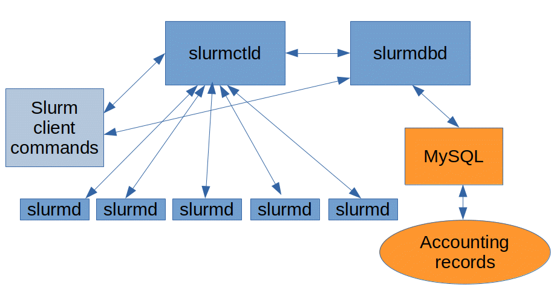
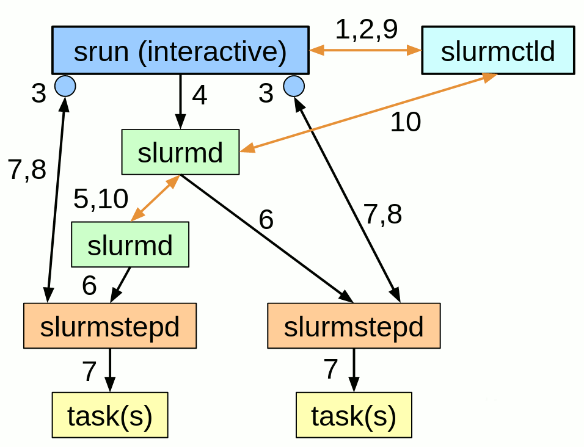
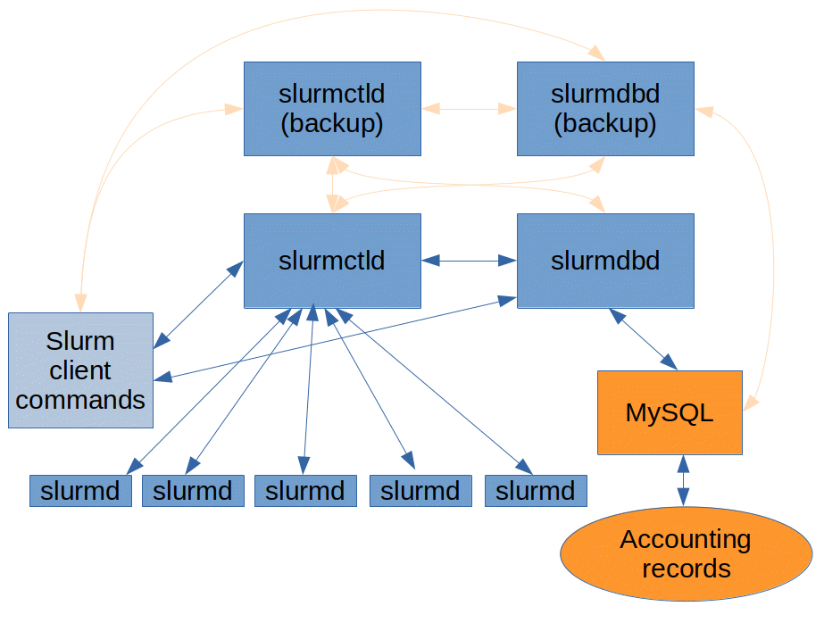
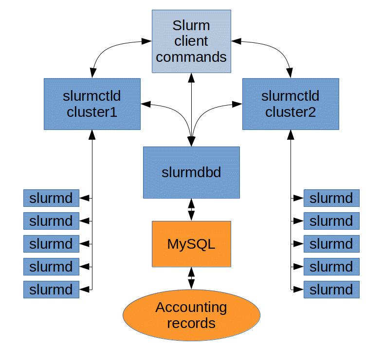
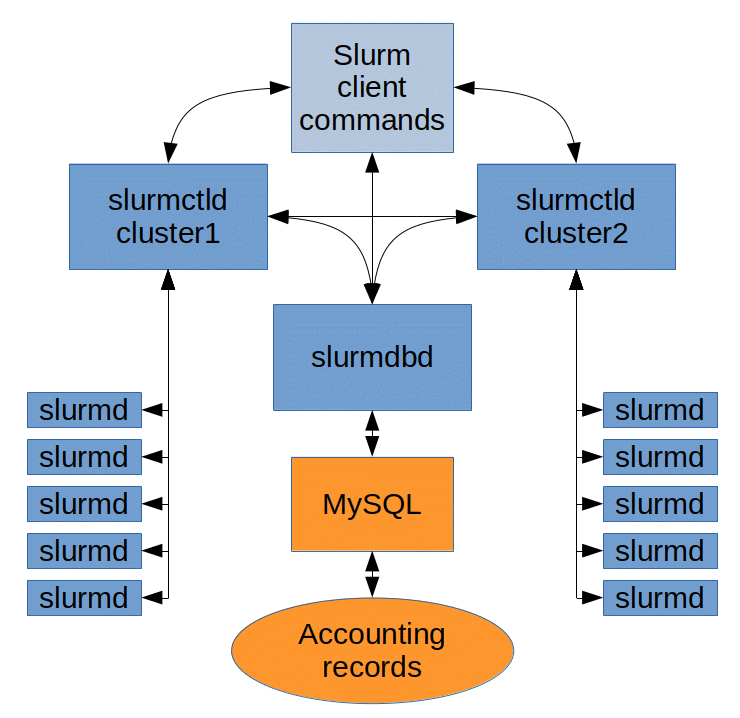

# Network Configuration Guide

## Contents

- [Overview](#overview)
- [Communication for slurmctld](#slurmctld)
- [Communication for slurmdbd](#slurmdbd)
- [Communication for slurmd](#slurmd)
- [Communication for client commands](#client)
- [Communication for multiple controllers](#failover)
- [Communication with multiple clusters](#multi)
- [Communication in a federation](#federation)
- [Communication with IPv6](#ipv6)

## Overview

There are a lot of components in a Slurm cluster that need to be able to communicate with each
other. Some sites have security requirements that prevent them from opening all communications
between the machines and will need to be able to selectively open just the ports that are necessary.
This document will go over what is needed for different components to be able to talk to each other.

Below is a diagram of a fairly typical cluster, with **slurmctld** and **slurmdbd** on separate
machines. In smaller clusters, MySQL can run on the same machine as the **slurmdbd**, but in most
cases it is preferable to have it run on a dedicated machine. **slurmd** runs on the compute nodes
and the client commands can be installed and run from machines of your choosing.

  
Typical configuration

## Communication for slurmctld

The default port used by **slurmctld** to listen for incoming requests is <u>6817</u>. This port can
be changed with the [SlurmctldPort](slurm.conf.md#OPT_SlurmctldPort) slurm.conf parameter. Slurmctld
listens for incoming requests on that port and responds back on the same connection opened by the
requestor.

The machine running **slurmctld** needs to be able to establish outbound connections as well. It
needs to communicate with **slurmdbd** on port <u>6819</u> by default (see the [slurmdbd](#slurmdbd)
section for information on how to change this). It also needs to communicate with **slurmd** on the
compute nodes on port <u>6818</u> by default (see the [slurmd](#slurmd) section for information on
how to change this).

By default, the **slurmctld** will listen for IPv4 traffic. IPv6 communication can be enabled by
adding <u>EnableIPv6</u> to the [CommunicationParameters](slurm.conf.md#OPT_CommunicationParameters)
in your slurm.conf. With IPv6 enabled, you can disable IPv4 by adding <u>DisableIPv4</u> to the
[CommunicationParameters](slurm.conf.md#OPT_CommunicationParameters). These settings must match in
both slurmdbd.conf and slurm.conf (see the [slurmdbd](#slurmdbd) section).

## Communication for slurmdbd

The default port used by **slurmdbd** to listen for incoming requests is <u>6819</u>. This port can
be changed with the [DbdPort](slurmdbd.conf.md#OPT_DbdPort) slurmdbd.conf parameter. Slurmdbd
listens for incoming requests on that port and responds back on the same connection opened by the
requestor.

The machine running **slurmdbd** needs to be able to reach the MySQL or MariaDB server on port
<u>3306</u> by default (the port is configurable on the database side). This port can be changed
with the [StoragePort](slurmdbd.conf.md#OPT_StoragePort) slurmdbd.conf parameter. It also needs to
be able to initiate a connection to **slurmctld** on port 6819 by default (see the
[slurmctld](#slurmctld) section for information on how to change this).

By default, the **slurmdbd** will listen for IPv4 traffic. IPv6 communication can be enabled by
adding <u>EnableIPv6</u> to the
[CommunicationParameters](slurmdbd.conf.md#OPT_CommunicationParameters) in your slurmdbd.conf. With
IPv6 enabled, you can disable IPv4 by adding <u>DisableIPv4</u> to the
[CommunicationParameters](slurmdbd.conf.md#OPT_CommunicationParameters). These settings must match
in both slurmdbd.conf and slurm.conf (see the [slurmctld](#slurmctld) section).

## Communication for slurmd

The default port used by **slurmd** to listen for incoming requests from **slurmctld** is
<u>6818</u>. This port can be changed with the [SlurmdPort](slurm.conf.md#OPT_SlurmdPort) slurm.conf
parameter.

The machines running **srun** also use a range of ports to be able to communicate with
**slurmstepd**. By default these ports are chosen at random from the ephemeral port range, but you
can use the [SrunPortRange](slurm.conf.md#OPT_SrunPortRange) to specify a range of ports from which
they can be chosen. This is necessary for login nodes that are behind a firewall.

The machines running **slurmd** need to be able to establish connections with **slurmctld** on port
<u>6817</u> by default (see the [slurmctld](#slurmctld) section for information on how to change
this).

By default, the **slurmd** communicates over IPv4. Please see the [slurmctld](#slurmctld) section
for details on how to change this as the slurm.conf parameter affects **slurmd** daemons as well.

## Communication for client commands

The majority of the client commands will communicate with **slurmctld** on port <u>6817</u> by
default (see the [slurmctld](#slurmctld) section for information on how to change this) to get the
information they need. This includes the following commands:

salloc

sacctmgr

sbatch

sbcast

scancel

scontrol

sdiag

sinfo

sprio

squeue

sshare

sstat

strigger

sview

There are also commands that communicate directly with **slurmdbd** on port <u>6819</u> by default
(see the [slurmdbd](#slurmdbd) section for information on how to change this). The following
commands get information from **slurmdbd**:

sacct

sacctmgr

sreport

When a user starts a job using **srun** there has to be a communication path from the machine where
**srun** is called to the node(s) the job is allocated. Communication follows the sequence outlined
below:

1a. srun sends job allocation request to slurmctld

1b. slurmctld grants allocation and returns details

2a. srun sends step create request to slurmctld

2b. slurmctld responds with step credential

3\. srun opens sockets for I/O

4\. srun forwards credential with task info to slurmd

5\. slurmd forwards request as needed (per fanout)

6\. slurmd forks/execs slurmstepd

7\. slurmstepd connects I/O and launches tasks

8\. On task termination, slurmstepd notifies srun

9\. srun notifies slurmctld of job termination

10\. slurmctld verifies termination of all processes via slurmd and releases resources for next job

  
srun communication

## Communication with multiple controllers

You can configure a secondary **slurmctld** and/or **slurmdbd** to serve as a fallback if the
primary should go down. The ports involved don't change, but there are additional communication
paths that need to be taken into consideration. The client commands need to be able to reach both
machines running **slurmctld** as well as both machines running **slurmdbd**. Both instances of
**slurmctld** need to be able to reach both instances of **slurmdbd** and each **slurmdbd** needs to
be able to reach the MySQL server.

  
Fallback slurmctld and slurmdbd

## Communication with multiple clusters

In environments where multiple **slurmctld** instances share the same **slurmdbd** you can configure
each cluster to stand on their own and allow users to specify a cluster to submit their jobs to.
Ports used by the different daemons don't change, but all instances of **slurmctld** need to be able
to communicate with the same instance of **slurmdbd**. You can read more about multi cluster
configurations in the [Multi-Cluster Operation](multi_cluster.md#OPT_SlurmdPort) documentation.

  
Multi-Cluster configuration

## Communication in a federation

Slurm also provides the ability to schedule jobs in a peer-to-peer fashion between multiple
clusters, allowing jobs to run on the cluster that has available resources first. The difference in
communication needs between this and a multi-cluster configuration is that the two instances of
**slurmctld** need to be able to communicate with each other. There are more details about using a
[Federation](federation.md#OPT_SlurmdPort) in the documentation.

  
Federation configuration

## Communication with IPv6

The **slurmctld**, **slurmdbd**, and **slurmd** daemons will, by default, communicate using IPv4,
but they can be configured to use IPv6. This is handled by setting
**CommunicationParameters=EnableIPv6** in your slurm.conf and slurmdbd.conf, then restarting all of
the daemons. The **slurmd** may operate over IPv4 OR IPv6 in this mode. IPv4 can be disabled by
setting **CommunicationParameters=EnableIPv6,DisableIPv4**. In is mode, everything must have a valid
IPv6 address or the connection will fail.

The **slurmctld** expects a node to map to a single IP address (which will be the first address
returned when looking up the IP of the node with **getaddrinfo()**). If you enable IPv6 on an
existing cluster and the nodes have IPv6 addresses, you must restart the **slurmd** daemons for
communication over IPv6 to be established.

The presence of precedence ::ffff:0:0/96 100 in /etc/gai.conf will cause IPv4 addresses to be
returned BEFORE an IPv6 address. This might cause a situation where you have enabled IPv6 for Slurm,
but are still seeing nodes communicate with IPv4. If there is confusion as to which address is being
used you can call scontrol setdebugflags +NET to enable network related debug logging in your
slurmctld.log.

If IPv4 and IPv6 are enabled, the loopback interface may still resolve to 127.0.0.1. This is not
necessarily an indication of a problem.

Last modified 25 November 2020
