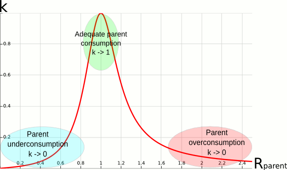

# Depth-Oblivious Fair-share Factor

## Contents

- [Introduction](#intro)
- [Depth-Oblivious Fair-Share Formula](#fairshare)
- [The Effective Usage Ratio Under an Account Hierarchy](#ratio)
- [Configuration](#config)

## Introduction

The depth-oblivious fair-share factor is a variant of the default fair-share factor which increases
usable priority ranges and improves fairness between accounts in deep and/or irregular hierarchies.
The reader is assumed to be familiar with the priority/multifactor plugin and only the specifics of
the depth-oblivious factor are documented here

## Depth-Oblivious Fair-Share Formula

The main formula for calculating the fair-share factor of an account is:

        F = 2^(-R)

where:

F  
is the fair-share factor

R  
is the effective usage ratio of the account

This formula resembles the original fair-share formula, and produces the same result for an account
at the first level of the tree (under root). Indeed, for first-level accounts, the effective usage
ratio R is equal to the usage ratio r defined as:

        r = U/S

where:

S  
is the normalized shares

U  
is the normalized usage factoring in half-life decay

which is the same as the original formula.

## The Effective Usage Ratio Under an Account Hierarchy

The generalized formula for R is a bit more complex. It involves a local usage ratio rl:

        rl = r / (Uall_siblings/Sall_siblings)

which is the ratio between the usage ratio of an account, and the total usage ratio of all the
siblings at his level including itself. For example, assuming that all the children of an account
have used in total two times their combined shares (which equal the shares of the parent account),
but that one of the child has used only two thirds of his shares, the local usage ratio of that
child will be of one third.

The general formula for R is then defined by:

        R = Rparent * rl^k

where:

k  
varies between 0 and 1 and determines how much the effective usage ratio of an account is determined
by the usage ratio of its ancestors.

To understand the formula for k, it is useful to first make a few observations about the formula for
R. On the one hand, if k equals 1, the above formula gives R = Rparent \* rl.
For a second-level account, by plugging in the formula for rl, this leads to R = r \*
Uparent/Uall_siblings. Assuming jobs are submitted at leaf accounts,
Uparent = Uall_siblings which gives R = r. This means that if k equals 1, the
fair-share factor of an account is only based on its own usage ratio. On the other hand, if k equals
0, R = Rparent which means the fair-share factor of an account is only based on the usage
ratio of its ancestors.

The formula for k is:

        k = (1/(1+(5*ln(Rparent))^2)) if ln(Rparent)*ln(rl) <= 0
        k = 1 if ln(Rparent)*ln(rl) >= 0

This formula is chosen to ensure that, if the usage of the ancestors of an account is on target, the
fair-share factor of the account mainly depends on its own usage. Therefore k tends towards 1 when
Rparent tends towards 1. On the contrary, the more the ancestors of an account have
underused/overused their shares, the more the fair-share factor of the account should get a
bonus/malus by moving towards the fair-share factor of its parent. Therefore, k tends towards 0 when
Rparent diverges from 1. However, if the account usage imbalance is greater than its
ancestors' in the same direction, (for example, the ancestors have consumed two times their shares,
and the child has consumed 3 times its shares), moving the fair-share factor back towards the one of
the parent is not helpful. As a result, k is kept to 1 in that case.

  
Figure 1. Plot of k as a function of Rparent

## Configuration

The following slurm.conf parameters are used to enable the depth-oblivious flavor of the fair-share
factor. See slurm.conf(5) man page for more details.

PriorityFlags  
Set to "DEPTH_OBLIVIOUS".

PriorityType  
Set this value to "priority/multifactor". The default value for this variable is "priority/basic"
which enables simple FIFO scheduling.

Last modified 30 October 2013
