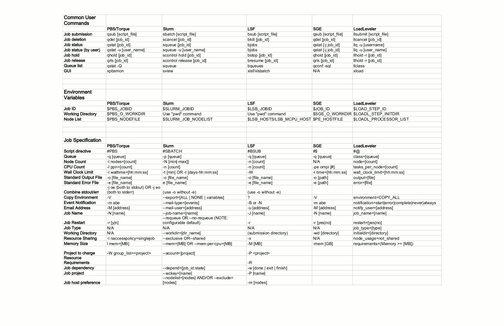

# Rosetta Stone of Workload Managers

## PBS/Torque, Slurm, LSF, SGE and LoadLeveler

This table lists the most common command, environment variables, and job specification options used
by the major workload management systems: PBS/Torque, Slurm, LSF, SGE and LoadLeveler. Each of these
workload managers has unique features, but the most commonly used functionality is available in all
of these environments as listed in the table. This should be considered a work in progress and
contributions to improve the document are welcome.

Click to get full size file

Last modified 17 January 2013
