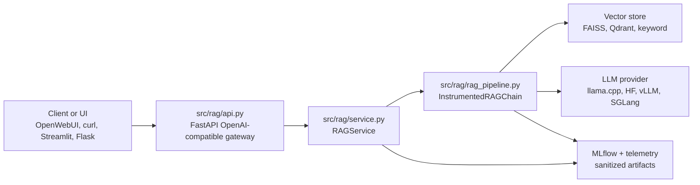

# OARC AI Assistant Architecture

This is the canonical architecture guide for the OARC AI Assistant codebase. It describes the
current implementation in `src/`, operational entrypoints in `scripts/`, test architecture under
`tests/`, and how project documentation relates to the RAG corpus under `docs/`.

## System Summary

The project is a Retrieval-Augmented Generation system for OARC and HPC documentation. It has four
main layers:

- **Knowledge layer:** Markdown corpora, prepared ServiceNow records, Slurm imports, embeddings, and
  FAISS/Qdrant/keyword retrieval.
- **RAG application layer:** LangChain RAG chain construction, prompt formatting, provider
  invocation, source extraction, request metadata, MLflow logging, and host/GPU telemetry.
- **Serving layer:** FastAPI OpenAI-compatible gateway, legacy Flask chat harnesses, Streamlit local
  UI, and HPC launch scripts.
- **Evaluation layer:** Embedding bakeoff runner, model registry helpers, LLM judge, retrieval
  metrics, sanitized outputs, and MLflow artifacts.

The FastAPI gateway is the preferred API boundary. Direct Streamlit/Flask entrypoints remain useful
for local and HPC smoke testing.

## Directory Map

```text
src/
  rag/
    api.py                 OpenAI-compatible FastAPI gateway.
    service.py             Gateway orchestration, request IDs, source metadata, MLflow logging.
    rag_pipeline.py        LangChain retriever + prompt + LLM runnable with instrumentation.
    llm_provider.py        Provider abstraction for llama.cpp, Hugging Face, vLLM, and SGLang.
    vector_store.py        Embeddings, Qdrant, FAISS, and keyword retriever factories.
    data_loader.py         Markdown and prepared ServiceNow loading plus chunking.
    config.py              Environment-first runtime, provider, MLflow, and telemetry settings.
    endpoint_discovery.py  Reads hosted vLLM endpoint metadata from `vllm-endpoint.json`.
    mlflow_tracker.py      Safe MLflow wrappers and prompt-record sanitization.
    telemetry.py           Background CPU/GPU sampler used by instrumented runtime calls.
    slurm_docs.py          Imports official Slurm source docs into a local Markdown corpus.
    main.py                Streamlit developer UI.
  evaluation/
    batch_runner.py        Embedding sweep runner and retrieval/generation metrics.
    model_provider.py      Local model registry helpers for embeddings and GGUF LLMs.
    llm_judge.py           LLM-as-judge scoring helper.
    evaluator.py           MLflow evaluation wrapper for saved JSONL results.
    reporter.py            Simple text report generator.

scripts/
  common/                  Shared environment activation.
  rag/                     Corpus cleaning, preparation, vector-store build, Slurm import.
  deployment/              macOS, legacy, and HPC chat/gateway/model-serving launchers.
  evaluation/              Local and Slurm evaluation entrypoints.
  models/                  Model download and verification utilities.
  register_prompts.py      MLflow prompt registry helper.

tests/
  conftest.py              Test import path and optional dependency guards.
  unit/                    Fast unit/contract tests for gateway, providers, scripts, docs, plans,
                            telemetry, and Slurm import behavior.
```

## Runtime Architecture



### FastAPI Gateway

`src/rag/api.py` exposes:

- `GET /health`: returns gateway status, active model alias, backend metadata, and provider health
  without initializing the full RAG chain.
- `GET /v1/models`: returns OpenAI-style model metadata for the RAG system alias
  `oarc-rag-v1`.
- `POST /v1/chat/completions`: accepts OpenAI-style chat messages, extracts the latest non-empty
  user message, invokes `RAGService`, and returns an OpenAI-style response with `rag_request_id`,
  `rag_sources`, and public `rag_metadata`.

For `stream: true`, the gateway returns server-sent events. The first chunk establishes the
assistant role, content chunks follow, and the final chunk carries sources and request metadata.
Midstream failures emit an `error` SSE event and then `[DONE]` without leaking backend exception
details.

### RAG Service

`src/rag/service.py` keeps HTTP concerns out of the RAG pipeline. It owns:

- lazy chain creation through a configurable `chain_factory`;
- per-request IDs;
- answer normalization across string and dict-like RAG results;
- source metadata extraction and deduplication;
- backing provider metadata and health checks;
- prompt hashing and sanitized MLflow request records.

The default gateway provider is `vllm`, and the default gateway vector store is `qdrant`. Operators
can override these with `RAG_GATEWAY_LLM_PROVIDER` and `RAG_GATEWAY_VECTOR_STORE`.

### RAG Chain

`src/rag/rag_pipeline.py` builds a LangChain runnable that:

1. retrieves context with an injected retriever or a configured vector store;
2. formats retrieved documents into a bounded context string;
3. renders the project prompt template;
4. invokes the configured LLM provider;
5. returns both `answer` and `context` so callers can show sources.

`InstrumentedRAGChain` wraps that runnable and samples runtime telemetry. It hashes prompt,
retriever, corpus, and index descriptors for reproducibility, logs sanitized prompt records, caps
artifact size, and optionally persists sanitized provider config under `logs/provider_configs/`.

Context limits are controlled by:

- `RAG_MAX_CONTEXT_TOKENS`: preferred hard token cap.
- `RAG_MAX_CONTEXT_CHARS`: fallback character cap.

Evaluation jobs set `RAG_MAX_CONTEXT_TOKENS` dynamically to avoid overflowing local `llama.cpp`
context windows.

### LLM Providers

`src/rag/llm_provider.py` defines `LLMProvider`, `LLMResponse`, and `LLMUsage`. Provider
implementations hide backend-specific details behind `generate()` and `get_llm()`:

- `llama_cpp`: local GGUF model through `langchain_community.llms.LlamaCpp`.
- `huggingface_api`: Hugging Face endpoint through LangChain.
- `vllm` / `vllm_api`: OpenAI-compatible HTTP provider for vLLM.
- `sglang` / `sglang_api`: OpenAI-compatible HTTP provider for SGLang.

HTTP providers support retries, timeout configuration, optional API keys, streaming, and
generation-parameter overrides. The shared base class parses OpenAI-style streaming chunks and
normalizes usage counts when the backend emits them.

### Retrieval and Corpora

`src/rag/data_loader.py` loads Markdown from `DATA_PATH` and optional prepared ServiceNow JSONL from
`SERVICE_NOW_DATA_PATH`, then chunks documents with LangChain's recursive character splitter.

`src/rag/vector_store.py` supports:

- `qdrant`: connects to `QDRANT_HOST`, `QDRANT_PORT`, and `QDRANT_COLLECTION_NAME`.
- `faiss`: builds or loads local FAISS indexes, usually under `FAISS_INDEX_PATH`.
- `keyword`: lightweight fallback retriever over Markdown files from `KEYWORD_CORPUS_PATHS`.

The keyword retriever intentionally skips ServiceNow task JSON files; ServiceNow data should enter
runtime through the prepared JSONL path, not as raw task exports.

### Configuration

Runtime config is env-first and centralized in `src/rag/config.py`. `.env` is loaded for local
development, while Slurm jobs typically export variables explicitly.

Important groups:

- Corpus and index: `DATA_PATH`, `SERVICE_NOW_DATA_PATH`, `EMBEDDING_MODEL`, `FAISS_INDEX_PATH`.
- Qdrant: `QDRANT_HOST`, `QDRANT_PORT`, `QDRANT_COLLECTION_NAME`.
- Local LLM: `LLAMA_CPP_MODEL_PATH`, `LLM_PROVIDER`.
- vLLM: `VLLM_BASE_URL`, `VLLM_MODEL`, `VLLM_API_KEY`, `VLLM_HEALTH_URL`,
  `VLLM_ENDPOINT_DIR`, timeout/retry/generation overrides.
- SGLang: `SGLANG_BASE_URL`, `SGLANG_MODEL`, `SGLANG_API_KEY`, `SGLANG_HEALTH_PORT`, and matching
  timeout/retry/generation overrides.
- Gateway: `RAG_GATEWAY_LLM_PROVIDER`, `RAG_GATEWAY_VECTOR_STORE`,
  `RAG_GATEWAY_PROVIDER_HEALTH_TIMEOUT`.
- MLflow: `MLFLOW_ENABLED`, `MLFLOW_TRACKING_URI`, `MLFLOW_EXPERIMENT_NAME`,
  `MLFLOW_RUNTIME_SAMPLE_P`, `MLFLOW_ARTIFACT_TOP_K`, `MLFLOW_ARTIFACT_MAX_BYTES`.
- Telemetry: `TELEMETRY_ENABLED`, `TELEMETRY_INTERVAL_S`, `TELEMETRY_WINDOW`,
  `TELEMETRY_GPU_ENABLED`.

`VLLM_ENDPOINT_DIR` points to a directory containing `vllm-endpoint.json`. That file is written by
the hosted vLLM Slurm job and read by `endpoint_discovery.py` to supply provider defaults.

### Observability and Privacy

`src/rag/mlflow_tracker.py` is the only place runtime and evaluation code should call for MLflow
logging. It returns no-op contexts when MLflow is disabled or unavailable, stringifies parameters,
filters non-numeric metrics, truncates large artifacts, and hashes prompts before persistence.

`src/rag/telemetry.py` samples GPU and host metrics in this order:

1. `pynvml`
2. `nvidia-smi`
3. `psutil`
4. no backend

Raw prompts are not stored in MLflow runtime records. Retrieved document identifiers are capped by
`MLFLOW_ARTIFACT_TOP_K`. The current evaluation path may include generated answers and ground-truth
answers in sanitized artifacts for scoring review, so treat evaluation output directories as
project artifacts rather than public corpus material.

## Main Execution Paths

### Build a FAISS Index


Typical command:

```bash
scripts/rag/run_pipeline.sh
```

On Slurm:

```bash
sbatch scripts/rag/run_pipeline.sbatch
```

The pipeline writes cleaned/prepared ServiceNow derivatives, loads Markdown and prepared JSONL,
chunks documents, embeds them, and saves a FAISS index. Raw ServiceNow task JSON files are not part
of normal documentation review.

### Serve the RAG Gateway Locally

```bash
scripts/deployment/macos/run_rag_gateway.sh --host 127.0.0.1 --port 8088
```

The script activates `.venv`, sets `PYTHONPATH`, defaults to `RAG_GATEWAY_LLM_PROVIDER=vllm`, and
runs:

```bash
uvicorn src.rag.api:app --host "$HOST" --port "$PORT"
```

### Hosted vLLM on HPC

1. Prepare the HPC environment:

   ```bash
   scripts/deployment/hpc/setup_hpc.sh
   ```

2. Start vLLM:

   ```bash
   scripts/deployment/hpc/submit_vllm_serve.sh \
     --model meta-llama/Llama-3-8B-Instruct \
     --endpoint-dir "$VLLM_ENDPOINT_DIR"
   ```

3. Check status:

   ```bash
   scripts/deployment/hpc/check_vllm_status.sh --endpoint-dir "$VLLM_ENDPOINT_DIR"
   ```

4. Start the RAG gateway:

   ```bash
   sbatch --export=ALL,PROJECT_ROOT=/scratch/$USER/oarc-ai-assistant \
     scripts/deployment/hpc/run_rag_gateway.sbatch
   ```

5. Stop vLLM when finished:

   ```bash
   scripts/deployment/hpc/stop_vllm_serve.sh --endpoint-dir "$VLLM_ENDPOINT_DIR"
   ```

`docs/hpc-vllm-runbook.md` is the operational runbook for this flow. The gateway talks to vLLM
through the OpenAI-compatible `/v1/chat/completions` model endpoint but keeps retrieval and sources
inside repo-owned code.

### Evaluation Bakeoff

`src/evaluation/batch_runner.py` runs grid sweeps over embedding models, chunk sizes, overlaps, and
retriever depth from `configs/evaluation/*.yml`.

Flow:

1. Load gold queries, answers, and qrels from `data/evaluation/gold/`.
2. Load Markdown corpus and optional prepared ServiceNow JSONL.
3. Build stable `docN` IDs for qrels alignment.
4. Chunk documents and build an in-memory FAISS vector store per sweep run.
5. Invoke the RAG chain with an injected retriever and generator LLM.
6. Score retrieval with recall and nDCG.
7. Score generated answers with `LLMJudge`.
8. Write per-run metrics, sanitized responses, summaries, and MLflow artifacts.

Smoke run:

```bash
sbatch scripts/evaluation/run_evaluation_smoke.sbatch \
  --config configs/evaluation/embedding_bakeoff_smoke.yml
```

Full sweep:

```bash
sbatch scripts/evaluation/run_evaluation.sbatch \
  --config configs/evaluation/embedding_bakeoff.yml
```

Outputs live under `results/embedding_bakeoff*`, including `summary_metrics.json`,
`per_run_metrics.jsonl`, `doc_id_map.json`, and `runs/<run_id>/`.

## Scripts

Scripts are thin operational wrappers around `src/` code or external services.

| Path | Purpose | Inputs and env | Outputs and side effects |
| --- | --- | --- | --- |
| `scripts/common/activate_project_env.sh` | Source repo-local `.venv`. | `PROJECT_ROOT`, `VENV_DIR`. | Activates shell environment; errors if missing. |
| `scripts/rag/run_pipeline.sh` | ServiceNow clean/prepare plus FAISS build. | Raw ServiceNow export path, prepared output path, vector index path. | Writes cleaned/prepared files, logs, and FAISS index. |
| `scripts/rag/create_vector_store.py` | Build Qdrant or FAISS vector store. | `--vector-store`, `--persist-dir`, `--servicenow-path`; config env vars. | Writes FAISS index or mutates Qdrant collection. |
| `scripts/rag/import_slurm_docs.py` | Import official Slurm docs. | `--version`, `--output-dir`, `--force`; requires `pandoc`. | Rebuilds corpus tree and manifest. |
| `scripts/rag/servicenow/clean.py` | Clean and anonymize ServiceNow export. | `--input-path`, `--output-path`. | Writes cleaned JSON and dated log file. |
| `scripts/rag/servicenow/prepare.py` | Convert cleaned ServiceNow data to JSONL. | `--input-path`, `--output-path`. | Writes prepared JSONL for embedding. |
| `scripts/deployment/macos/run_rag_gateway.sh` | Local FastAPI gateway. | Gateway/provider/vector env vars. | Starts `uvicorn`; binds configured host/port. |
| `scripts/deployment/hpc/run_rag_gateway.sbatch` | HPC FastAPI gateway. | `PROJECT_ROOT`, gateway/provider/vector env vars. | Starts Slurm job and prints tunnel instructions. |
| `scripts/deployment/hpc/submit_vllm_serve.sh` | Submit hosted vLLM job. | Model, GPU, port, endpoint-dir, API key options. | Submits Slurm job; may generate an API key. |
| `scripts/deployment/hpc/vllm_serve.sbatch` | Run vLLM server. | vLLM model/port/GPU/env settings. | Starts vLLM and writes endpoint metadata JSON. |
| `scripts/deployment/hpc/check_vllm_status.sh` | Inspect hosted endpoint. | `--endpoint-dir` or `VLLM_ENDPOINT_DIR`. | Reads endpoint metadata and probes health URL. |
| `scripts/deployment/hpc/stop_vllm_serve.sh` | Stop hosted endpoint. | Job ID or endpoint directory. | Cancels Slurm job and removes endpoint file. |
| `scripts/deployment/hpc/run_phase3_openwebui_verification.sbatch` | Manual OpenWebUI/RAG gateway verification. | vLLM, gateway, FAISS, and keepalive env vars. | Starts vLLM and gateway in one allocation; prints checks. |
| `scripts/deployment/hpc/chat_hpc.py` | Legacy Flask/CLI RAG chat harness. | Provider/vector/index env and CLI args. | Starts CLI or Flask chat server. |
| `scripts/deployment/macos/chat_local.py` | Legacy local llama.cpp chat harness. | `LLAMA_CPP_MODEL_PATH`; `--web`. | Loads local model and starts CLI or Flask server. |
| `scripts/evaluation/run_evaluation.py` | Run bakeoff config locally. | `--config`. | Writes configured evaluation results. |
| `scripts/evaluation/*.sbatch` | Run evaluation jobs on Slurm. | Config, project root, model availability. | Writes logs and results; may log to MLflow. |
| `scripts/models/download_models.py` | Download registry models. | `configs/models.yml`; Hugging Face CLI/auth. | Mutates `models/`. |
| `scripts/models/verify_models.py` | Verify local model files/directories. | `configs/models.yml`. | Prints verification results. |
| `scripts/register_prompts.py` | Register LLM judge prompt in MLflow. | `configs/evaluation/default.yml`, MLflow env. | Mutates MLflow prompt registry. |

Older phase setup scripts remain for historical workflows. Prefer the repo-local `uv` setup scripts
and current gateway/vLLM launchers for new work.

## Tests

All current tracked tests are unit or contract tests under `tests/unit/`. They avoid real model
serving, real vector databases, and raw ServiceNow task JSON files.

Important patterns:

- `tests/conftest.py` disables Pydantic plugin scanning and masks `pyarrow` to keep collection fast
  in cloud-synced local worktrees.
- Gateway tests use fake RAG chains to verify OpenAI-compatible request/response shapes,
  streaming SSE behavior, source metadata, validation errors, and error redaction.
- Service hardening tests monkeypatch MLflow calls so telemetry privacy can be asserted without a
  real tracking server.
- Provider tests mock HTTP requests and reload `src.rag.config` after env changes to verify
  provider config precedence.
- Script tests read shell/sbatch files as contract tests for entrypoints, environment setup, and
  expected commands.
- Slurm importer tests build a synthetic archive and require `pandoc`; they skip when `pandoc` is
  unavailable.
- Plan/design tests assert that `project_docs/DESIGN.md` and `.plans/` stay synchronized for
  project phases.

Recommended commands:

```bash
python -m pytest tests/unit -q
python -m pytest tests/unit/test_rag_gateway.py tests/unit/test_rag_service_hardening.py -q
python -m pytest tests/unit/test_slurm_docs.py -q
python -m ruff check src scripts tests
```

When adding tests, prefer narrow fakes and monkeypatching over external services. Add integration or
HPC tests only when a behavior cannot be asserted by file-contract or in-process unit tests.

## Documentation Structure

- `project_docs/ARCHITECTURE.md`: canonical current architecture and maintenance guide.
- `project_docs/DESIGN.md`: phased product/design roadmap for the OpenAI-compatible gateway and UI.
- `project_docs/mlflow_logging_spec.md`: MLflow schema and privacy details.
- `.plans/`: implementation plans for significant or risky work.
- `docs/README.md`: index and audit for corpus/supporting docs under `docs/`.
- `docs/google_sites_guide/`: OARC/Amarel guide corpus.
- `docs/slurm-23.02.7/`: vendored Slurm corpus with upstream, rendered, and Markdown outputs.
- `docs/corpus/`: future authority-tiered corpus layout.
- `docs/hpc-vllm-runbook.md`: hosted vLLM operational runbook.
- `docs/onboarding/`: supporting user-facing HPC material, not architecture documentation.

Do not duplicate architecture details across README, runbooks, and phase plans. Link to this file
when explaining code responsibilities, control flow, or extension points.

## Extension Points

- **New LLM provider:** implement `LLMProvider`, add it to `get_llm_provider()`, add config
  resolution in `config.py`, document env vars, and add provider tests.
- **New vector store:** extend `get_vector_store()`, document persistence and external service
  requirements, and add script/runtime tests.
- **New corpus source:** add a loader or preparation step that produces LangChain `Document`
  objects with stable metadata; document corpus placement in `docs/README.md`.
- **New evaluation metric:** add metric helpers or `BatchRunner` aggregation, write per-run output,
  and update this architecture guide.
- **New deployment path:** add a thin script under `scripts/deployment/`, document env vars and
  side effects, and add a script contract test.

## Maintenance Policy

Update architecture docs, test docs, relevant developer docs, and meaningful inline comments
whenever a change significantly alters:

- modules, scripts, tests, fixtures, or architecture-relevant docs;
- public APIs or important internal abstractions;
- data flow, control flow, configuration, environment variables, deployment behavior, testing
  strategy, or external integrations;
- invariants, assumptions, side effects, privacy behavior, or operational behavior.

Reviewers should ask for documentation updates when code changes make this file, `README.md`,
`docs/README.md`, project plans, or inline comments inaccurate.
