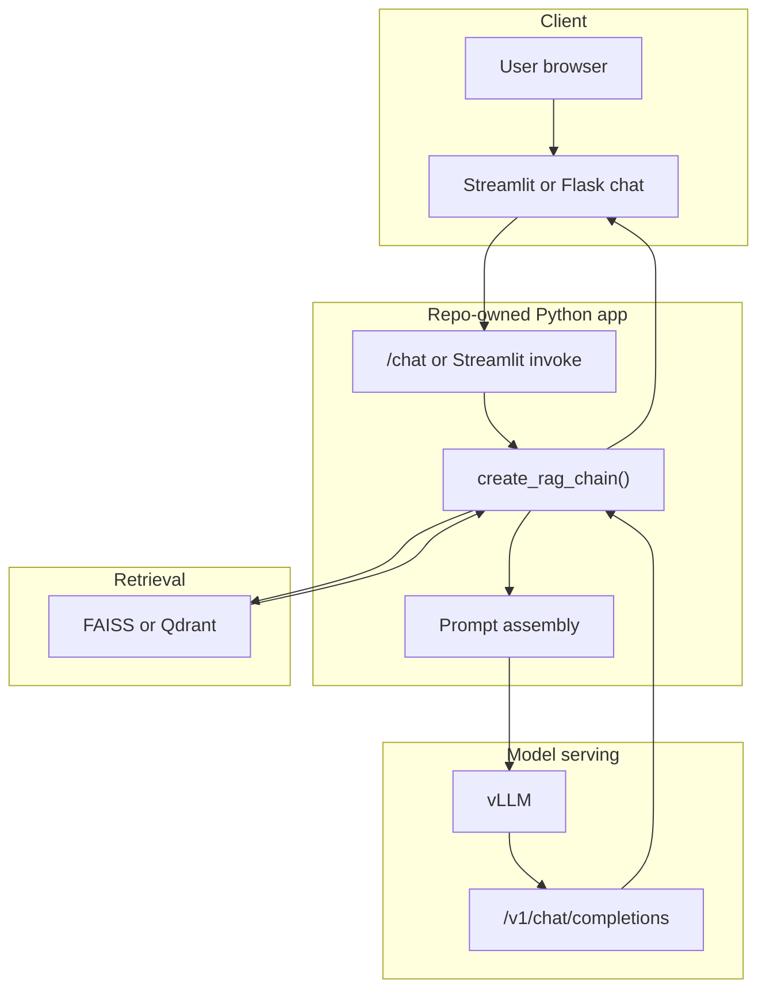
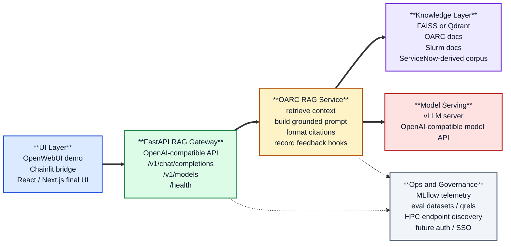
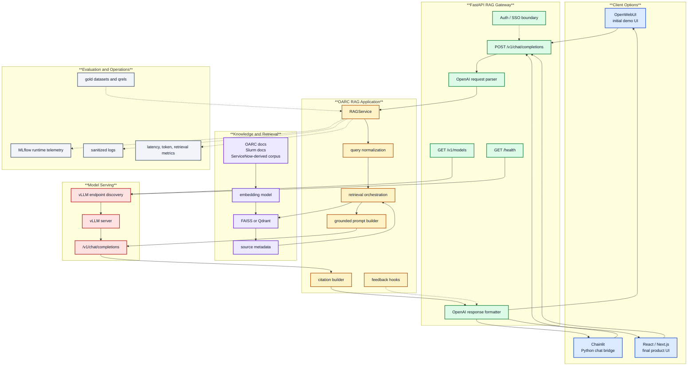
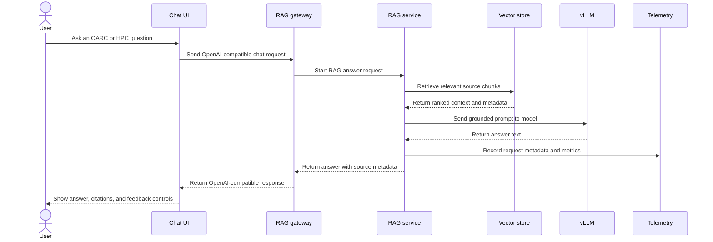

# OARC AI Assistant Design

This document records the current and target architecture for the OARC AI Assistant RAG system.

## Current Architecture

The current application has a custom RAG pipeline, but it does not expose that pipeline as an
OpenAI-compatible API. The OpenAI-compatible boundary exists only at the model server layer.

Current properties:

- The UI sends a plain prompt to repo-owned Python code.
- The repo-owned RAG pipeline retrieves context, builds the prompt, calls vLLM, and returns an
  answer.
- The current app-facing web endpoint is not OpenAI-compatible. The Flask path exposes `POST /chat`
  and returns a simple JSON payload.
- vLLM is already the intended model-hosting layer and exposes the OpenAI-compatible model API.
- OpenWebUI can talk directly to vLLM today, but that would bypass the repo-owned RAG pipeline.

## Simplified Target Architecture

The target architecture keeps the custom OARC RAG pipeline as the source of truth and exposes it
through a RAG-aware OpenAI-compatible endpoint. OpenWebUI, Chainlit, or a custom React frontend can
then use the same backend contract.

Target properties:

- The application backend exposes `POST /v1/chat/completions` with an OpenAI-compatible request and
  response shape.
- That endpoint is RAG-aware: it retrieves OARC, Slurm, and ServiceNow-derived context before
  calling vLLM.
- vLLM remains the model server and is not responsible for retrieval, citations, evaluation, or
  corpus governance.
- OpenWebUI can be used as a UI by pointing it at the RAG gateway instead of directly at vLLM.
- React/Next.js can later replace or complement OpenWebUI without changing the RAG backend contract.

Target responsibility split:

| Layer | Owns | Does not own |
| :--- | :--- | :--- |
| UI | Chat experience, source display, feedback controls | Retrieval logic or model hosting |
| FastAPI gateway | OpenAI-compatible contract, routing, health, auth boundary | Corpus processing |
| RAG service | Retrieval, prompt assembly, citations, telemetry hooks | Browser UI |
| Knowledge layer | Indexed OARC, Slurm, and ServiceNow-derived content | LLM inference |
| vLLM | Fast model inference behind an OpenAI-compatible API | RAG or source governance |

## Detailed Target Architecture

The detailed architecture separates user-facing clients, the OpenAI-compatible gateway contract,
the repo-owned RAG service, retrieval assets, model serving, and operational systems.

Detailed flow:

1. The UI sends an OpenAI-compatible chat request to the FastAPI gateway.
2. The gateway validates/parses the request and forwards the user question to `RAGService`.
3. `RAGService` retrieves ranked chunks from FAISS or Qdrant using the indexed OARC, Slurm, and
   ServiceNow-derived corpus.
4. The prompt builder combines the user question, retrieved context, and system instructions.
5. The model layer resolves the active vLLM endpoint and sends the grounded prompt to vLLM.
6. The RAG service formats the answer, citations, request metadata, and telemetry.
7. The gateway returns an OpenAI-compatible response to OpenWebUI, Chainlit, or React/Next.js.

## User Perspective

From the user's perspective, the application should feel like a support assistant that can answer
HPC and OARC questions with visible sources. The user should not need to know whether the current UI
is OpenWebUI, Chainlit, or the final React application.

Expected user-facing behavior:

- The user asks a normal question in the chat UI.
- The answer is grounded in OARC, Slurm, or ServiceNow-derived sources when relevant.
- The UI shows source references or a source panel, not just generated text.
- The UI exposes simple feedback controls so users can flag wrong, stale, or incomplete answers.
- Maintainers can inspect request IDs, retrieval metadata, model information, and MLflow telemetry
  without exposing raw prompts unnecessarily.

## Design Decision

Use OpenWebUI as an optional UI/demo client, not as the owner of RAG logic.

The project should own the retrieval pipeline because it needs project-specific behavior:

- OARC, Slurm, and ServiceNow-derived corpus processing.
- FAISS or Qdrant index selection.
- Source and citation control.
- Evaluation datasets, qrels, and regression testing.
- MLflow runtime and evaluation telemetry.
- HPC endpoint discovery and vLLM job lifecycle integration.
- Future support workflows such as feedback capture and ServiceNow ticket drafting.

This keeps OpenWebUI replaceable and preserves a stable backend contract for future custom UI work.

## Work Items

### Phase 1: RAG-Compatible API Boundary

- [ ] Add a FastAPI service module for the RAG gateway.
- [ ] Implement `GET /health`.
- [ ] Implement `GET /v1/models` with the active RAG model alias and backing vLLM model metadata.
- [ ] Implement non-streaming `POST /v1/chat/completions`.
- [ ] Parse OpenAI-style chat messages and extract the latest user question.
- [ ] Call the existing RAG pipeline, including retrieval and prompt assembly.
- [ ] Return an OpenAI-compatible chat completion response.
- [ ] Add tests for request parsing, response shape, and basic error handling.

### Phase 2: Streaming and Source Metadata

- [ ] Add streaming support for `stream: true` using server-sent events.
- [ ] Preserve a synchronous fallback for providers or deployments that cannot stream.
- [ ] Add a citation/source payload strategy.
- [ ] Return source metadata through a stable extension field or a companion endpoint.
- [ ] Add tests for streaming event shape and citation metadata.

### Phase 3: OpenWebUI Integration

- [ ] Document how to point OpenWebUI at the RAG gateway base URL.
- [ ] Verify OpenWebUI can call the RAG gateway as an OpenAI-compatible provider.
- [ ] Keep a separate path for raw vLLM smoke testing when retrieval should be bypassed.
- [ ] Add an operator checklist for distinguishing raw model answers from RAG-backed answers.

### Phase 4: Service Hardening

- [ ] Extract a clean `RAGService` abstraction so UI/API code does not own retrieval details.
- [ ] Add request IDs, latency metrics, prompt hashes, retrieval IDs, and provider metadata.
- [ ] Log runtime telemetry to MLflow without storing raw prompts.
- [ ] Add configurable timeouts, retries, and health checks for vLLM.
- [ ] Add deployment scripts for the FastAPI gateway on macOS and HPC.

### Phase 5: Final Product UI

- [ ] Build the React/Next.js frontend against the FastAPI API.
- [ ] Add auth/SSO integration.
- [ ] Add source and citation panels.
- [ ] Add user feedback capture.
- [ ] Add maintainer/debug views for retrieved chunks, endpoint status, and telemetry links.

## Open Questions

- Should the RAG gateway expose citations inside the OpenAI response body, through a custom extension
  field, or through a companion `/rag/sources/{request_id}` endpoint?
- Should the model alias represent the RAG system, for example `oarc-rag-v1`, while metadata records
  the backing vLLM model?
- Should conversation persistence live in the RAG gateway, the UI layer, or a separate store?
- What auth boundary is required for the first deploy: no auth behind SSH tunnel, shared token, or
  institutional SSO?
